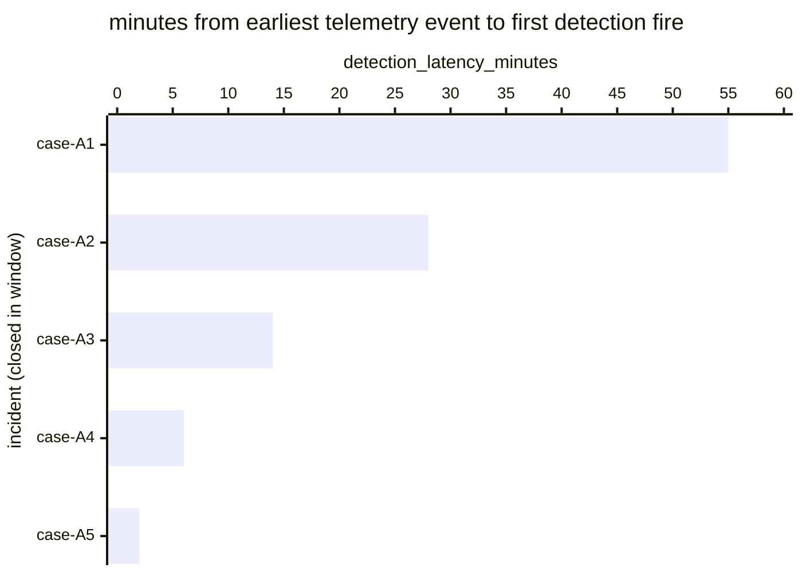

# Reference visualisation — `kpi.mttd_agentic_threat@v1`

This is the committed reference-visualisation artifact for the
agentic-threat-scoped mean-time-to-detect KPI. It exists so the G-04
catalog definition-of-done (a *committed* reference visualisation,
not a narrated one) is closed; downstream compile targets (n8n /
Temporal / LangGraph) read the same metric YAML and render the
executable form in their own dashboard surface. The artifact here is
the contract for the chart shape, not the executable chart.

## Chart kind

Horizontal bar chart, one bar per agentic-threat-rooted incident
closed within the evaluation window, sorted by
`detection_latency_minutes` descending so the slowest detection sits
at the top. The `p95` aggregate is the headline figure operators read
first; the per-incident bars are the supporting drill-down that names
*which* agentic-threat cases pulled the tail.

- **x-axis:** `detection_latency_minutes` — minutes between
  `earliest_telemetry_event_timestamp` (OCSF API Activity, the earliest
  LLM API call trace in the causal chain) and
  `first_detection_fire_timestamp` (OCSF Detection Finding, the
  agentic-threat indicator rule match) for each closed agentic-threat
  incident in the window.
- **y-axis:** one row per closed agentic-threat incident, labelled by
  the case `incident.uid`; sorted by latency descending so the
  worst-case incidents sit at the top.
- **Headline annotation:** the `p95` aggregate across closed
  agentic-threat incidents, annotated as the metric value.

The scoped variant does not redeclare numeric thresholds — operators
with NIS2 Article 21(2)(b) incident-handling and Article 21(2)(e)
agentic-tool-supply-chain obligations typically tighten machine-speed
values in their own scoped overrides against the unscoped
mean-time-to-detect baseline.

## Reference rendering (Mermaid)

The mermaid block below is the canonical reference rendering — small
enough to live in-tree and renderable directly on the public repo
surface. The numeric values are illustrative; the compile target is
the source of truth for the executable form against operator data.

Reading the bars in this illustrative rendering:

| case    | detection_latency_minutes | reading                                                             |
|---------|---------------------------|---------------------------------------------------------------------|
| case-A1 | 55                        | slowest detection — the agentic operator ran the credential-      |
|         |                           | enumeration burst almost end-to-end before the indicator fired      |
| case-A2 | 28                        | detection landed mid-burst                                          |
| case-A3 | 14                        | detection landed early in the self-correction window                |
| case-A4 | 6                         | detection landed on the first two-cycle self-correction fingerprint |
| case-A5 | 2                         | detection landed on the first anomalous API-call cadence sample    |

The headline `p95` figure here is `≈ 55 min` (p95 across five
samples is the worst observed). That value is what the catalog
aggregation `measurement.aggregation: p95` resolves to for this
snapshot.

## OCSF source-data shape

The chart's underlying observations are derived from the operator's
detection pipeline: each closed agentic-threat incident contributes
one `detection_latency_minutes` sample computed from the two inputs
declared in `mttd_agentic_threat.yaml`'s `measurement.inputs`:

- `earliest_telemetry_event` — bound to `telemetry.ocsf.api_activity@v1`
  (OCSF API Activity, class_uid 6003). The earliest LLM API call trace
  attributable to the implicated workload principal whose
  `api.service.name` / `api.operation` / cadence pattern is the
  causal-chain origin for the machine-speed decision cadence case set.
- `first_detection_fire` — bound to
  `telemetry.ocsf.detection_finding@v1` (OCSF Detection Finding,
  class_uid 2004). The agentic-threat Detection Finding meta-finding
  the detection layer emits when the agentic-threat indicator rule
  matches. Catalog entry is detection-vendor-neutral.

## Operator override

Operators are expected to render this metric in their own dashboard
idiom — the catalog reference rendering above is the contract for
the chart shape (per-incident horizontal bars, p95 headline), not the
visual style. The compile target is the source of truth for the
executable form.
