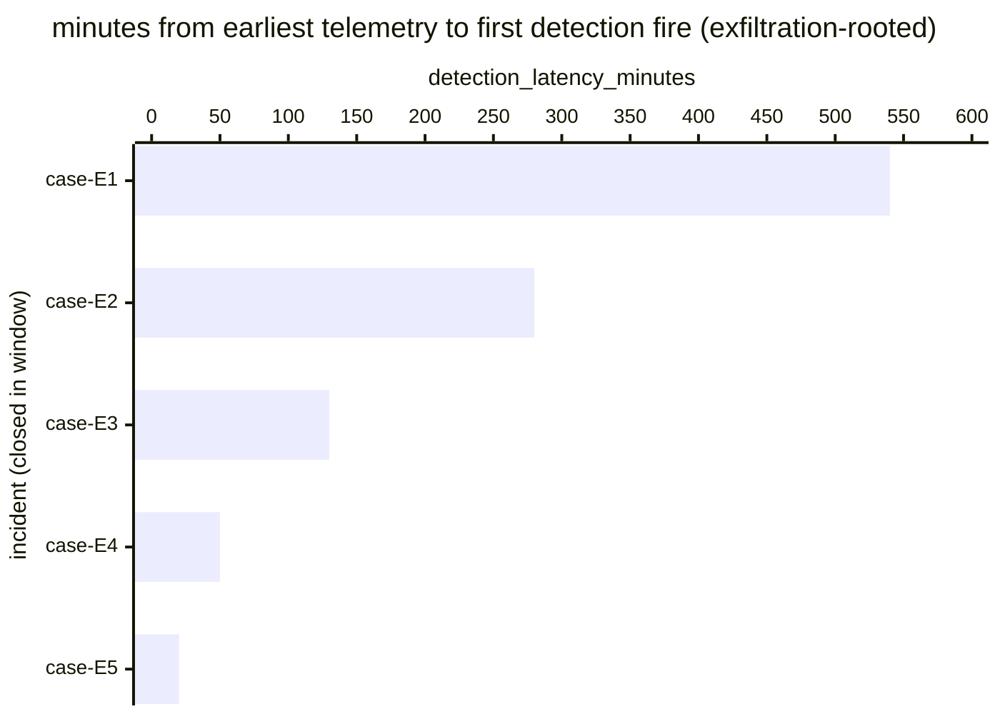

# Reference visualisation — `kpi.mttd_exfil@v1`

This is the committed reference-visualisation artifact for the
data-exfiltration-scoped mean-time-to-detect KPI. It exists so the
G-04 catalog definition-of-done (a *committed* reference
visualisation, not a narrated one) is closed; downstream compile
targets (n8n / Temporal / LangGraph) read the same metric YAML and
render the executable form in their own dashboard surface. The
artifact here is the contract for the chart shape, not the
executable chart.

## Chart kind

Horizontal bar chart, one bar per data-exfiltration-rooted incident
closed within the evaluation window, sorted by
`detection_latency_minutes` descending so the slowest detection sits
at the top. The `p95` aggregate is the headline figure operators read
first; the per-incident bars are the supporting drill-down that names
*which* exfiltration cases pulled the tail. Exfiltration
detection-latency tails interact with the NIS2 Art. 23 24-hour
early-warning clock anchored on this metric's `external_refs[]`, so
the chart is shaped to make the worst-case tail readable at a glance.

- **x-axis:** `detection_latency_minutes` — minutes between
  `earliest_telemetry_event_timestamp` and
  `first_detection_fire_timestamp` for each closed exfiltration
  incident in the window.
- **y-axis:** one row per closed exfiltration incident, labelled by
  the case `incident.uid`; sorted by latency descending so the
  worst-case incidents sit at the top.
- **Threshold overlays:** the unscoped baseline catalog entry
  (`kpi.mttd@v1`) carries the warn (60 min) and breach (240 min)
  thresholds; this scoped variant inherits the threshold shape but
  does not redeclare numeric values — operators with NIS2 Art. 23
  early-warning obligations typically tighten exfiltration-specific
  values in their own scoped overrides given the reporting clock
  anchored on this metric.
- **Headline annotation:** the `p95` aggregate across closed
  exfiltration incidents, annotated as the metric value.

## Reference rendering (Mermaid)

The mermaid block below is the canonical reference rendering — small
enough to live in-tree and renderable directly on the public repo
surface. The numeric values are illustrative; the compile target is
the source of truth for the executable form against operator data.

Reading the bars in this illustrative rendering, referencing the
unscoped baseline thresholds for context:

| case    | detection_latency_minutes | band (vs. kpi.mttd@v1) | reading                                                |
|---------|---------------------------|------------------------|--------------------------------------------------------|
| case-E1 | 540                       | breach                 | above 240-min breach floor — staged egress unflagged   |
| case-E2 | 280                       | breach                 | above 240-min breach floor                             |
| case-E3 | 130                       | warn                   | inside warn band                                       |
| case-E4 | 50                        | on-target              | under 60-min target floor                              |
| case-E5 | 20                        | on-target              | well under target — DLP caught early                   |

The headline `p95` figure here is `≈ 540 min` — that value is what
the catalog aggregation `measurement.aggregation: p95` resolves to
for this snapshot. A `p95` deep inside the breach band, with the
NIS2 Art. 23 24-hour early-warning clock anchored on this metric, is
the operator signal the chart is shaped to surface.

## Threshold band reference

This scoped variant does not redeclare numeric thresholds; it inherits
the band shape from the unscoped baseline `kpi.mttd@v1`. Operators
with NIS2 Art. 23 reporting obligations typically tighten these in
their own scoped overrides given the early-warning clock declared in
this metric's `external_refs[]`. See `mttd.yaml` and `mttd.viz.md`
for the inherited numeric bands.

## OCSF source-data shape

The chart's underlying observations are derived from the operator's
detection pipeline for exfiltration-rooted incidents. Each closed
exfiltration incident contributes one `detection_latency_minutes`
sample computed from the two inputs declared in `mttd_exfil.yaml`'s
`measurement.inputs`:

- `earliest_telemetry_event` — earliest event in the causal chain
  (typically network-egress, DLP, identity, or endpoint
  file-activity telemetry for the data-exfiltration path declared
  in `playbook_refs[]`). The catalog entry does not pin a single
  OCSF class at this scope — the data-exfiltration playbook
  (`playbook.data_exfil@v1` /
  `action--20000000-0000-4000-8000-000000000002` and
  `action--20000000-0000-4000-8000-000000000003`) is the playbook
  anchor and the operator's executable form resolves the concrete
  telemetry class.
- `first_detection_fire` — the first authoritative detection firing
  that opened the exfiltration incident record. Catalog entry is
  detection-vendor-neutral.

The unscoped baseline (`kpi.mttd@v1`) carries the same shape and is
the place a CORE follow-up will land an OCSF Detection Finding
binding; this scoped variant inherits whatever binding lands there.
The reference rendering above remains shape-valid: it reads two
timestamps per incident and computes a duration, regardless of which
OCSF classes carry them.

## Operator override

Operators are expected to render this metric in their own dashboard
idiom — the catalog reference rendering above is the contract for
the chart shape (per-incident horizontal bars, p95 headline,
inherited-band geometry), not the visual style. The compile target
is the source of truth for the executable form.
