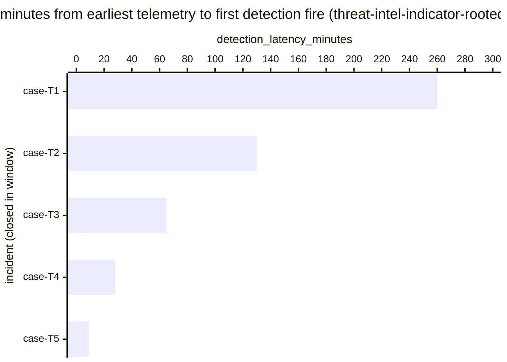

# Reference visualisation — `kpi.mttd_threat_intel_indicator@v1`

This is the committed reference-visualisation artifact for the
threat-intel-indicator-scoped mean-time-to-detect KPI. It exists so
the G-04 catalog definition-of-done (a *committed* reference
visualisation, not a narrated one) is closed; downstream compile
targets (n8n / Temporal / LangGraph) read the same metric YAML and
render the executable form in their own dashboard surface. The
artifact here is the contract for the chart shape, not the
executable chart.

## Chart kind

Horizontal bar chart, one bar per threat-intel-indicator-rooted
incident closed within the evaluation window, sorted by
`detection_latency_minutes` descending so the slowest detection sits
at the top. The `p95` aggregate is the headline figure operators read
first; the per-incident bars are the supporting drill-down that names
*which* indicator-match cases pulled the tail. This scope measures
how quickly the operator's pipeline turns an ingested indicator into
a fired detection against historic and live telemetry — the lag this
chart surfaces is dominated by indicator-ingest, enrichment, and
retro-hunt latency rather than rule-evaluation.

- **x-axis:** `detection_latency_minutes` — minutes between
  `earliest_telemetry_event_timestamp` and
  `first_detection_fire_timestamp` for each closed
  threat-intel-indicator incident in the window.
- **y-axis:** one row per closed threat-intel-indicator incident,
  labelled by the case `incident.uid`; sorted by latency descending so
  the worst-case incidents sit at the top.
- **Threshold overlays:** the unscoped baseline catalog entry
  (`kpi.mttd@v1`) carries the warn (60 min) and breach (240 min)
  thresholds; this scoped variant inherits the threshold shape but
  does not redeclare numeric values — operators typically tighten
  threat-intel-specific values in their own scoped overrides given
  that indicator-driven detection is expected to fire faster than
  the unscoped baseline.
- **Headline annotation:** the `p95` aggregate across closed
  threat-intel-indicator incidents, annotated as the metric value.

## Reference rendering (Mermaid)

The mermaid block below is the canonical reference rendering — small
enough to live in-tree and renderable directly on the public repo
surface. The numeric values are illustrative; the compile target is
the source of truth for the executable form against operator data.

Reading the bars in this illustrative rendering, referencing the
unscoped baseline thresholds for context:

| case    | detection_latency_minutes | band (vs. kpi.mttd@v1) | reading                                                |
|---------|---------------------------|------------------------|--------------------------------------------------------|
| case-T1 | 260                       | breach                 | above 240-min breach floor — indicator-ingest tail     |
| case-T2 | 130                       | warn                   | inside warn band                                       |
| case-T3 | 65                        | warn                   | just above warn floor                                  |
| case-T4 | 28                        | on-target              | under 60-min target floor                              |
| case-T5 | 9                         | on-target              | well under target — indicator fired on live telemetry  |

The headline `p95` figure here is `≈ 260 min` — that value is what
the catalog aggregation `measurement.aggregation: p95` resolves to
for this snapshot.

## Threshold band reference

This scoped variant does not redeclare numeric thresholds; it inherits
the band shape from the unscoped baseline `kpi.mttd@v1` and operators
typically tighten threat-intel-specific values in their own scoped
overrides given the expectation that indicator-match detection fires
faster than the unscoped baseline. See `mttd.yaml` and `mttd.viz.md`
for the inherited numeric bands.

## OCSF source-data shape

The chart's underlying observations are derived from the operator's
detection pipeline for threat-intel-indicator-rooted incidents. Each
closed incident contributes one `detection_latency_minutes` sample
computed from the two inputs declared in
`mttd_threat_intel_indicator.yaml`'s `measurement.inputs`:

- `earliest_telemetry_event` — earliest event in the causal chain
  that the matched indicator was found against (typically network,
  DNS, web-proxy, or endpoint telemetry for the threat-intel-ingest
  path declared in `playbook_refs[]`). The catalog entry does not pin
  a single OCSF class at this scope — the threat-intel-ingest
  playbook step (`playbook.threat_intel_ingest@v1` /
  `action--10000000-0000-4000-8000-000000000006`) is the playbook
  anchor and the operator's executable form resolves the concrete
  telemetry class.
- `first_detection_fire` — the first authoritative detection firing
  triggered by the indicator match that opened the incident record.
  Catalog entry is detection-vendor-neutral.

The unscoped baseline (`kpi.mttd@v1`) carries the same shape and is
the place a CORE follow-up will land an OCSF Detection Finding
binding; this scoped variant inherits whatever binding lands there.
The reference rendering above remains shape-valid: it reads two
timestamps per incident and computes a duration, regardless of which
OCSF classes carry them.

## Operator override

Operators are expected to render this metric in their own dashboard
idiom — the catalog reference rendering above is the contract for
the chart shape (per-incident horizontal bars, p95 headline,
inherited-band geometry), not the visual style. The compile target
is the source of truth for the executable form.
