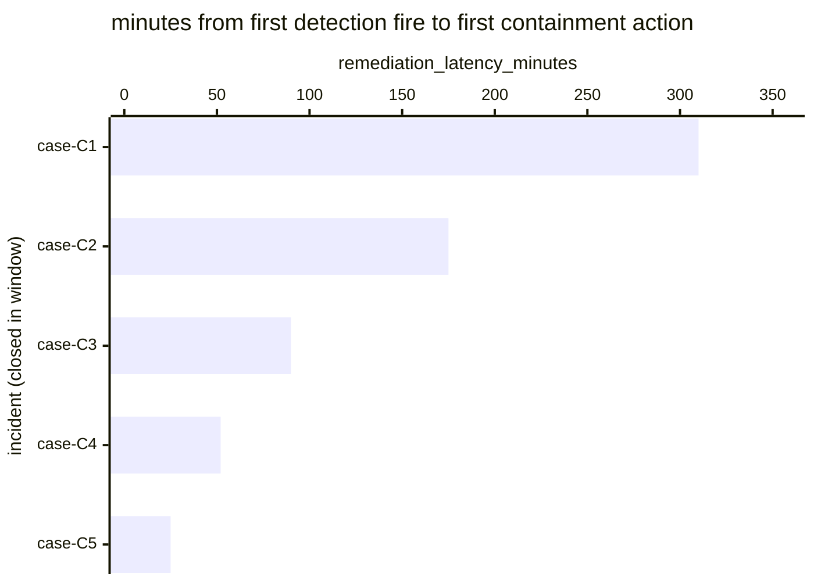

# Reference visualisation — `kpi.mttr_critical@v1`

This is the committed reference-visualisation artifact for the
critical-severity mean-time-to-respond KPI. It exists so the G-04
catalog definition-of-done (a *committed* reference visualisation,
not a narrated one) is closed; downstream compile targets (n8n /
Temporal / LangGraph) read the same metric YAML and render the
executable form in their own dashboard surface. The artifact here is
the contract for the chart shape, not the executable chart.

## Chart kind

Horizontal bar chart, one bar per critical-severity incident closed
within the evaluation window, sorted by
`remediation_latency_minutes` descending so the slowest containment
sits at the top. The `p95` aggregate is the headline figure operators
read first; the per-incident bars are the supporting drill-down that
names *which* incidents pulled the tail.

- **x-axis:** `remediation_latency_minutes` — minutes between
  `first_detection_fire_timestamp` and
  `first_containment_action_timestamp` for each closed critical
  incident in the window.
- **y-axis:** one row per closed critical incident, labelled by the
  case `incident.uid`; sorted by latency descending so the worst-case
  incidents sit at the top.
- **Threshold overlays:** vertical lines at the `warn` (60 min) and
  `breach` (240 min) threshold values from the catalog entry, so the
  operator reads the band each incident sits in without arithmetic.
- **Headline annotation:** the `p95` aggregate across closed critical
  incidents, annotated as the metric value with the threshold band it
  falls in. The `target` value (60 min) is overlaid on the same axis
  as a target floor.

## Reference rendering (Mermaid)

The mermaid block below is the canonical reference rendering — small
enough to live in-tree and renderable directly on the public repo
surface. The numeric values are illustrative; the compile target is
the source of truth for the executable form against operator data.

Reading the bars in this illustrative rendering:

| case    | remediation_latency_minutes | band      | reading                                              |
|---------|-----------------------------|-----------|------------------------------------------------------|
| case-C1 | 310                         | breach    | above 240-min breach floor — slowest containment     |
| case-C2 | 175                         | warn      | above 60-min warn floor, below breach                |
| case-C3 | 90                          | warn      | inside warn band                                     |
| case-C4 | 52                          | on-target | under 60-min target floor                            |
| case-C5 | 25                          | on-target | well under target — fast containment                 |

The headline `p95` figure here is `≈ 310 min` (p95 across five
samples is the worst observed) — inside the breach band. That value
is what the catalog aggregation `measurement.aggregation: p95`
resolves to for this snapshot.

## Threshold band reference

| name      | comparator | value (min) | severity  |
|-----------|------------|-------------|-----------|
| warn      | >          | 60          | warn      |
| breach    | >          | 240         | high      |

The bands match the `thresholds` array on `mttr.yaml`; the catalog
entry is the source of truth, this file is the visualisation surface.
The `target` (≤60 min) is the floor the warn band sits above.

## OCSF source-data shape

The chart's underlying observations are derived from the operator's
response pipeline: each closed critical incident contributes one
`remediation_latency_minutes` sample computed from the two inputs
declared in `mttr.yaml`'s `measurement.inputs`:

- `first_detection_fire` — the first authoritative detection firing
  that opened the incident record at critical severity. Catalog entry
  is detection-vendor-neutral; the executable form on the compile
  target resolves this against the operator's detection store.
- `first_containment_action` — the first playbook step transition in
  the response workflow whose purpose is to limit blast radius
  (isolate, block, revoke, quarantine). Bound by `playbook_step:
  containment` on the catalog entry — the compile target resolves the
  concrete step against the compiled response playbook.

The catalog entry deliberately does not pin a single OCSF telemetry
binding at the unscoped baseline (a CORE follow-up will add an OCSF
Detection Finding binding for the detection input once the binding is
declared at the catalog level). The reference rendering above remains
shape-valid: it reads two timestamps per incident and computes a
duration, regardless of which OCSF classes carry them.

## Operator override

Operators are expected to render this metric in their own dashboard
idiom — the catalog reference rendering above is the contract for
the chart shape (per-incident horizontal bars, threshold overlays,
p95 headline), not the visual style. The compile target is the source
of truth for the executable form.
