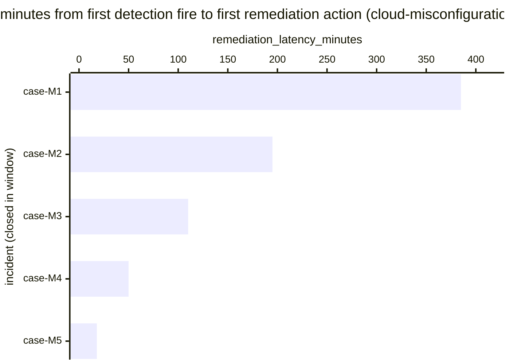

# Reference visualisation — `kpi.mttr_cloud_misconfig@v1`

This is the committed reference-visualisation artifact for the
cloud-misconfiguration-scoped mean-time-to-respond KPI. It exists so
the G-04 catalog definition-of-done (a *committed* reference
visualisation, not a narrated one) is closed; downstream compile
targets (n8n / Temporal / LangGraph) read the same metric YAML and
render the executable form in their own dashboard surface. The
artifact here is the contract for the chart shape, not the executable
chart.

## Chart kind

Horizontal bar chart, one bar per cloud-misconfiguration-rooted
incident closed within the evaluation window whose response playbook
reached the canonical remediation step, sorted by
`remediation_latency_minutes` descending so the slowest remediation
sits at the top. The `p95` aggregate is the headline figure operators
read first; the per-incident bars are the supporting drill-down that
names *which* misconfiguration findings pulled the tail at the
remediation step.

- **x-axis:** `remediation_latency_minutes` — minutes between
  `first_detection_fire_timestamp` and
  `first_response_action_timestamp` (remediation step) for each closed
  cloud-misconfiguration incident in the window.
- **y-axis:** one row per closed cloud-misconfiguration incident,
  labelled by the case `incident.uid`; sorted by latency descending so
  the worst-case incidents sit at the top.
- **Threshold overlays:** the unscoped baseline catalog entry
  (`kpi.mttr_critical@v1`) carries the warn (60 min) and breach (240
  min) thresholds; this scoped variant inherits the threshold-band
  shape but does not redeclare numeric values — operators with NIS2
  Art. 21(2)(e) supply-chain / access-control obligations typically
  tighten cloud-platform-specific remediation targets in their own
  scoped overrides.
- **Headline annotation:** the `p95` aggregate across closed
  cloud-misconfiguration incidents at the remediation step, annotated
  as the metric value.

## Reference rendering (Mermaid)

The mermaid block below is the canonical reference rendering — small
enough to live in-tree and renderable directly on the public repo
surface. The numeric values are illustrative; the compile target is
the source of truth for the executable form against operator data.

Reading the bars in this illustrative rendering, referencing the
unscoped baseline thresholds for context:

| case    | remediation_latency_minutes | band (vs. kpi.mttr_critical@v1) | reading                                          |
|---------|-----------------------------|---------------------------------|--------------------------------------------------|
| case-M1 | 385                         | breach                          | above 240-min breach floor — change-control lag  |
| case-M2 | 195                         | warn                            | above 60-min warn floor, below breach            |
| case-M3 | 110                         | warn                            | inside warn band                                 |
| case-M4 | 50                          | on-target                       | under 60-min target floor                        |
| case-M5 | 18                          | on-target                       | well under target — auto-revert path             |

The headline `p95` figure here is `≈ 385 min` — that value is what
the catalog aggregation `measurement.aggregation: p95` resolves to
for this snapshot.

## Threshold band reference

This scoped variant does not redeclare numeric thresholds; it inherits
the band shape from the unscoped baseline `kpi.mttr_critical@v1` and
operators typically tighten cloud-misconfiguration-specific values in
their own scoped overrides given the NIS2 Art. 21(2)(e) access-control
surface and the variable nature of change-window approval paths.
See `mttr.yaml` and `mttr.viz.md` for the inherited numeric bands.

## OCSF source-data shape

The chart's underlying observations are derived from the operator's
response pipeline for cloud-misconfiguration-rooted incidents. Each
closed incident contributes one `remediation_latency_minutes` sample
computed from the two inputs declared in
`mttr_cloud_misconfig.yaml`'s `measurement.inputs`:

- `first_detection_fire` — the first authoritative detection firing
  that opened the cloud-misconfiguration incident record. Catalog
  entry is detection-vendor-neutral.
- `first_response_action` — the first playbook step transition whose
  purpose matches the scoped response class (remediation). Bound by
  `playbook_step: remediation` on the catalog entry; the
  `playbook_refs[]` array anchors the canonical remediation steps
  against `playbook.cloud_misconfiguration@v1`
  (`action--30000000-0000-4000-8000-000000000006`, `…000007`,
  `…000008`).

The unscoped baseline (`kpi.mttr_critical@v1`) is the place a CORE
follow-up will land an OCSF Detection Finding binding for the
detection input; this scoped variant inherits whatever binding lands
there. The reference rendering above remains shape-valid: it reads
two timestamps per incident and computes a duration, regardless of
which OCSF classes carry them.

## Operator override

Operators are expected to render this metric in their own dashboard
idiom — the catalog reference rendering above is the contract for
the chart shape (per-incident horizontal bars, p95 headline,
inherited-band geometry), not the visual style. The compile target
is the source of truth for the executable form.
