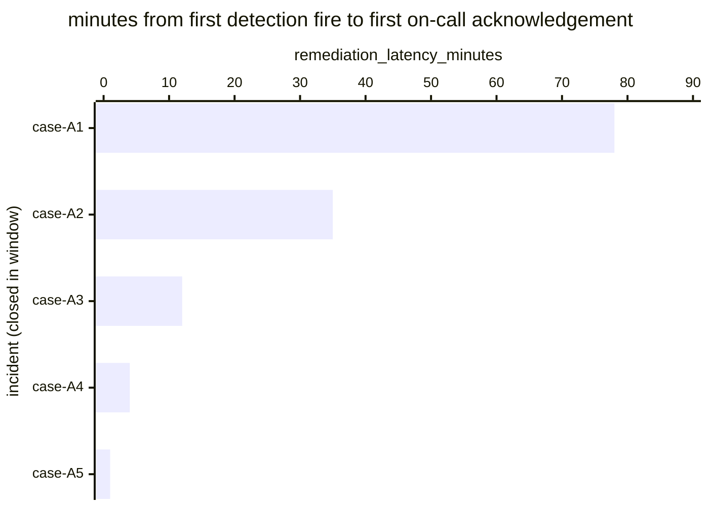

# Reference visualisation — `kpi.mttr_on_call_ack@v1`

This is the committed reference-visualisation artifact for the
on-call-acknowledgement-scoped mean-time-to-respond KPI. It exists so
the G-04 catalog definition-of-done (a *committed* reference
visualisation, not a narrated one) is closed; downstream compile
targets (n8n / Temporal / LangGraph) read the same metric YAML and
render the executable form in their own dashboard surface. The
artifact here is the contract for the chart shape, not the executable
chart.

## Chart kind

Horizontal bar chart, one bar per incident closed within the
evaluation window whose response playbook reached the canonical
on-call acknowledgement step, sorted by `remediation_latency_minutes`
descending so the slowest acknowledgement sits at the top. The `p95`
aggregate is the headline figure operators read first; the
per-incident bars are the supporting drill-down that names *which*
pages waited longest for human acknowledgement.

- **x-axis:** `remediation_latency_minutes` — minutes between
  `first_detection_fire_timestamp` and
  `first_response_action_timestamp` (acknowledge step) for each closed
  in-scope incident in the window.
- **y-axis:** one row per closed in-scope incident, labelled by the
  case `incident.uid`; sorted by latency descending so the worst-case
  incidents sit at the top.
- **Threshold overlays:** the unscoped baseline catalog entry
  (`kpi.mttr_critical@v1`) carries the warn (60 min) and breach (240
  min) thresholds; this scoped variant inherits the threshold-band
  shape but does not redeclare numeric values — on-call
  acknowledgement targets are typically much tighter than the
  unscoped baseline (single-digit minutes) and operators are expected
  to set those in their own scoped overrides.
- **Headline annotation:** the `p95` aggregate across closed in-scope
  incidents at the acknowledge step, annotated as the metric value.

## Reference rendering (Mermaid)

The mermaid block below is the canonical reference rendering — small
enough to live in-tree and renderable directly on the public repo
surface. The numeric values are illustrative; the compile target is
the source of truth for the executable form against operator data.

Reading the bars in this illustrative rendering, referencing the
unscoped baseline thresholds for context:

| case    | remediation_latency_minutes | band (vs. kpi.mttr_critical@v1) | reading                                                |
|---------|-----------------------------|---------------------------------|--------------------------------------------------------|
| case-A1 | 78                          | warn                            | above 60-min warn floor — likely missed first page     |
| case-A2 | 35                          | on-target                       | under 60-min baseline target, above tight ack target   |
| case-A3 | 12                          | on-target                       | typical primary-on-call ack window                     |
| case-A4 | 4                           | on-target                       | first-page ack inside the rotation handover budget     |
| case-A5 | 1                           | on-target                       | immediate ack — primary on-call already engaged        |

The headline `p95` figure here is `≈ 78 min` — that value is what
the catalog aggregation `measurement.aggregation: p95` resolves to
for this snapshot.

## Threshold band reference

This scoped variant does not redeclare numeric thresholds; it inherits
the band shape from the unscoped baseline `kpi.mttr_critical@v1` and
operators almost always set much tighter ack-specific values (often
in single-digit minutes) in their own scoped overrides — the
baseline 60 / 240 minute bands are most useful as the "this rotation
is broken" outer boundary, not the operating target. See `mttr.yaml`
and `mttr.viz.md` for the inherited numeric bands.

## OCSF source-data shape

The chart's underlying observations are derived from the operator's
response pipeline for incidents whose response path reaches the
on-call acknowledgement step. Each closed in-scope incident
contributes one `remediation_latency_minutes` sample computed from
the two inputs declared in `mttr_on_call_ack.yaml`'s
`measurement.inputs`:

- `first_detection_fire` — the first authoritative detection firing
  that opened the incident record at the scoped class. Catalog entry
  is detection-vendor-neutral.
- `first_response_action` — the first playbook step transition whose
  purpose matches the scoped response class (acknowledge). Bound by
  `playbook_step: acknowledge` on the catalog entry; the
  `playbook_refs[]` array anchors the canonical step against
  `playbook.on_call_rotation@v1`
  (`action--30000000-0000-4000-8000-000000000003`).

The unscoped baseline (`kpi.mttr_critical@v1`) is the place a CORE
follow-up will land an OCSF Detection Finding binding for the
detection input; this scoped variant inherits whatever binding lands
there. The reference rendering above remains shape-valid: it reads
two timestamps per incident and computes a duration, regardless of
which OCSF classes carry them.

## Operator override

Operators are expected to render this metric in their own dashboard
idiom — the catalog reference rendering above is the contract for
the chart shape (per-incident horizontal bars, p95 headline,
inherited-band geometry), not the visual style. The compile target
is the source of truth for the executable form.
