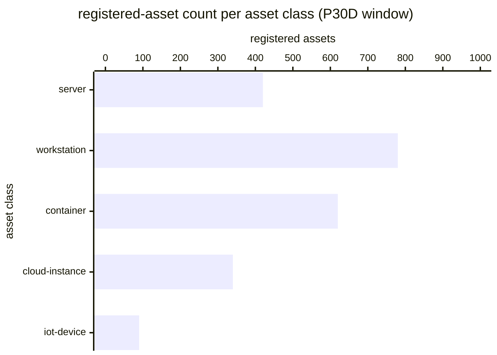

# Reference visualisation — `kri.nis2_asset_inventory_coverage_ratio@v1`

This is the committed reference-visualisation artifact for the NIS2
asset-inventory coverage-ratio KRI. It exists so the G-04 catalog
definition-of-done (a *committed* reference visualisation, not a
narrated one) is closed; downstream compile targets (n8n / Temporal
/ LangGraph) read the same metric YAML and render the executable
form in their own dashboard surface. The artifact here is the
contract for the chart shape, not the executable chart.

## Chart kind

Two-panel composition. The headline panel is a single gauge-style
horizontal bar reading the coverage ratio `|R| / |D|` — the share
of network-visible discovered assets that carry a current entry in
the operator-authoritative inventory. The drill-down panel is a
horizontal bar chart, one row per operator-declared asset class
(server, workstation, container, cloud-instance, iot-device,
other), plotting registered-versus-discovered counts so operators
can see which asset class is dragging the coverage ratio down.
Because this KRI uses `higher_is_better` semantics (see the target
rationale on the YAML), a rising value is the healthy signal that
the operator's asset-management discipline is closing gaps on the
authoritative register.

- **Headline (ratio):** `|R| / |D|` across all discovered live
  assets in the evaluation window; the figure operators read first.
- **Drill-down x-axis:** per-asset-class count (grouped registered
  vs discovered).
- **Drill-down y-axis:** one row per operator-declared asset class
  with at least one discovered asset; sorted ascending on the
  per-class coverage ratio so the worst-covered classes sit at the
  top.
- **Threshold overlay:** vertical lines on the headline gauge at
  the `warn` (0.98), `high` (0.90), and `breach` (0.75) coverage-
  ratio bounds — because the KRI is `higher_is_better`, all three
  bounds sit *below* the target and a value below any line lands
  inside the corresponding band.
- **Headline annotation:** the overall coverage-ratio figure with
  the threshold band it falls in.

## Reference rendering (Mermaid)

The mermaid block below is the canonical reference rendering — small
enough to live in-tree and renderable directly on the public repo
surface. The numeric values are illustrative; the compile target is
the source of truth for the executable form against operator data.

Reading the bars in this illustrative rendering (`|D| = 2540`
discovered live assets across the five classes, `|R| = 2250`
registered on the authoritative snapshot):

| asset class      | discovered | registered | coverage | band                    |
|------------------|------------|------------|----------|-------------------------|
| server           | 425        | 420        | 0.988    | above target            |
| workstation      | 800        | 780        | 0.975    | warn band               |
| container        | 700        | 620        | 0.886    | high band               |
| cloud-instance   | 465        | 340        | 0.731    | breach band             |
| iot-device       | 150        | 90         | 0.600    | breach band             |

The headline `|R| / |D|` figure here is
`2250 / 2540 = 0.886` — inside the high band; the leading signal
to watch is the cloud-instance / iot-device classes dragging the
aggregate down because their reconciliation cadence lags the
network-visible discovery cadence.

## Threshold band reference

| name    | comparator | value (ratio) | severity  |
|---------|------------|---------------|-----------|
| warn    | <          | 0.98          | warn      |
| high    | <          | 0.90          | high      |
| breach  | <          | 0.75          | critical  |

The bands match the `thresholds` array on
`nis2_asset_inventory_coverage_ratio.yaml`; the catalog entry is
the source of truth, this file is the visualisation surface.

## OCSF source-data shape

The chart's underlying observations are derived from OCSF Device
Inventory Info events (`class_uid: 5001`, category `Discovery`)
the operator's asset-management surface emits at each
reconciliation against the documented discovery sources. The
discovered set (`|D|`) is the union of Device Inventory Info
observations at the ingest-inventory-sources step; the registered
set (`|R|`) is the subset that carry an authoritative-source
attribution after the reconcile-authoritative-inventory step. The
catalog entry binds to the OCSF Device Inventory Info class shape,
not to a vendor-specific CMDB or asset-API object.

The binding lives at
`content/telemetry/telemetry.ocsf.device_inventory_info@v1.json`
and is back-referenced from the metric YAML's `telemetry_refs[]`
and from the `discovered_assets` / `registered_assets`
`measurement.inputs[].telemetry_ref`.

## Operator override

Operators are expected to render this metric in their own dashboard
idiom — the catalog reference rendering above is the contract for
the chart shape (coverage-ratio headline gauge with `warn` / `high`
/ `breach` bounds, per-asset-class registered-vs-discovered drill-
down bar chart), not the visual style. The compile target is the
source of truth for the executable form.
