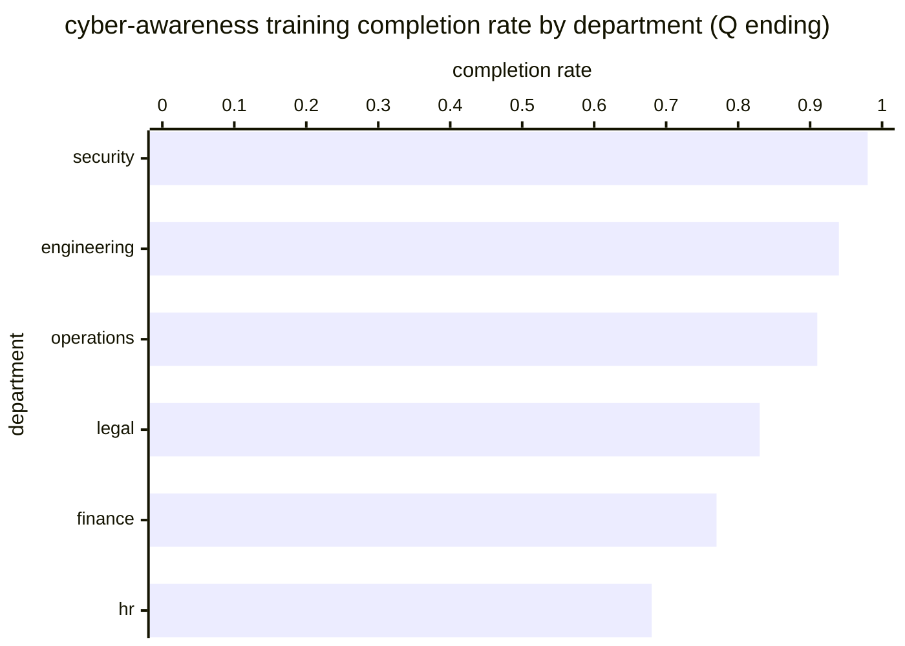

# Reference visualisation — `kpi.nis2_cyber_awareness_training_completion_rate@v1`

This is the committed reference-visualisation artifact for the NIS2
cyber-awareness training completion-rate KPI. It exists so the G-04
catalog definition-of-done (a *committed* reference visualisation,
not a narrated one) is closed; downstream compile targets (n8n /
Temporal / LangGraph) read the same metric YAML and render the
executable form in their own dashboard surface. The artifact here
is the contract for the chart shape, not the executable chart.

## Chart kind

Two-panel composition. The headline panel is a single gauge-style
horizontal bar reading the completion-rate ratio `(|R| - |D|) /
|R|` — the share of in-scope staff (R) with no mandatory-awareness-
training-overdue Compliance Finding open at cycle close (D). The
drill-down panel is a horizontal bar chart, one row per operator-
declared department (or cohort) as carried on the training-roster
snapshot, plotting the per-department completion rate for the
current training cycle. Because the KPI is `higher_is_better`, a
rising value is the healthy signal that the operator's awareness
programme is discharging the NIS2 Art. 21(2)(g) obligation on the
declared roster.

- **Headline (ratio):** `(|R| - |D|) / |R|` across the in-scope
  training roster at cycle close; the figure operators read first.
- **Drill-down x-axis:** per-department completion rate in the cycle.
- **Drill-down y-axis:** one row per operator-declared department
  or cohort with at least one in-scope staff member; sorted
  ascending so the departments closest to the warn / high / breach
  bounds sit at the top of the chart.
- **Threshold overlay:** vertical lines on the drill-down at the
  `warn` (0.95), `high` (0.85), and `breach` (0.70) completion-rate
  bounds — because the KPI is `higher_is_better`, all three bounds
  sit *below* the target and a value below any line lands inside
  the corresponding band.
- **Headline annotation:** the overall completion-rate figure with
  the threshold band it falls in.

## Reference rendering (Mermaid)

The mermaid block below is the canonical reference rendering — small
enough to live in-tree and renderable directly on the public repo
surface. The numeric values are illustrative; the compile target is
the source of truth for the executable form against operator data.

Reading the bars in this illustrative rendering (in-scope roster
`|R| = 480` staff across the six departments, `|D| = 42`
mandatory-awareness-training-overdue Compliance Findings open at
cycle close):

| department   | in-scope | completed | rate  | band                                |
|--------------|----------|-----------|-------|-------------------------------------|
| security     | 40       | 39        | 0.98  | above target                        |
| engineering  | 120      | 113       | 0.94  | warn band                           |
| operations   | 80       | 73        | 0.91  | warn band                           |
| legal        | 100      | 83        | 0.83  | high band                           |
| finance      | 60       | 46        | 0.77  | high band                           |
| hr           | 80       | 54        | 0.68  | breach band                         |

The headline `(|R| - |D|) / |R|` figure here is `(480 - 42) / 480 =
0.913` — inside the warn band; a per-cycle drift toward the high
bound (0.85) is the leading signal the training pipeline is
slipping against the declared cadence.

## Threshold band reference

| name    | comparator | value (ratio) | severity  |
|---------|------------|---------------|-----------|
| warn    | <          | 0.95          | warn      |
| high    | <          | 0.85          | high      |
| breach  | <          | 0.70          | critical  |

The bands match the `thresholds` array on
`nis2_cyber_awareness_training_completion_rate.yaml`; the catalog
entry is the source of truth, this file is the visualisation
surface.

## OCSF source-data shape

The chart's underlying observations are derived from two OCSF
classes emitted by the cyber_hygiene_training playbook:

- **API Activity (6003)** at the inventory-training-roster step for
  the in-scope roster read against the operator's HR / identity
  source (`__roster_id__` binding); the catalog entry does not
  bind to a vendor-specific HR object.
- **Compliance Finding (2003)** at the track-completion step for
  each per-staff mandatory-awareness-training-overdue deviation
  emitted against the cycle assignments; the catalog entry binds
  to the OCSF Compliance Finding class shape, not to a vendor-
  specific LMS completion object.

The bindings live at
`content/telemetry/telemetry.ocsf.api_activity@v1.json` and
`content/telemetry/telemetry.ocsf.compliance_finding@v1.json` and
are back-referenced from the metric YAML's `telemetry_refs[]` and
from the `in_scope_roster` / `completion_deviation`
`measurement.inputs[].telemetry_ref`.

## Operator override

Operators are expected to render this metric in their own dashboard
idiom — the catalog reference rendering above is the contract for
the chart shape (completion-rate headline gauge with `warn` /
`high` / `breach` bounds, per-department drill-down bar chart), not
the visual style. The compile target is the source of truth for the
executable form.
