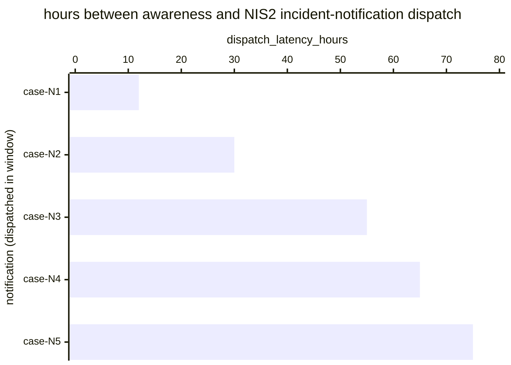

# Reference visualisation — `kri.nis2_incident_notification_latency_hours@v1`

This is the committed reference-visualisation artifact for the NIS2
Article 23(4)(b) 72-hour incident-notification dispatch-latency KRI.
It exists so the G-04 catalog definition-of-done (a *committed*
reference visualisation, not a narrated one) is closed; downstream
compile targets (n8n / Temporal / LangGraph) read the same metric
YAML and render the executable form in their own dashboard surface.
The artifact here is the contract for the chart shape, not the
executable chart.

## Chart kind

Two-panel composition. The headline panel is a single gauge-style
horizontal bar reading the max dispatch latency (`hours`) across NIS2
Art. 23(4)(b) incident-notifications dispatched in the evaluation
window, plotted against the catalog `warn` / `high` / `breach`
thresholds (48h / 60h / 72h) and the statutory 72-hour bound.
Direction is `lower_is_better`: a max reading beyond 72 hours is a
statutory overrun. The drill-down panel is a horizontal bar chart,
one bar per incident-notification dispatched in the window, plotting
`dispatch_latency_hours` — hours between the awareness timestamp and
the CSIRT / competent-authority submission.

- **Headline (max):** the worst-case latency across dispatches in the
  window. This is the figure the operator's risk surface reads
  first — the case that came closest to (or beyond) the statutory
  wall.
- **Drill-down x-axis:** `dispatch_latency_hours` — hours between
  operator awareness and incident-notification dispatch. Positive
  values grow towards the 72-hour bound.
- **Drill-down y-axis:** one row per incident-notification dispatched
  in the window, labelled by the case `incident.uid`; sorted
  descending so the longest latencies (and any overruns) sit at the
  top — the cases that lift the max.
- **Threshold overlay (drill-down):** three vertical lines at 48h
  (warn), 60h (high), and 72h (breach / statutory bound). Bars right
  of the 72h line are statutory overruns and require a "reasons for
  the delay" record on the CSIRT / competent-authority submission.

## Reference rendering (Mermaid)

The mermaid block below is the canonical reference rendering — small
enough to live in-tree and renderable directly on the public repo
surface. The numeric values are illustrative; the compile target is
the source of truth for the executable form against operator data.

Reading the bars in this illustrative rendering:

| case    | dispatch_latency_hours | band     | reading                                                       |
|---------|------------------------|----------|---------------------------------------------------------------|
| case-N1 | 12                     | ok       | dispatched inside 48h — comfortable slack                     |
| case-N2 | 30                     | ok       | dispatched inside 48h — comfortable slack                     |
| case-N3 | 55                     | warn     | above 48h — leading signal, still inside statutory bound      |
| case-N4 | 65                     | high     | above 60h — approaching the 72-hour statutory wall            |
| case-N5 | 75                     | breach   | above 72h — statutory overrun, reasons-for-delay required     |

With one overrun in the window the max resolves to `75` hours — inside
the `breach` band (`> 72`). That value is what the catalog aggregation
`measurement.aggregation: max` resolves to for this snapshot.

## Threshold band reference

| name   | comparator | value | severity |
|--------|------------|-------|----------|
| warn   | >          | 48    | warn     |
| high   | >          | 60    | high     |
| breach | >          | 72    | critical |

The bands match the `thresholds` array on
`nis2_incident_notification_latency_hours.yaml`; the catalog entry is
the source of truth, this file is the visualisation surface. The
catalog `target` (`<= 72`) is the statutory ceiling every dispatch is
expected to clear.

## OCSF source-data shape

The chart's underlying observations are derived from the operator's
NIS2 CSIRT / competent-authority notification chain. Each incident-
notification dispatched in the evaluation window contributes one
`dispatch_latency_hours` sample computed from the two inputs declared
in `nis2_incident_notification_latency_hours.yaml`'s
`measurement.inputs`:

- `awareness_timestamp` — operator-awareness timestamp emitted by the
  NIS2 incident-handling process when a candidate incident crosses
  the significant-incident threshold under Art. 23(3), used as the
  start of the 72-hour clock. Bound to
  `telemetry.ocsf.compliance_finding@v1` field `start_time` on the
  incident-notification submission event.
- `notification_dispatch` — the regulator-notification chain step
  transition that dispatches the incident notification to the CSIRT
  or, where applicable, the competent authority. Bound to
  `telemetry.ocsf.compliance_finding@v1` field `time` on the
  incident-notification submission event.

The latency samples that drive the max headline are
`notification_dispatch.time - awareness_timestamp.start_time`
converted to hours.

## Operator override

Operators are expected to render this metric in their own dashboard
idiom — the catalog reference rendering above is the contract for
the chart shape (max headline, per-dispatch horizontal bars, three
statutory-clock threshold overlays), not the visual style. The
compile target is the source of truth for the executable form.
