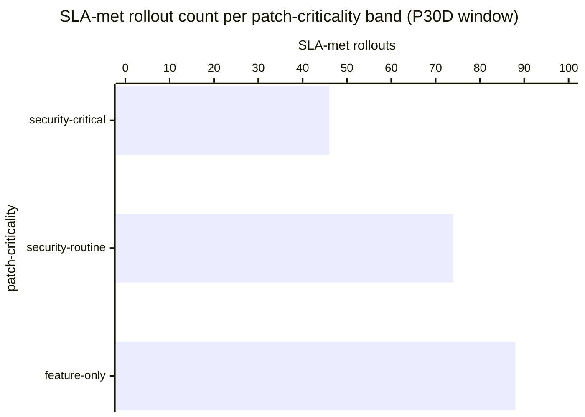

# Reference visualisation — `kpi.nis2_patch_cadence_compliance_rate@v1`

This is the committed reference-visualisation artifact for the NIS2
patch-cadence SLA compliance-rate KPI. It exists so the G-04 catalog
definition-of-done (a *committed* reference visualisation, not a
narrated one) is closed; downstream compile targets (n8n / Temporal
/ LangGraph) read the same metric YAML and render the executable
form in their own dashboard surface. The artifact here is the
contract for the chart shape, not the executable chart.

## Chart kind

Two-panel composition. The headline panel is a single gauge-style
horizontal bar reading the aggregate compliance ratio
`|{rollouts within_sla}| / |{rollouts closed}|` — the share of
rollouts that closed inside the per-severity SLA window declared by
the operator's patch-cadence policy. The drill-down panel is a
horizontal stacked-bar chart, one row per patch-criticality band
(security-critical, security-routine, feature-only, plus the
unclassified sentinel when present), plotting SLA-met versus
overdue counts side-by-side so operators can see which severity
band drove the aggregate reading. Because the KPI is
`higher_is_better`, a rising value is the healthy signal that the
operator's staged-rollout discipline is holding the documented
per-severity cadence.

- **Headline (ratio):** `|{within_sla}| / |{closed}|` across all
  rollouts in the evaluation window; the figure operators read first.
- **Drill-down x-axis:** per-severity rollout count (stacked
  SLA-met / overdue).
- **Drill-down y-axis:** one row per patch-criticality band with at
  least one rollout closed in the window; sorted from strictest
  cadence (security-critical) at the top to the loosest
  (feature-only) at the bottom.
- **Threshold overlay:** vertical lines on the headline gauge at
  the `warn` (0.90), `high` (0.75), and `breach` (0.50) compliance-
  rate bounds — because the KPI is `higher_is_better`, all three
  bounds sit *below* the target and a value below any line lands
  inside the corresponding band.
- **Headline annotation:** the overall compliance-rate figure with
  the threshold band it falls in.

## Reference rendering (Mermaid)

The mermaid block below is the canonical reference rendering — small
enough to live in-tree and renderable directly on the public repo
surface. The numeric values are illustrative; the compile target is
the source of truth for the executable form against operator data.

Reading the bars in this illustrative rendering (`|{closed}| = 220`
rollouts across the three severity bands, `|{within_sla}| = 208`
inside the per-severity SLA window):

| severity           | closed | SLA-met | overdue | rate  | SLA window (default) |
|--------------------|--------|---------|---------|-------|----------------------|
| security-critical  | 50     | 46      | 4       | 0.92  | <= 7 days            |
| security-routine   | 80     | 74      | 6       | 0.93  | <= 30 days           |
| feature-only       | 90     | 88      | 2       | 0.98  | <= 90 days           |

The headline aggregate figure here is
`208 / 220 = 0.945` — above the warn bound (0.90); the leading
signal to watch is the security-critical band (46/50 = 0.92) drifting
toward the warn bound, which would drop the aggregate into the warn
band before feature-only overdue counts move.

## Threshold band reference

| name    | comparator | value (ratio) | severity  |
|---------|------------|---------------|-----------|
| warn    | <          | 0.90          | warn      |
| high    | <          | 0.75          | high      |
| breach  | <          | 0.50          | critical  |

The bands match the `thresholds` array on
`nis2_patch_cadence_compliance_rate.yaml`; the catalog entry is
the source of truth, this file is the visualisation surface.

## OCSF source-data shape

The chart's underlying observations are derived from two OCSF
classes emitted by the patch_management playbook:

- **API Activity (6003)** at the detect-patch-availability step for
  the advisory-observation timestamp against the operator's
  advisory-intake surface (the SLA-clock start); the catalog entry
  does not bind to a vendor-specific advisory-feed object.
- **Operating System Patch State (5004)** at the evidence-capture
  step for the rollout-close observation; the catalog entry binds
  to the OCSF Operating System Patch State class shape, not to a
  vendor-specific patch-management API object.

The bindings live at
`content/telemetry/telemetry.ocsf.api_activity@v1.json` and
`content/telemetry/telemetry.ocsf.patch_state@v1.json` and are
back-referenced from the metric YAML's `telemetry_refs[]` and from
the `advisory_awareness` / `rollout_close`
`measurement.inputs[].telemetry_ref`.

## Operator override

Operators are expected to render this metric in their own dashboard
idiom — the catalog reference rendering above is the contract for
the chart shape (aggregate SLA-met headline gauge with `warn` /
`high` / `breach` bounds, per-severity stacked-bar drill-down), not
the visual style. The compile target is the source of truth for the
executable form.
