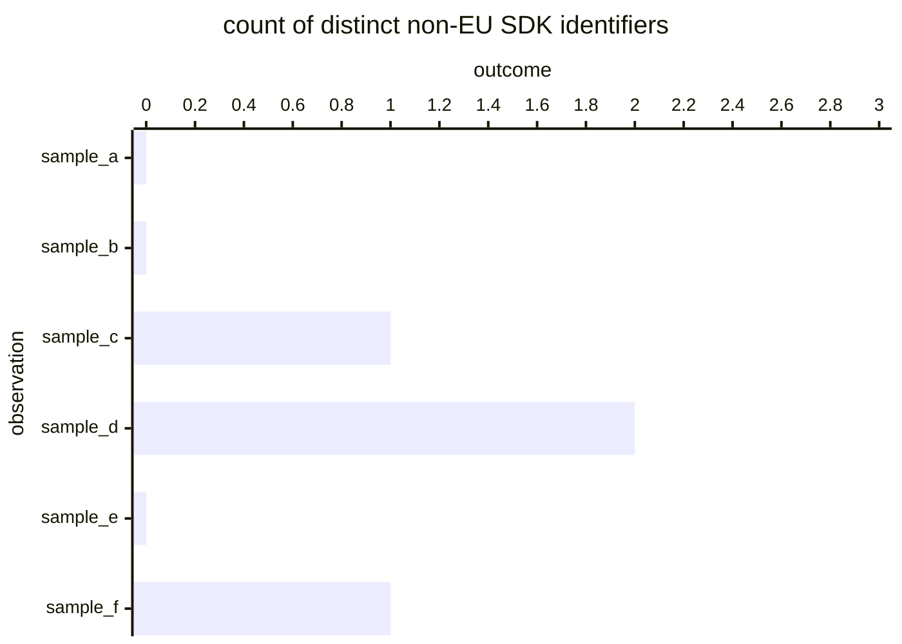

# Reference visualisation — `kri.non_eu_vendor_sdk_exposure@v1`

This is the committed reference-visualisation artifact for the
distinct non-EU vendor SDK identifiers referenced from compiled artifacts KRI. It exists so the G-04 catalog
definition-of-done (a *committed* reference visualisation, not a
narrated one) is closed; downstream compile targets (n8n / Temporal /
LangGraph) read the same metric YAML and render the executable form
in their own dashboard surface. The artifact here is the contract for
the chart shape, not the executable chart.

## Chart kind

Bar chart of per-observation outcomes contributing to the headline
`count` aggregate for `kri.non_eu_vendor_sdk_exposure@v1`. Each bar plots one observation
of the shape declared under `measurement.inputs` on the catalog YAML;
the headline aggregate is the `count` roll-up across the bars per the
catalog `measurement.aggregation`. Direction `lower_is_better` fixes the
colour convention — lower bars are better.

## Reference rendering (Mermaid)

The mermaid block below is the canonical reference rendering — small
enough to live in-tree and renderable directly on the public repo
surface. The numeric values are illustrative; the compile target is
the source of truth for the executable form against the artifacts
declared in `measurement.inputs`.

## Threshold band reference

| name | comparator | value | severity |
|------|------------|-------|----------|
| warn | > | 0 | warn |
| breach | >= | 3 | high |

The bands match the `thresholds` array on `non_eu_vendor_sdk_exposure.yaml`; the catalog
entry is the source of truth, this file is the visualisation surface.

## Source-data shape

The chart's underlying observations are derived from the inputs
declared under `measurement.inputs` on `non_eu_vendor_sdk_exposure.yaml`. Each observation
contributes one bar to the drill-down; the headline aggregate is
computed per the catalog `measurement.aggregation`. The catalog
window is the tumbling / sliding window declared under
`measurement.window`, so operators can compare readings across
comparable windows without re-litigating the shape.

## Operator override

Operators are expected to render this metric in their own dashboard
idiom — the catalog reference rendering above is the contract for
the chart shape, not the visual style. The compile target is the
source of truth for the executable form against the artifacts the
catalog entry binds to.
