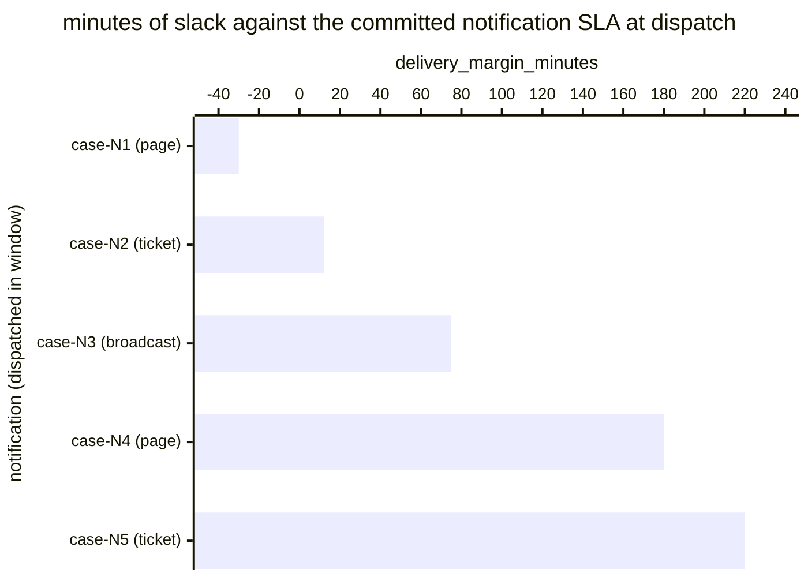

# Reference visualisation — `kpi.notification_sla_compliance@v1`

This is the committed reference-visualisation artifact for the
operator-facing notification SLA compliance KPI. It exists so the
G-04 catalog definition-of-done (a *committed* reference
visualisation, not a narrated one) is closed; downstream compile
targets (n8n / Temporal / LangGraph) read the same metric YAML and
render the executable form in their own dashboard surface. The
artifact here is the contract for the chart shape, not the executable
chart.

## Chart kind

Two-panel composition. The headline panel is a single gauge-style
horizontal bar reading the on-time-delivery rate (`ratio`) across
operator-facing notifications dispatched within the evaluation
window. The drill-down panel is a horizontal bar chart, one bar per
notification dispatched in the window, plotting
`delivery_margin_minutes` — minutes between the dispatch timestamp
and the notification's committed SLA deadline. Positive bars are
on-time slack; negative bars are SLA misses and contribute the
failing samples that pull the ratio below 1.00. Slicing by
`notification_channel` (paging, ticketing, stakeholder broadcast) is
the canonical drill-down dimension because each channel typically
carries its own committed SLA.

- **Headline (ratio):** the `ratio` aggregate across in-scope
  operator-facing notifications dispatched in the window. This is
  the figure operators read first.
- **Drill-down x-axis:** `delivery_margin_minutes` — minutes
  remaining at dispatch against the notification's committed SLA.
  Positive values left-to-right are on-time slack; negative values
  left of zero are SLA misses.
- **Drill-down y-axis:** one row per dispatched notification in the
  window, labelled by the case `incident.uid` and notification
  channel; sorted ascending so the slimmest margins (and any misses)
  sit at the top — the cases that are about to break the rate.
- **Threshold overlay (drill-down):** a vertical line at zero — every
  bar left of zero is a sample that failed the SLA and contributes a
  `1` to the denominator without contributing a `1` to the numerator.
  Operators reading the drill-down see *which* notifications pulled
  the ratio off 1.00.

## Reference rendering (Mermaid)

The mermaid block below is the canonical reference rendering — small
enough to live in-tree and renderable directly on the public repo
surface. The numeric values are illustrative; the compile target is
the source of truth for the executable form against operator data.

Reading the bars in this illustrative rendering:

| case (channel)          | delivery_margin_minutes | on-time? | reading                                                   |
|-------------------------|-------------------------|----------|-----------------------------------------------------------|
| case-N1 (page)          | -30                     | no       | paging SLA missed — 30 min late                           |
| case-N2 (ticket)        | 12                      | yes      | dispatched 12 min before deadline — thin slack            |
| case-N3 (broadcast)     | 75                      | yes      | comfortable slack on stakeholder broadcast                |
| case-N4 (page)          | 180                     | yes      | early dispatch, healthy slack                             |
| case-N5 (ticket)        | 220                     | yes      | well under the ticketing SLA                              |

With one miss across five dispatches, the headline `ratio` resolves
to `4 / 5 = 0.80` in this snapshot. That value is what the catalog
aggregation `measurement.aggregation: ratio` resolves to for this
snapshot.

## Threshold band reference

The catalog entry at `notification_sla_compliance.yaml` is
recipient-neutral and does not declare numeric warn / breach
thresholds at the unscoped baseline — the operator's
notification-channel policy is the source of truth for the
per-channel SLA, and the catalog ratio reflects the share of
notifications that hit that policy. Channel-scoped variants (for
example a paging-scoped notification SLA compliance indicator)
declare numeric bands and live as separate catalog entries. The
catalog YAML at `content/metrics/notification_sla_compliance.yaml`
remains the source of truth for the indicator shape; this file is
the visualisation surface.

## OCSF source-data shape

The chart's underlying observations are derived from the operator's
notification pipeline. Each operator-facing notification dispatched
within the evaluation window contributes one
`delivery_margin_minutes` sample computed against the
`measurement.inputs` declared on `notification_sla_compliance.yaml`:

- **numerator** — count of dispatched notifications whose dispatch
  timestamp landed earlier than (notification scheduled-at +
  committed SLA). The dispatch event is bound to the operator-facing
  notification step transitions declared on the catalog entry's
  `playbook_refs`:
  - `playbook.data_exfil@v1`
    `action--20000000-0000-4000-8000-000000000007` — stakeholder
    notification step on the data-exfiltration playbook;
  - `playbook.data_exfil@v1`
    `action--20000000-0000-4000-8000-000000000008` — paging /
    on-call step on the data-exfiltration playbook;
  - `playbook.ransomware_containment@v1`
    `action--30000000-0000-4000-8000-000000000009` — operator-facing
    notification step on the ransomware-containment playbook.
- **denominator** — count of in-scope notifications due within the
  evaluation window per the operator's notification policy. Exclude
  notifications whose dispatch step never fired (record-keeping gap)
  so the indicator does not silently improve when the notification
  channel stalls.

The catalog entry deliberately does not pin a single OCSF telemetry
binding at the unscoped baseline: operator-facing notifications are
carried by an operator's own paging / ticketing / broadcast channel,
and there is no unambiguous OCSF event class that covers the
intersection of those channels at the catalog level. The deferral is
named honestly — the playbook step transition is the binding for the
dispatch event, not an OCSF class. A CORE follow-up may add an OCSF
binding for channel-scoped variants once the operator's channel is
declared.

The reference rendering above remains shape-valid: it reads two
timestamps per dispatched notification (the dispatch timestamp and
the SLA deadline) and computes a duration, regardless of which
channel the operator's compile target resolves the dispatch event
against.

## Operator override

Operators are expected to render this metric in their own dashboard
idiom — the catalog reference rendering above is the contract for
the chart shape (ratio headline, per-notification dispatch-margin
drill-down sliced by notification channel, zero-line on-time
overlay), not the visual style. The compile target is the source of
truth for the executable form.
