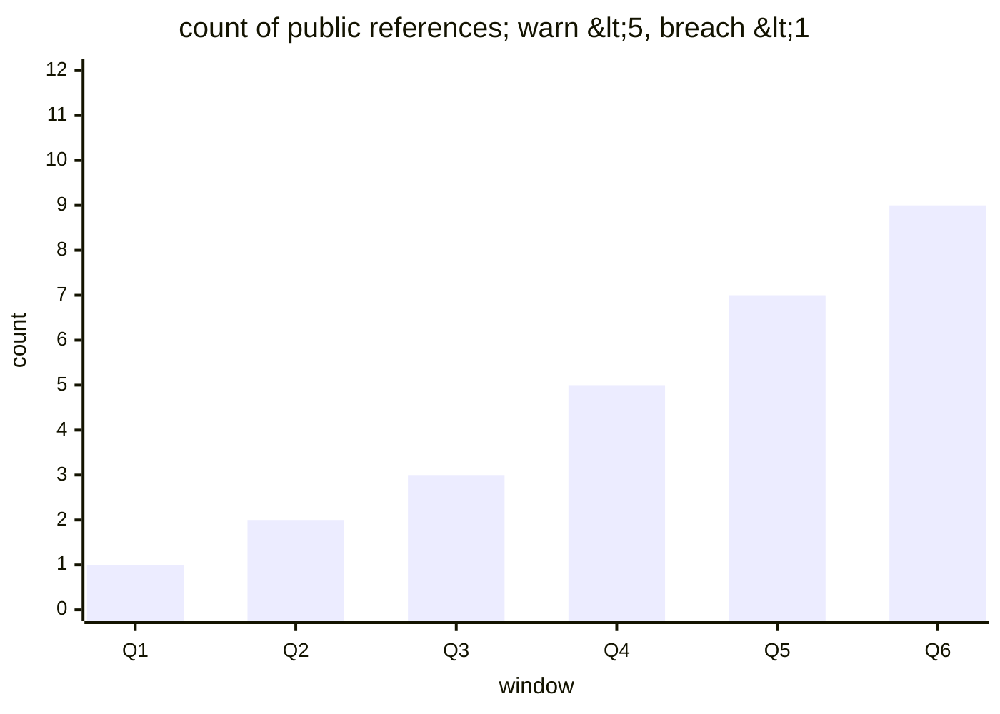

# Reference visualisation — `kpi.operator_adoption_reference_count@v1`

This is the committed reference-visualisation artifact for the
publicly-attestable operator adoption reference count KPI. It exists
so the G-04 catalog definition-of-done (a *committed* reference
visualisation, not a narrated one) is closed; downstream compile
targets (n8n / Temporal / LangGraph) read the same metric YAML and
render the executable form in their own dashboard surface. The
artifact here is the contract for the chart shape, not the executable
chart.

## Chart kind

Stacked-bar chart of the per-window reference count contributing to
the headline `count` aggregate for
`kpi.operator_adoption_reference_count@v1`. Each bar plots one
evaluation window (default P90D tumbling) partitioned by
`evidence_type` — the shape declared under `measurement.inputs` on
the catalog YAML — so the total-count envelope decomposes into its
constituent public signals. Direction `higher_is_better` fixes the
colour convention — taller bars are better.

## Reference rendering (Mermaid)

The mermaid block below is the canonical reference rendering — small
enough to live in-tree and renderable directly on the public repo
surface. The numeric values are illustrative; the compile target is
the source of truth for the executable form against the artifacts
declared in `measurement.inputs`.

## Threshold band reference

| name | comparator | value | severity |
|------|------------|-------|----------|
| warn | < | 5 | warn |
| breach | < | 1 | high |

The bands match the `thresholds` array on
`operator_adoption_reference_count.yaml`; the catalog entry is the
source of truth, this file is the visualisation surface.

## Source-data shape

The chart's underlying observations are derived from the inputs
declared under `measurement.inputs` on
`operator_adoption_reference_count.yaml`. Registry rows are read from
the shipped `USED-BY.md` at the evaluation commit; talks, papers,
blog posts, and public repositories are read from the operator's
declared feed list. Only public artifacts qualify per the `USED-BY.md`
policy — private links are excluded at ingest. The catalog window is
the tumbling window declared under `measurement.window`, so operators
can compare readings across comparable windows without re-litigating
the shape.

## Operator override

Operators are expected to render this metric in their own dashboard
idiom — the catalog reference rendering above is the contract for
the chart shape, not the visual style. The compile target is the
source of truth for the executable form against the artifacts the
catalog entry binds to.
