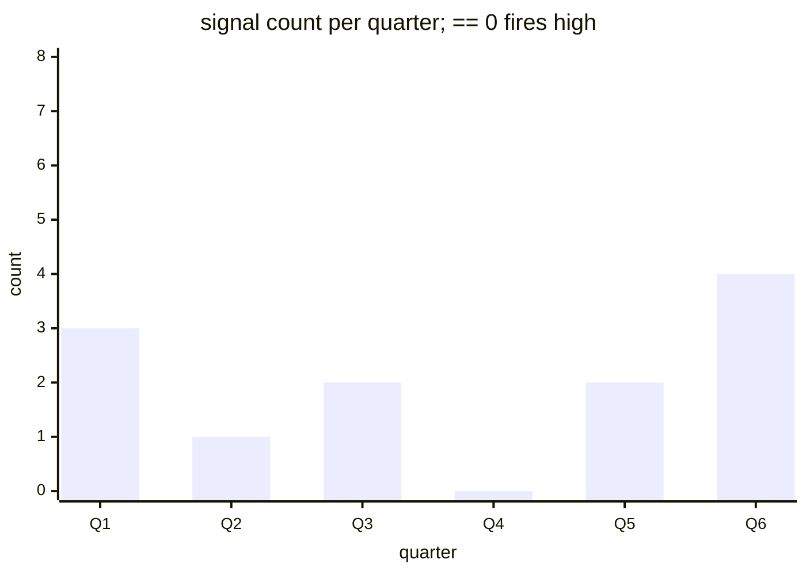

# Reference visualisation — `kri.operator_adoption_zero_signals@v1`

This is the committed reference-visualisation artifact for the
zero-quarterly-deployment-signals operator-adoption KRI. It exists so
the G-04 catalog definition-of-done (a *committed* reference
visualisation, not a narrated one) is closed; downstream compile
targets (n8n / Temporal / LangGraph) read the same metric YAML and
render the executable form in their own dashboard surface. The
artifact here is the contract for the chart shape, not the executable
chart.

## Chart kind

Stacked-bar chart of the per-quarter deployment-signal count
contributing to the headline `count` aggregate for
`kri.operator_adoption_zero_signals@v1`. Each bar plots one quarterly
evaluation window partitioned by signal_type — the shape declared
under `measurement.inputs` on the catalog YAML — so the total-count
envelope decomposes into its constituent public signals. Direction
`lower_is_better` fixes the colour convention: the fire condition is
a bar of height zero, not a tall bar.

## Reference rendering (Mermaid)

The mermaid block below is the canonical reference rendering — small
enough to live in-tree and renderable directly on the public repo
surface. The numeric values are illustrative; the compile target is
the source of truth for the executable form against the artifacts
declared in `measurement.inputs`.

## Threshold band reference

| name | comparator | value | severity |
|------|------------|-------|----------|
| quarterly_high | == | 0 | high |

The band matches the `thresholds` array on
`operator_adoption_zero_signals.yaml`; the catalog entry is the
source of truth, this file is the visualisation surface.

## Source-data shape

The chart's underlying observations are derived from the inputs
declared under `measurement.inputs` on
`operator_adoption_zero_signals.yaml`. Deployment-question discussion
threads are read from the shipped
`.github/DISCUSSION_TEMPLATE/` at the evaluation commit;
deployment-tagged issues, `USED-BY.md` pull-requests, and
community-forum references are read from the operator's declared feed
list. Only public artifacts qualify — login-walled forums are excluded
at ingest. The catalog window is the quarterly tumbling window
declared under `measurement.window`, so operators can compare
readings across comparable windows without re-litigating the shape.

## Operator override

Operators are expected to render this metric in their own dashboard
idiom — the catalog reference rendering above is the contract for
the chart shape, not the visual style. The compile target is the
source of truth for the executable form against the artifacts the
catalog entry binds to.
