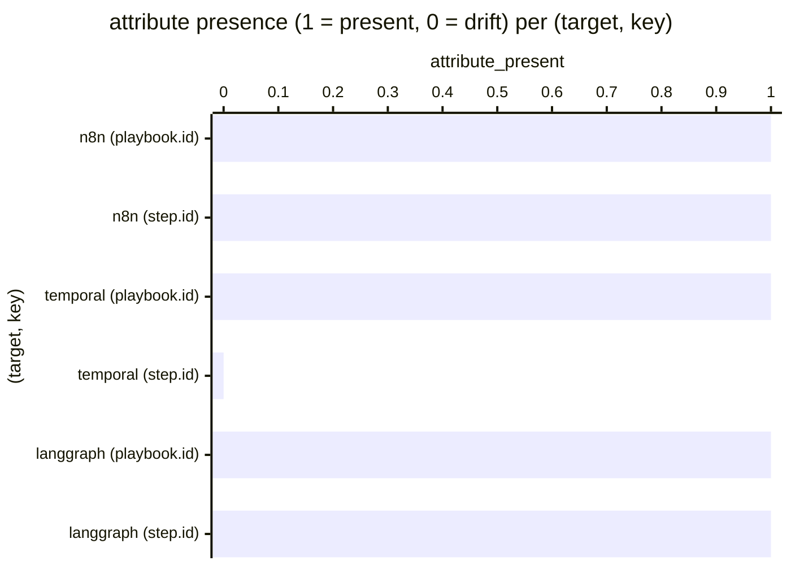

# Reference visualisation — `kri.otel_span_attribute_schema_drift@v1`

This is the committed reference-visualisation artifact for the OTel
span-attribute schema drift KRI. It exists so the G-04 catalog
definition-of-done (a *committed* reference visualisation, not a
narrated one) is closed; downstream compile targets (n8n / Temporal /
LangGraph) read the same metric YAML and render the executable form
in their own dashboard surface. The artifact here is the contract for
the chart shape, not the executable chart.

## Chart kind

Two-panel composition. The headline panel is a single gauge-style
horizontal bar reading the `count` of (target, key) pairs on the
evaluation commit where the emitted artifact under
``examples/<target>/<workflow>/`` does not attach the canonical
``secops_ng.*`` span-attribute key declared in the shared helper
module at ``compilers/_shared/observability.py`` (``SPAN_ATTR_KEYS``).
The drill-down panel is a horizontal bar chart, one bar per
(target, key) pair observed, plotting the attribute-presence outcome
encoded as `1` (the canonical key is attached on the appropriate
span) or `0` (drift — the key is absent or the emitter attaches a
key outside the shared tuple). Bars at `0` contribute the count
headline; bars at `1` do not. Slicing by compile target (n8n /
temporal / langgraph) is the canonical drill-down dimension because
the F-CR-04 acceptance criterion pins the shared helper as the
single source of truth across the three reference compile targets.

- **Headline (count):** the `count` aggregate of distinct
  (target, key) pairs that drifted from the shared tuple on the
  evaluation commit. Because the KRI is `lower_is_better`, a
  reading of `0` is the floor (target value) and any positive
  reading is an open F-CR-04 / FOUNDATION §2 exposure on the
  commit under evaluation.
- **Drill-down x-axis:** one row per (target, key) pair observed,
  labelled by the compile target and the canonical attribute key
  (e.g. `secops_ng.playbook.id`, `secops_ng.step.id`); sorted
  ascending so the drift samples sit at the top — the (target, key)
  pairs that pulled the count off `0`.
- **Drill-down y-axis:** attribute-presence encoding (`0` = drift,
  `1` = the canonical key is attached on the appropriate span in
  the committed reference artifact under
  ``examples/<target>/<workflow>/``).
- **Threshold overlay (drill-down):** a horizontal line at `1` —
  every bar below the line is a drift sample that contributes a `1`
  to the count. Operators reading the drill-down see *which*
  (target, key) pairs pulled the KRI off `0`.

## Reference rendering (Mermaid)

The mermaid block below is the canonical reference rendering — small
enough to live in-tree and renderable directly on the public repo
surface. The numeric values are illustrative; the compile target is
the source of truth for the executable form against the shared
helper and the per-example golden suite at evaluation time.

Reading the bars in this illustrative rendering:

| (target, key)                       | attribute_present | drift? | reading                                                                |
|-------------------------------------|-------------------|--------|------------------------------------------------------------------------|
| n8n (`secops_ng.playbook.id`)       | 1                 | no     | n8n emitter attaches the canonical playbook-id key                     |
| n8n (`secops_ng.step.id`)           | 1                 | no     | n8n emitter attaches the canonical step-id key                         |
| temporal (`secops_ng.playbook.id`)  | 1                 | no     | temporal emitter attaches the canonical playbook-id key                |
| temporal (`secops_ng.step.id`)      | 0                 | yes    | temporal emitter does not attach the canonical step-id key on activity spans |
| langgraph (`secops_ng.playbook.id`) | 1                 | no     | langgraph emitter attaches the canonical playbook-id key               |
| langgraph (`secops_ng.step.id`)     | 1                 | no     | langgraph emitter attaches the canonical step-id key                   |

With one drift across six pairs, the headline `count` resolves to
`1` in this snapshot. Because direction is `lower_is_better`, a
higher reading is worse — every drifted (target, key) pair is an
open F-CR-04 / FOUNDATION §2 exposure on the commit under
evaluation. That value is what the catalog aggregation
`measurement.aggregation: count` resolves to for this snapshot.

## Threshold band reference

| name   | comparator | value (count) | severity |
|--------|------------|---------------|----------|
| warn   | >=         | 1             | warn     |
| breach | >=         | 3             | high     |

The bands match the `thresholds` array on
`otel_span_attribute_schema_drift.yaml`; the catalog entry is the
source of truth, this file is the visualisation surface. The `warn`
band fires on any drift; the `breach` band fires at three or more
drifted (target, key) pairs, the level at which schema disagreement
across the three reference compile targets stops being a single
emitter omission and becomes a systemic drift in the shared helper's
intent.

## Source-data shape

The chart's underlying observations are derived from two artifacts
already shipped in the framework, per the `measurement.inputs`
declared on `otel_span_attribute_schema_drift.yaml`:

- **`shared_attribute_schema`** — the ``SPAN_ATTR_KEYS`` tuple in
  ``compilers/_shared/observability.py``. The tuple is the single
  source of truth for the canonical ``secops_ng.*`` key namespace
  each reference compile target attaches on its emitted spans, and
  is itself pinned by ``tests/compilers/_shared/test_observability.py``.
- **`per_example_otel_wrapping_assertion`** — per-example
  byte-parity golden assertion that covers the emitted OTel
  wrapping block. Under F-CR-04, the per-example byte-parity
  goldens under ``tests/examples/`` cover the emitted
  instrumentation so any regression in the OTel wrapping flips a
  test red; a red wrapping assertion against the canonical
  reference artifact under ``examples/<target>/<workflow>/``
  increments the count.

Per-(target, key) observations are counted once per evaluation
commit; the catalog window is `P1D` and tumbling because the
schema and the per-example goldens are evaluated against a
discrete commit, not against an operator's runtime telemetry
stream.

## Operator override

Operators are expected to render this metric in their own dashboard
idiom — the catalog reference rendering above is the contract for
the chart shape (count headline, per-(target, key) attribute-
presence drill-down sliced by compile target, presence-floor
overlay at `1`), not the visual style. The compile target is the
source of truth for the executable form.
