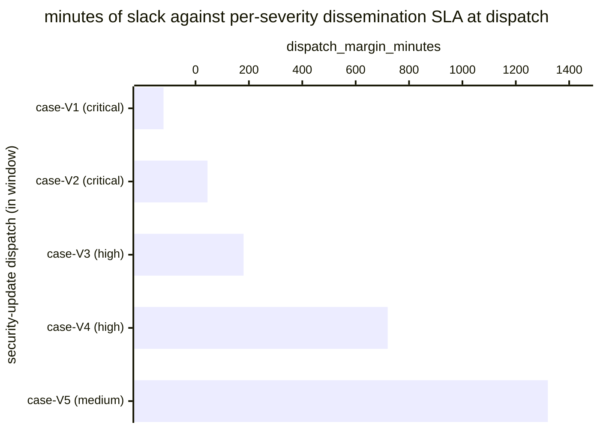

# Reference visualisation — `kpi.patch_disseminated_on_time@v1`

This is the committed reference-visualisation artifact for the
security-update dissemination on-time KPI. It exists so the G-04
catalog definition-of-done (a *committed* reference visualisation,
not a narrated one) is closed; downstream compile targets (n8n /
Temporal / LangGraph) read the same metric YAML and render the
executable form in their own dashboard surface. The artifact here is
the contract for the chart shape, not the executable chart.

## Chart kind

Two-panel composition. The headline panel is a single gauge-style
horizontal bar reading the on-time-dispatch rate (`ratio`) across
security-update dispatches in the evaluation window. The drill-down
panel is a horizontal bar chart, one bar per dispatched security
update in the window, plotting `dispatch_margin_minutes` — minutes
between the dispatch timestamp and the per-severity dissemination SLA
deadline computed against the case-open timestamp. Positive bars are
on-time slack; negative bars are SLA misses and contribute the failing
samples that pull the ratio below 1.00. Slicing by `severity_band`
(the case-derived severity that selects the per-severity SLA) is the
canonical drill-down dimension because the catalog YAML's formula
binds the deadline to a per-severity SLA.

- **Headline (ratio):** the `ratio` aggregate across in-scope
  security-update dispatches in the window. This is the figure
  operators read first.
- **Drill-down x-axis:** `dispatch_margin_minutes` — minutes
  remaining at dispatch against `case_open_timestamp + per-severity
  SLA`. Positive values left-to-right are on-time slack; negative
  values left of zero are SLA misses.
- **Drill-down y-axis:** one row per dispatched security update in
  the window, labelled by the case `incident.uid` and severity band;
  sorted ascending so the slimmest margins (and any misses) sit at
  the top — the dispatches that are about to break the rate.
- **Threshold overlays:** horizontal lines at the `warn` (0.95) and
  `breach` (0.80) ratio values, drawn on a companion ratio gauge /
  axis next to the bar chart, so the operator reads the band the
  overall ratio sits in without arithmetic.
- **Drill-down zero-line overlay:** a vertical line at zero — every
  bar left of zero is a dispatch that failed its per-severity SLA
  and contributes a `1` to the denominator without contributing a
  `1` to the numerator. Operators reading the drill-down see *which*
  dispatches pulled the ratio off 1.00.

## Reference rendering (Mermaid)

The mermaid block below is the canonical reference rendering — small
enough to live in-tree and renderable directly on the public repo
surface. The numeric values are illustrative; the compile target is
the source of truth for the executable form against operator data.

Reading the bars in this illustrative rendering:

| case (severity)     | dispatch_margin_minutes | on-time? | reading                                                      |
|---------------------|-------------------------|----------|--------------------------------------------------------------|
| case-V1 (critical)  | -120                    | no       | critical-severity SLA missed — dispatched 2h after deadline  |
| case-V2 (critical)  | 45                      | yes      | critical dispatched 45 min before deadline — thin slack      |
| case-V3 (high)      | 180                     | yes      | high dispatched 3h before deadline                           |
| case-V4 (high)      | 720                     | yes      | high dispatched 12h before deadline — healthy slack          |
| case-V5 (medium)    | 1320                    | yes      | medium dispatched 22h before deadline — well inside SLA      |

With one miss across five dispatches, the headline `ratio` resolves
to `4 / 5 = 0.80` in this snapshot — inside the breach band, on the
0.80 critical floor. That value is what the catalog aggregation
`measurement.aggregation: ratio` resolves to for this snapshot.

## Threshold band reference

| name   | comparator | value (ratio) | severity |
|--------|------------|---------------|----------|
| warn   | <          | 0.95          | warn     |
| breach | <          | 0.80          | high     |

The bands match the `thresholds` array on
`patch_disseminated_on_time.yaml`; the catalog entry is the source of
truth, this file is the visualisation surface. The catalog target
(`target.value: 0.95`, `comparator: ">="`) is the community-recommended
starting point for the unscoped baseline; the operator's per-severity
dissemination SLA remains the source of truth for individual
dispatches and the catalog ratio reflects the share of dispatches
that hit that SLA.

## OCSF source-data shape

The chart's underlying observations are derived from the operator's
vulnerability-intake pipeline. Each security-update dispatch within
the evaluation window contributes one `dispatch_margin_minutes`
sample computed against the `measurement.inputs` declared on
`patch_disseminated_on_time.yaml`:

- **case_open** — first playbook step transition that registers the
  disclosure on the case ledger. The case-open event is bound to the
  vulnerability-intake step transition declared on the catalog
  entry's `measurement.inputs.case_open.playbook_step`:
  - `playbook.vuln_intake@v1`
    `action--01a17a01-0000-4000-8000-000000000002` — disclosure
    registration step on the vulnerability-intake playbook.
- **dissemination** — per-severity response step transition that
  dispatches the security update and advisory. The dispatch event is
  bound to the operator-facing dissemination step transitions
  declared on the catalog entry's `playbook_refs`:
  - `playbook.vuln_intake@v1`
    `action--01a17a01-0000-4000-8000-000000000008` — security-update
    dispatch step on the vulnerability-intake playbook;
  - `playbook.vuln_intake@v1`
    `action--01a17a01-0000-4000-8000-000000000009` — advisory
    dispatch step on the vulnerability-intake playbook;
  - `playbook.vuln_intake@v1`
    `action--01a17a01-0000-4000-8000-00000000000a` — affected-user
    notification step on the vulnerability-intake playbook.
- The on-time predicate is computed as
  `dispatch_timestamp < case_open_timestamp + per-severity SLA`.
  Exclude cases whose dissemination step never fired so the indicator
  does not silently improve when the release pipeline stalls.

The catalog entry deliberately does not pin a single OCSF telemetry
binding at the unscoped baseline: security-update dissemination is
carried by an operator's own release / advisory channel (release
notes, advisory feed, affected-user mailout), and there is no
unambiguous OCSF event class that covers the intersection of those
channels at the catalog level. The deferral is named honestly — the
playbook step transition is the binding for the dispatch event, not
an OCSF class. A CORE follow-up may add an OCSF binding for
channel-scoped variants once the operator's release channel is
declared.

The reference rendering above remains shape-valid: it reads two
timestamps per dispatched security update (the case-open timestamp
and the dispatch timestamp) and a per-severity SLA from the
operator's dissemination policy, regardless of which release channel
the operator's compile target resolves the dispatch event against.

## Operator override

Operators are expected to render this metric in their own dashboard
idiom — the catalog reference rendering above is the contract for the
chart shape (ratio headline, per-dispatch margin drill-down sliced by
severity band, warn / breach band overlays on the companion ratio
axis, zero-line on-time overlay), not the visual style. The compile
target is the source of truth for the executable form.
