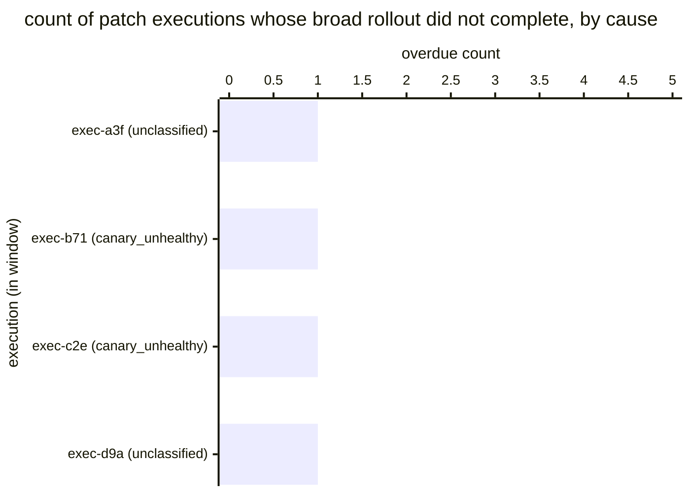

# Reference visualisation — `kri.patch_rollout_overdue_exposure@v1`

This is the committed reference-visualisation artifact for the
patch-rollout overdue-exposure KRI. It exists so the G-04 catalog
definition-of-done (a *committed* reference visualisation, not a
narrated one) is closed; downstream compile targets (n8n / Temporal /
LangGraph) read the same metric YAML and render the executable form
in their own dashboard surface. The artifact here is the contract for
the chart shape, not the executable chart.

## Chart kind

Two-panel composition. The headline panel is a single count-style
gauge reading the maximum overdue-exposure count across the
evaluation window — the per-window worst-case observation against
the patch-application evidence stream. The drill-down panel is a
stacked horizontal bar chart, one row per execution that contributed
to the count, segmented by overdue cause: the `unclassified` segment
(the classify-patch-criticality step short-circuited under the
documented intake deadline) and the `canary_unhealthy` segment
(the fan-out step was a deterministic skip against an unhealthy
canary). Slicing by execution is the canonical drill-down dimension
because operators usually carry a per-execution incident view and the
indicator surfaces which executions are pulling the count off zero.

- **Headline (count):** the maximum overdue-exposure count across
  the evaluation window. This is the figure operators read first.
  Because the KRI is `lower_is_better`, zero is healthy and a rising
  count is the risk signal.
- **Drill-down x-axis:** count of overdue causes per execution
  (always 1 per execution, but stacked by cause so the operator
  reads the composition).
- **Drill-down y-axis:** one row per contributing execution, labelled
  by the patch-application evidence artifact's short artifact_id
  prefix; sorted by execution recency so the most recent overdue
  observations sit at the top.
- **Threshold overlays:** band markers at the `warn` (>0), `breach`
  (>3), and `critical` (>10) count values, drawn on a companion
  count gauge / axis next to the bar chart, so the operator reads
  the band the headline count sits in without arithmetic.

## Reference rendering (Mermaid)

The mermaid block below is the canonical reference rendering — small
enough to live in-tree and renderable directly on the public repo
surface. The numeric values are illustrative; the compile target is
the source of truth for the executable form against operator data.

Reading the bars in this illustrative rendering:

| execution (cause)           | count | band     | reading                                                              |
|-----------------------------|-------|----------|----------------------------------------------------------------------|
| exec-a3f (unclassified)     | 1     | warn     | classify short-circuited under the intake deadline                   |
| exec-b71 (canary_unhealthy) | 1     | warn     | canary unhealthy, fan-out deterministically skipped                  |
| exec-c2e (canary_unhealthy) | 1     | warn     | canary unhealthy, fan-out deterministically skipped                  |
| exec-d9a (unclassified)     | 1     | warn     | classify short-circuited under the intake deadline                   |

With four contributing executions in the window, the window `max`
resolves to `4` — inside the breach band (>3). That value is what the
catalog aggregation `measurement.aggregation: max` resolves to for
this snapshot.

## Threshold band reference

| name     | comparator | value (count) | severity |
|----------|------------|---------------|----------|
| warn     | >          | 0             | warn     |
| breach   | >          | 3             | high     |
| critical | >          | 10            | critical |

The bands match the `thresholds` array on
`patch_rollout_overdue_exposure.yaml`; the catalog entry is the
source of truth, this file is the visualisation surface. The catalog
target (`target.value: 0`, `comparator: "=="`) is the
community-recommended starting point for the unscoped baseline;
operators set scoped tolerances per update cohort under their
patch-management programme.

## OCSF source-data shape

The chart's underlying observations are derived from the
patch_management patch-application evidence stream rather than a
direct OCSF event class. Each execution within the evaluation window
contributes one observation computed against the
`measurement.inputs` declared on
`patch_rollout_overdue_exposure.yaml`:

- **patch_criticality** — closed-taxonomy bucket emitted by the
  classify-patch-criticality step transition declared on the catalog
  entry's `measurement.inputs.patch_criticality.playbook_step`:
  - `playbook.patch_management@v1`
    `action--70000000-0000-4000-8000-000000000003` — classify step
    on the patch_management playbook. The `unclassified` sentinel
    counts toward the overdue total.
- **broad_rollout_id** + **broad_rollout_skip_reason** — emitted by
  the fan-out step transition declared on the catalog entry's
  `measurement.inputs.broad_rollout_id.playbook_step`:
  - `playbook.patch_management@v1`
    `action--70000000-0000-4000-8000-000000000006` — fan-out step on
    the patch_management playbook. An empty `broad_rollout_id`
    paired with `broad_rollout_skip_reason == "canary_unhealthy"`
    counts toward the overdue total.
- All three inputs are durably pinned on the JSON-native
  patch-application evidence artifact the evidence-capture step
  emits (schemas/evidence/patch.schema.json, stream = `patch`); the
  consumer reads the artifact and increments the count per artifact
  matching either overdue condition.

The catalog entry deliberately does not pin a single OCSF telemetry
binding at the unscoped baseline: the patch-application evidence
stream is itself the binding shape and is carried in the JSON-native
evidence artifact rather than via an OCSF event class. The deferral
is named honestly — the playbook step transitions are the bindings,
not an OCSF class. The patch_management detect step may correlate
against an upstream OCSF API Activity event
(`telemetry.ocsf.api_activity@v1`) emitted by the operator's
advisory-intake pipeline, but the indicator itself reads the
evidence record.

The reference rendering above remains shape-valid: it reads one
patch-application evidence artifact per execution, evaluates the
overdue conditions, and counts the window `max`, regardless of which
advisory-intake surfaces the operator's compile target consulted.

## Operator override

Operators are expected to render this metric in their own dashboard
idiom — the catalog reference rendering above is the contract for the
chart shape (max-count headline, per-execution overdue-cause
drill-down sliced by execution, warn / breach / critical band
overlays on the companion count axis), not the visual style. The
compile target is the source of truth for the executable form.
