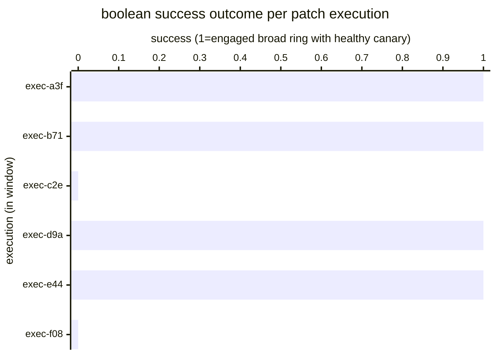

# Reference visualisation — `kpi.patch_rollout_success_rate@v1`

This is the committed reference-visualisation artifact for the
patch-rollout success-rate KPI. It exists so the G-04 catalog
definition-of-done (a *committed* reference visualisation, not a
narrated one) is closed; downstream compile targets (n8n / Temporal /
LangGraph) read the same metric YAML and render the executable form
in their own dashboard surface. The artifact here is the contract for
the chart shape, not the executable chart.

## Chart kind

Two-panel composition. The headline panel is a single gauge-style
horizontal bar reading the success-rate ratio across patch_management
executions in the evaluation window — `successful_count /
total_count` over patch-application evidence artifacts emitted in
the window. The drill-down panel is a horizontal bar chart, one bar
per execution in the window, plotting the boolean success outcome
(1 for a successful rollout, 0 for an execution that did not engage
the broad ring with a healthy canary). Slicing by execution is the
canonical drill-down dimension because operators usually carry a
per-execution incident view and the indicator surfaces which
executions are pulling the ratio off the target band.

- **Headline (ratio):** the success ratio across the evaluation
  window. This is the figure operators read first. Because the KPI
  is `higher_is_better`, a value at or above the `target` (0.95) is
  healthy and a falling value is the risk signal.
- **Drill-down x-axis:** per-execution success outcome (1 or 0).
- **Drill-down y-axis:** one row per execution in the window,
  labelled by the patch-application evidence artifact's short
  artifact_id prefix; sorted by execution recency so the most recent
  executions sit at the top.
- **Threshold overlays:** horizontal lines at the `warn` (<0.95),
  `breach` (<0.80), and `critical` (<0.50) ratio values, drawn on a
  companion ratio gauge / axis next to the bar chart, so the
  operator reads the band the headline ratio sits in without
  arithmetic.

## Reference rendering (Mermaid)

The mermaid block below is the canonical reference rendering — small
enough to live in-tree and renderable directly on the public repo
surface. The numeric values are illustrative; the compile target is
the source of truth for the executable form against operator data.

Reading the bars in this illustrative rendering:

| execution | success | reading                                                                         |
|-----------|---------|---------------------------------------------------------------------------------|
| exec-a3f  | 1       | canary healthy, broad rollout engaged                                           |
| exec-b71  | 1       | canary healthy, broad rollout engaged                                           |
| exec-c2e  | 0       | canary unhealthy OR classify short-circuit; broad rollout did not engage        |
| exec-d9a  | 1       | canary healthy, broad rollout engaged                                           |
| exec-e44  | 1       | canary healthy, broad rollout engaged                                           |
| exec-f08  | 0       | canary unhealthy OR classify short-circuit; broad rollout did not engage        |

With six executions and four successes, the window ratio resolves to
`4 / 6 = 0.667` — inside the breach band (<0.80, ≥0.50). That value
is what the catalog aggregation `measurement.aggregation: ratio`
resolves to for this snapshot.

## Threshold band reference

| name     | comparator | value (ratio) | severity |
|----------|------------|---------------|----------|
| warn     | <          | 0.95          | warn     |
| breach   | <          | 0.80          | high     |
| critical | <          | 0.50          | critical |

The bands match the `thresholds` array on
`patch_rollout_success_rate.yaml`; the catalog entry is the source
of truth, this file is the visualisation surface. The catalog target
(`target.value: 0.95`, `comparator: ">="`) is the
community-recommended starting point for the unscoped baseline;
operators set scoped targets per update cohort under their
patch-management programme.

## OCSF source-data shape

The chart's underlying observations are derived from the
patch_management patch-application evidence stream rather than a
direct OCSF event class. Each execution within the evaluation window
contributes one boolean success sample computed against the
`measurement.inputs` declared on
`patch_rollout_success_rate.yaml`:

- **canary_healthy** — boolean canary-health outcome emitted by the
  validate-canary step transition declared on the catalog entry's
  `measurement.inputs.canary_healthy.playbook_step`:
  - `playbook.patch_management@v1`
    `action--70000000-0000-4000-8000-000000000005` — validate-canary
    step on the patch_management playbook.
- **broad_rollout_id** — deterministic broad-ring rollout identifier
  emitted by the fan-out step transition declared on the catalog
  entry's `measurement.inputs.broad_rollout_id.playbook_step`:
  - `playbook.patch_management@v1`
    `action--70000000-0000-4000-8000-000000000006` — fan-out step on
    the patch_management playbook.
- **health_observations** — closed-shape gate block emitted by the
  validate-canary step on the same artifact. The success condition
  reads the boolean `canary_healthy` field; the block is the
  drill-down forensic context.
- All three inputs are durably pinned on the JSON-native
  patch-application evidence artifact the evidence-capture step
  emits (schemas/evidence/patch.schema.json, stream = `patch`); the
  consumer reads the artifact and increments the numerator when the
  success condition holds.

The catalog entry deliberately does not pin a single OCSF telemetry
binding at the unscoped baseline: the patch-application evidence
stream is itself the binding shape and is carried in the JSON-native
evidence artifact rather than via an OCSF event class. The deferral
is named honestly — the playbook step transitions are the bindings,
not an OCSF class. The patch_management detect step may correlate
against an upstream OCSF API Activity event
(`telemetry.ocsf.api_activity@v1`) emitted by the operator's
advisory-intake pipeline, but the indicator itself reads the
evidence record.

The reference rendering above remains shape-valid: it reads one
patch-application evidence artifact per execution, evaluates the
success condition, and computes the window ratio, regardless of
which advisory-intake surfaces the operator's compile target
consulted.

## Operator override

Operators are expected to render this metric in their own dashboard
idiom — the catalog reference rendering above is the contract for
the chart shape (success-rate-ratio headline, per-execution success
drill-down sliced by execution, warn / breach / critical band
overlays on the companion ratio axis), not the visual style. The
compile target is the source of truth for the executable form.
