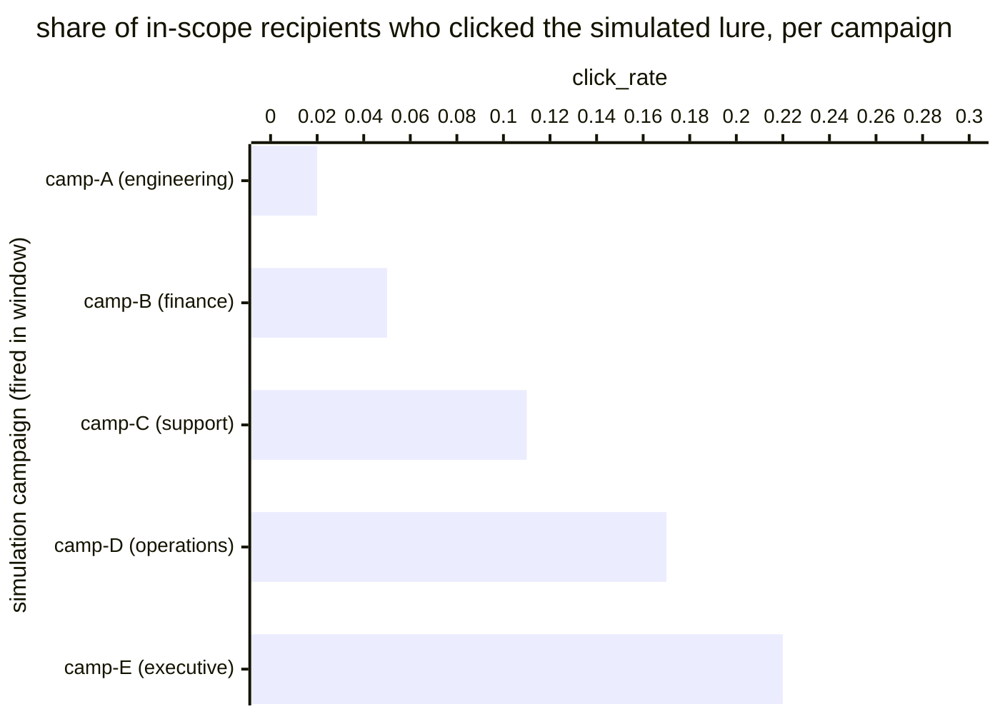

# Reference visualisation — `kpi.phishing_sim_click_rate@v1`

This is the committed reference-visualisation artifact for the
phishing-simulation click-rate KPI. It exists so the G-04 catalog
definition-of-done (a *committed* reference visualisation, not a
narrated one) is closed; downstream compile targets (n8n / Temporal /
LangGraph) read the same metric YAML and render the executable form in
their own dashboard surface. The artifact here is the contract for the
chart shape, not the executable chart.

## Chart kind

Two-panel composition. The headline panel is a single gauge-style
horizontal bar reading the click rate (`ratio`) across in-scope
phishing-simulation recipients in the evaluation window — the share of
sanctioned-simulation recipients who clicked the simulated lure
divided by the total in-scope simulation-recipient population. The
drill-down panel is a horizontal bar chart, one bar per simulation
campaign that fired inside the window, plotting the per-campaign
`click_rate` so operators can see which audience cohort drove the
headline reading. Slicing by `cohort` (the recipient population the
operator's simulation programme targeted — by business unit, by role,
by training-track) is the canonical drill-down dimension because
campaign-level effectiveness is what the simulation programme acts on.

- **Headline (ratio):** the `ratio` aggregate across in-scope
  simulation recipients in the window. This is the figure operators
  read first. Because the KPI is `lower_is_better`, a value near zero
  is a healthy reading and a rising value is the signal that
  awareness reinforcement is needed.
- **Drill-down x-axis:** `click_rate` per simulation campaign that
  fired inside the evaluation window — the campaign-scoped numerator
  divided by the campaign-scoped denominator.
- **Drill-down y-axis:** one row per simulation campaign that fired
  inside the window, labelled by campaign id and recipient cohort;
  sorted descending so the campaigns that pulled the headline
  upwards sit at the top — the campaigns the awareness programme
  acts on next.
- **Threshold overlay (drill-down):** none at the unscoped baseline —
  the catalog YAML at `phishing_sim_click_rate.yaml` does not pin
  numeric warn / breach values; the operator's awareness programme is
  the source of truth for the per-cohort click-rate expectation, and
  the catalog ratio reflects the share of simulation recipients that
  clicked the simulated lure across the evaluation window.

## Reference rendering (Mermaid)

The mermaid block below is the canonical reference rendering — small
enough to live in-tree and renderable directly on the public repo
surface. The numeric values are illustrative; the compile target is
the source of truth for the executable form against operator data.

Reading the bars in this illustrative rendering (assume five
simulation campaigns fired across the window, each with the recipient
counts implied by the cohort labels):

| campaign (cohort)      | click_rate | reading                                                |
|------------------------|------------|--------------------------------------------------------|
| camp-A (engineering)   | 0.02       | very low click rate — strong awareness reinforcement   |
| camp-B (finance)       | 0.05       | low click rate, comfortably below cohort expectation   |
| camp-C (support)       | 0.11       | mid-band — programme owner watches the trend           |
| camp-D (operations)    | 0.17       | elevated — pulls the headline reading upward           |
| camp-E (executive)     | 0.22       | top of drill-down — awareness reinforcement candidate  |

Aggregating the five campaign-scoped numerators and denominators
across the window, the headline `ratio` resolves to the
recipient-weighted aggregate click rate over the in-scope
simulation-recipient population. That value is what the catalog
aggregation `measurement.aggregation: ratio` resolves to for this
snapshot.

## Threshold band reference

The catalog entry at `phishing_sim_click_rate.yaml` is
programme-neutral and does not declare numeric warn / breach
thresholds at the unscoped baseline — the operator's awareness
programme is the source of truth for the per-cohort click-rate
expectation, and the catalog ratio reflects the share of simulation
recipients that clicked the simulated lure across the evaluation
window. Cohort-scoped variants (for example an
executive-only simulation-click-rate KPI) declare numeric bands and
live as separate catalog entries. The catalog YAML at
`content/metrics/phishing_sim_click_rate.yaml` remains the source of
truth for the indicator shape; this file is the visualisation
surface.

## OCSF source-data shape

The chart's underlying observations are derived from the operator's
phishing-simulation programme. Each in-scope recipient contributes
one sample computed against the `measurement.inputs` declared on
`phishing_sim_click_rate.yaml`:

- **numerator** — count of in-scope recipients who clicked the
  simulated lure inside the evaluation window. The click event is
  bound to the phishing-triage step that registers a click against
  the simulation-click-rate KPI, declared on the catalog entry's
  `playbook_refs`:
  - `playbook.phishing_triage@v1`
    `action--c0a17a01-0000-4000-8000-000000000009` — credential-harvest
    response step that identifies clickers from URL Activity
    telemetry and feeds the simulation click-rate KPI when the
    source is a sanctioned phishing simulation.
- **denominator** — count of in-scope recipients targeted by a
  sanctioned phishing simulation campaign that fired within the
  evaluation window. Exclude recipients whose mailbox never received
  the simulated lure (delivery-failure gap) so the indicator does
  not silently improve when delivery telemetry stalls.

The catalog entry deliberately does not pin a single OCSF telemetry
binding at the unscoped baseline: the click event is observable
through more than one OCSF class depending on the operator's
simulation platform and telemetry pipeline — typically a URL
Activity event class against the simulation landing-page redirector,
sometimes an Email URL Activity event class against the inbound
mailbox surface, sometimes a Web Resources Activity event class
against the awareness-training platform's tracking pixel. The
deferral is named honestly — the phishing-triage playbook step is
the binding for the simulation-click lifecycle event, not an OCSF
class. A CORE follow-up may add an OCSF binding for tracker-scoped
variants once the operator's simulation tracker is declared.

The reference rendering above remains shape-valid: it reads a click
predicate per recipient and a recipient-population reference, and
computes a ratio, regardless of which OCSF class the operator's
compile target resolves the click event against.

## Operator override

Operators are expected to render this metric in their own dashboard
idiom — the catalog reference rendering above is the contract for the
chart shape (ratio headline, per-campaign click-rate drill-down
sliced by recipient cohort), not the visual style. The compile target
is the source of truth for the executable form.
