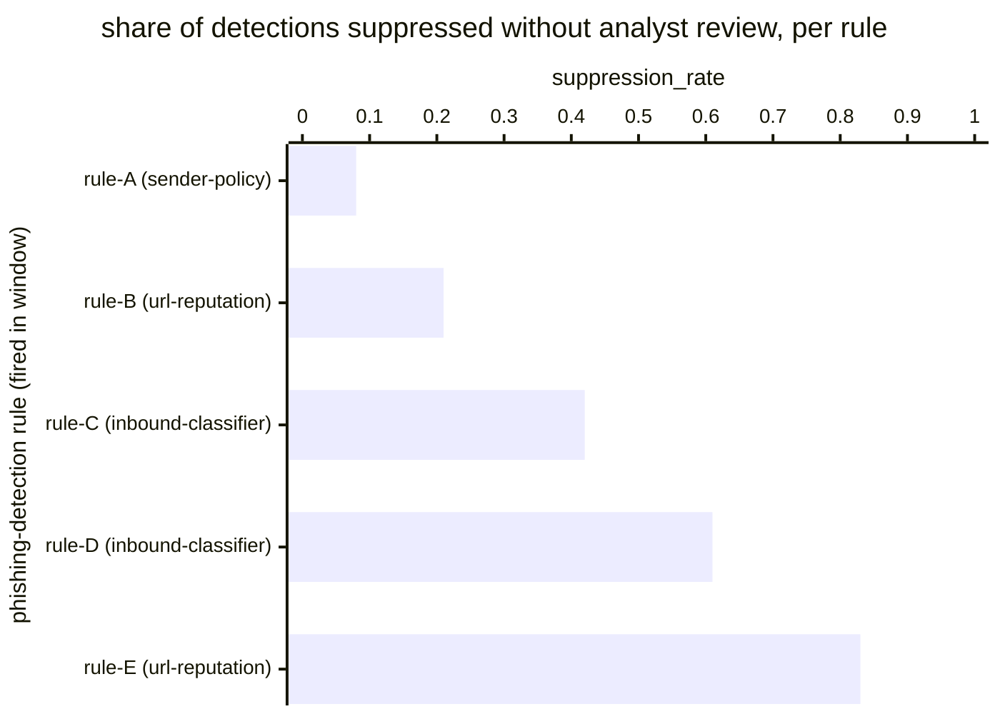

# Reference visualisation — `kri.phishing_suppression_rate@v1`

This is the committed reference-visualisation artifact for the
phishing-detection suppression-rate KRI. It exists so the G-04 catalog
definition-of-done (a *committed* reference visualisation, not a
narrated one) is closed; downstream compile targets (n8n / Temporal /
LangGraph) read the same metric YAML and render the executable form in
their own dashboard surface. The artifact here is the contract for the
chart shape, not the executable chart.

## Chart kind

Two-panel composition. The headline panel is a single gauge-style
horizontal bar reading the suppression rate (`ratio`) across in-scope
phishing detections fired in the evaluation window — the share of
phishing detections that were auto-closed, tuned out, or marked
benign without analyst review divided by the total phishing-detection
population that fired in the window. The drill-down panel is a
horizontal bar chart, one bar per detection rule that fired inside
the window, plotting the per-rule `suppression_rate` so operators can
see which rules drove the headline reading. Slicing by `rule_family`
(the operator's detection-engineering grouping — for example
inbound-email-classifier rules, URL-reputation rules, sender-policy
rules) is the canonical drill-down dimension because tuning
decisions are taken at the rule-family scope.

- **Headline (ratio):** the `ratio` aggregate across in-scope
  phishing detections that fired in the window. This is the figure
  operators read first. Because the KRI is `lower_is_better`, a
  value near zero is healthy and a rising value is the risk signal
  that detection fatigue or over-aggressive tuning may be hiding
  active campaigns.
- **Drill-down x-axis:** `suppression_rate` per phishing-detection
  rule that fired inside the evaluation window — the rule-scoped
  numerator divided by the rule-scoped denominator.
- **Drill-down y-axis:** one row per phishing-detection rule that
  fired inside the window, labelled by rule id and rule family;
  sorted descending so the rules that pulled the headline upwards
  sit at the top — the rules whose tuning the detection-engineering
  programme acts on next.
- **Threshold overlay (drill-down):** none at the unscoped baseline —
  the catalog YAML at `phishing_suppression_rate.yaml` does not pin
  numeric warn / breach values; the operator's detection-engineering
  programme is the source of truth for the per-rule suppression
  expectation, and the catalog ratio reflects the share of phishing
  detections that were suppressed without analyst review across the
  evaluation window.

## Reference rendering (Mermaid)

The mermaid block below is the canonical reference rendering — small
enough to live in-tree and renderable directly on the public repo
surface. The numeric values are illustrative; the compile target is
the source of truth for the executable form against operator data.

Reading the bars in this illustrative rendering (assume five
phishing-detection rules fired across the window, with the detection
counts implied by the rule labels):

| rule (family)              | suppression_rate | reading                                                          |
|----------------------------|------------------|------------------------------------------------------------------|
| rule-A (sender-policy)     | 0.08             | low suppression — most fires reach analyst review                |
| rule-B (url-reputation)    | 0.21             | mid-low — comfortably below tuning concern                       |
| rule-C (inbound-classifier)| 0.42             | mid-band — detection engineering watches the trend               |
| rule-D (inbound-classifier)| 0.61             | elevated — pulls the headline reading upward, tuning candidate   |
| rule-E (url-reputation)    | 0.83             | top of drill-down — most fires suppressed, may hide live signals |

Aggregating the five rule-scoped numerators and denominators across
the window, the headline `ratio` resolves to the detection-weighted
aggregate suppression rate over the in-scope phishing-detection
population. That value is what the catalog aggregation
`measurement.aggregation: ratio` resolves to for this snapshot.

## Threshold band reference

The catalog entry at `phishing_suppression_rate.yaml` is
programme-neutral and does not declare numeric warn / breach
thresholds at the unscoped baseline — the operator's
detection-engineering programme is the source of truth for the
per-rule suppression expectation, and the catalog ratio reflects the
share of phishing detections that were suppressed without analyst
review across the evaluation window. Rule-family-scoped variants
(for example an inbound-classifier-only suppression-rate KRI)
declare numeric bands and live as separate catalog entries. The
catalog YAML at `content/metrics/phishing_suppression_rate.yaml`
remains the source of truth for the indicator shape; this file is
the visualisation surface.

## OCSF source-data shape

The chart's underlying observations are derived from the operator's
phishing-triage detection surface. Each in-scope phishing detection
contributes one sample computed against the `measurement.inputs`
declared on `phishing_suppression_rate.yaml`:

- **numerator** — count of in-scope phishing detections that were
  auto-closed, tuned out, or marked benign without analyst review
  inside the evaluation window. The suppression event is bound to
  the phishing-triage step that accounts the suppression against
  the suppression-rate KRI, declared on the catalog entry's
  `playbook_refs`:
  - `playbook.phishing_triage@v1`
    `action--c0a17a01-0000-4000-8000-000000000005` — suppress-and-close
    step that links the report onto an existing case (or onto the
    known-benign sender record), closes it without paging, and
    accounts the suppression against the suppression-rate KRI.
- **denominator** — count of in-scope phishing detections that fired
  inside the evaluation window. Exclude detections whose lifecycle
  step never fired (record-keeping gap) so the indicator does not
  silently improve when the phishing-triage programme stalls.

The catalog entry deliberately does not pin a single OCSF telemetry
binding at the unscoped baseline: phishing-detection lifecycle
events are observable through more than one OCSF class depending on
where the operator's detection surface materialises — typically a
Detection Finding event class against the detection-engine surface,
sometimes an Email Activity / Email URL Activity event class against
the inbound-mail surface, sometimes a custom case-tracker event
against the operator's triage platform. The deferral is named
honestly — the phishing-triage playbook step transition is the
binding for the suppression lifecycle event, not an OCSF class. A
CORE follow-up may add an OCSF binding for tracker-scoped variants
once the operator's detection-finding surface is declared.

The reference rendering above remains shape-valid: it reads a
suppression predicate per detection and a detection-population
reference, and computes a ratio, regardless of which OCSF class the
operator's compile target resolves the detection lifecycle event
against.

## Operator override

Operators are expected to render this metric in their own dashboard
idiom — the catalog reference rendering above is the contract for the
chart shape (ratio headline, per-rule suppression-rate drill-down
sliced by rule family), not the visual style. The compile target is
the source of truth for the executable form.
