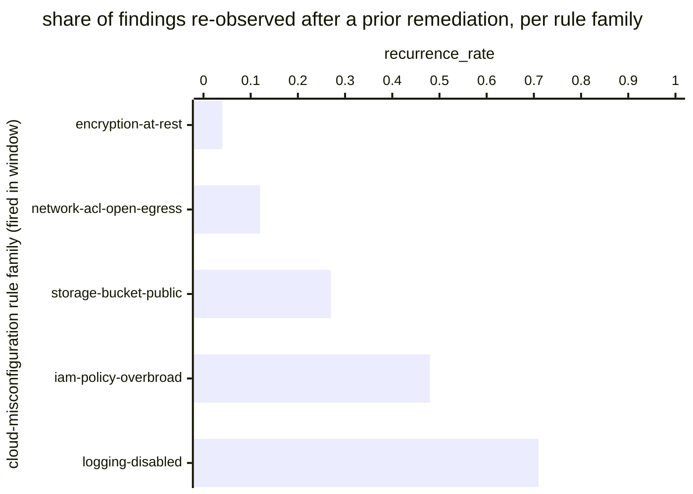

# Reference visualisation — `kri.recurring_cloud_misconfig@v1`

This is the committed reference-visualisation artifact for the
recurring-cloud-misconfiguration KRI. It exists so the G-04 catalog
definition-of-done (a *committed* reference visualisation, not a
narrated one) is closed; downstream compile targets (n8n / Temporal /
LangGraph) read the same metric YAML and render the executable form in
their own dashboard surface. The artifact here is the contract for the
chart shape, not the executable chart.

## Chart kind

Two-panel composition. The headline panel is a single gauge-style
horizontal bar reading the recurrence rate (`ratio`) across in-scope
cloud-misconfiguration findings observed inside the evaluation window
— the share of findings re-observed after a prior remediation closed
them divided by the total cloud-misconfiguration findings observed in
the window. The drill-down panel is a horizontal bar chart, one bar
per misconfiguration-rule family that fired inside the window,
plotting the per-family recurrence rate so operators can see which
remediations are not durable. Slicing by `rule_family` (the operator's
cloud-posture grouping — for example storage-bucket-public,
iam-policy-overbroad, network-acl-open-egress, encryption-at-rest
disabled) is the canonical drill-down dimension because remediation
durability is owned at the rule-family scope.

- **Headline (ratio):** the `ratio` aggregate across in-scope
  cloud-misconfiguration findings in the window. This is the figure
  operators read first. Because the KRI is `lower_is_better`, a
  value near zero is a healthy reading and a rising value is the
  risk signal that remediations are not durable — fixes are being
  reverted, infrastructure-as-code drift is reintroducing the same
  flaw, or guardrails are not catching the recurrence at deploy
  time.
- **Drill-down x-axis:** `recurrence_rate` per
  cloud-misconfiguration rule family that fired inside the
  evaluation window — the family-scoped numerator (recurring
  findings) divided by the family-scoped denominator (total
  findings).
- **Drill-down y-axis:** one row per cloud-misconfiguration rule
  family that fired inside the window, labelled by family name;
  sorted descending so the families that pulled the headline upward
  sit at the top — the families whose remediation pattern the
  cloud-posture programme acts on next.
- **Threshold overlay (drill-down):** none at the unscoped
  baseline — the catalog YAML at `recurring_cloud_misconfig.yaml`
  does not declare numeric warn / breach values; the operator's
  cloud-posture programme is the source of truth for the
  per-family recurrence expectation, and the catalog ratio
  reflects the share of cloud-misconfiguration findings that
  re-occurred after a prior remediation closed them across the
  evaluation window.

## Reference rendering (Mermaid)

The mermaid block below is the canonical reference rendering — small
enough to live in-tree and renderable directly on the public repo
surface. The numeric values are illustrative; the compile target is
the source of truth for the executable form against operator data.

Reading the bars in this illustrative rendering (assume five
cloud-misconfiguration rule families fired across the window, with the
finding counts implied by the family labels):

| rule family                  | recurrence_rate | reading                                                          |
|------------------------------|-----------------|------------------------------------------------------------------|
| encryption-at-rest           | 0.04            | very low recurrence — remediation pattern is durable             |
| network-acl-open-egress      | 0.12            | low recurrence — guardrails mostly catching reintroductions      |
| storage-bucket-public        | 0.27            | mid-band — cloud-posture programme watches the trend             |
| iam-policy-overbroad         | 0.48            | elevated — pulls headline upward, remediation pattern not durable|
| logging-disabled             | 0.71            | top of drill-down — recurrence dominates the family              |

Aggregating the five family-scoped numerators and denominators across
the window, the headline `ratio` resolves to the finding-weighted
aggregate recurrence rate over the in-scope cloud-misconfiguration
population. That value is what the catalog aggregation
`measurement.aggregation: ratio` resolves to for this snapshot.

## Threshold band reference

The catalog entry at `recurring_cloud_misconfig.yaml` is
programme-neutral and does not declare numeric warn / breach
thresholds at the unscoped baseline — the operator's cloud-posture
programme is the source of truth for the per-family recurrence
expectation, and the catalog ratio reflects the share of
cloud-misconfiguration findings re-observed after a prior remediation
closed them across the evaluation window. Family-scoped variants (for
example an iam-policy-overbroad-only recurrence KRI) declare numeric
bands and live as separate catalog entries. The catalog YAML at
`content/metrics/recurring_cloud_misconfig.yaml` remains the source of
truth for the indicator shape; this file is the visualisation surface.

## OCSF source-data shape

The chart's underlying observations are derived from the operator's
cloud-posture finding stream and the cloud-misconfiguration
remediation playbook's lifecycle steps. Each in-scope
cloud-misconfiguration finding contributes one sample computed against
the `measurement.inputs` declared on `recurring_cloud_misconfig.yaml`:

- **numerator** — count of in-scope cloud-misconfiguration findings
  re-observed within the evaluation window *after* a prior
  remediation closed them. The recurrence lifecycle is bound to the
  cloud-misconfiguration playbook steps declared on the catalog
  entry's `playbook_refs`:
  - `playbook.cloud_misconfiguration@v1`
    `action--30000000-0000-4000-8000-000000000005` — the remediation
    step whose closure establishes the prior-fix anchor against
    which a later observation is adjudicated as a recurrence.
  - `playbook.cloud_misconfiguration@v1`
    `action--30000000-0000-4000-8000-00000000000b` — the verification
    / re-scan step that detects the same finding signature after the
    prior-fix anchor and accounts the recurrence against the KRI.
- **denominator** — count of in-scope cloud-misconfiguration
  findings observed inside the evaluation window. Exclude findings
  whose adjudication is still pending so the indicator reflects
  closed dispositions only.

The catalog entry deliberately does not pin a single OCSF telemetry
binding at the unscoped baseline: cloud-misconfiguration findings are
observable through more than one OCSF class depending on the
operator's cloud-posture platform — typically a Compliance Finding
event class against a CSPM / cloud-security-posture surface, sometimes
a Detection Finding event class against a custom cloud-rule surface,
sometimes a Cloud Resource Inventory event against the
infrastructure-as-code drift detector. The deferral is named
honestly — the cloud-misconfiguration playbook step transitions are
the binding for the recurrence lifecycle event, not an OCSF class. A
CORE follow-up may add an OCSF binding for posture-platform-scoped
variants once the operator's cloud-posture surface is declared.

The reference rendering above remains shape-valid: it reads a
recurrence predicate per closed finding and a finding-population
reference, and computes a ratio, regardless of which OCSF class the
operator's compile target resolves the cloud-misconfiguration finding
against.

## Operator override

Operators are expected to render this metric in their own dashboard
idiom — the catalog reference rendering above is the contract for the
chart shape (ratio headline, per-rule-family recurrence-rate
drill-down sliced by rule family), not the visual style. The compile
target is the source of truth for the executable form.
