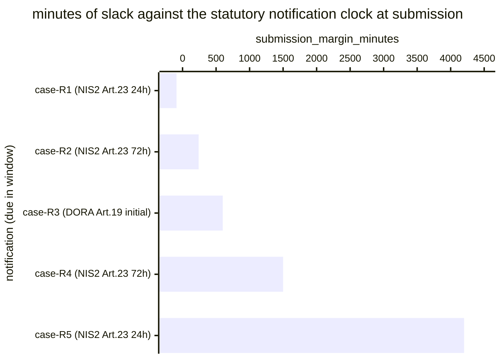

# Reference visualisation — `kri.regulator_notification_overrun@v1`

This is the committed reference-visualisation artifact for the
regulator-notification overrun-rate KRI. It exists so the G-04
catalog definition-of-done (a *committed* reference visualisation,
not a narrated one) is closed; downstream compile targets (n8n /
Temporal / LangGraph) read the same metric YAML and render the
executable form in their own dashboard surface. The artifact here
is the contract for the chart shape, not the executable chart.

## Chart kind

Two-panel composition. The headline panel is a single gauge-style
horizontal bar reading the overrun rate (`ratio`) across
regulator-facing notifications due within the evaluation window —
the share of notifications submitted *after* their statutory
deadline. Direction is `lower_is_better`: a value of 0.00 is the
floor every regulator-notification pipeline is expected to clear.
The drill-down panel is a horizontal bar chart, one bar per
regulator-facing notification due in the window, plotting
`submission_margin_minutes` — minutes between the submission
timestamp and the statutory deadline. Positive bars are on-time
slack; negative bars are statutory-clock overruns and contribute the
failing samples that pull the rate above 0.00. Slicing by
`regulatory_regime` (NIS2 Art. 23 early-warning, NIS2 Art. 23
incident-notification, DORA Art. 19(4)(a) initial notification) is
the canonical drill-down dimension because each regime defines its
own clock.

- **Headline (ratio):** the `ratio` aggregate of regulator-facing
  notifications submitted after their statutory deadline divided by
  total in-scope notifications due in the window. This is the figure
  the operator's risk surface reads first.
- **Drill-down x-axis:** `submission_margin_minutes` — minutes
  remaining at submission against the statutory clock. Positive
  values left-to-right are on-time slack; negative values left of
  zero are clock overruns.
- **Drill-down y-axis:** one row per regulator-facing notification
  due in the window, labelled by the case `incident.uid` and
  regulatory regime; sorted ascending so any overruns (and the
  slimmest margins) sit at the top — the cases that lift the risk
  reading.
- **Threshold overlay (drill-down):** a vertical line at zero —
  every bar left of zero is a sample that overran the statutory
  clock and contributes a `1` to the numerator. Operators reading
  the drill-down see *which* notifications pulled the rate above
  0.00.

## Reference rendering (Mermaid)

The mermaid block below is the canonical reference rendering — small
enough to live in-tree and renderable directly on the public repo
surface. The numeric values are illustrative; the compile target is
the source of truth for the executable form against operator data.

Reading the bars in this illustrative rendering:

| case (regime)                       | submission_margin_minutes | overrun? | reading                                                       |
|-------------------------------------|---------------------------|----------|---------------------------------------------------------------|
| case-R1 (NIS2 Art.23 24h)           | -90                       | yes      | overran early-warning clock by 90 min — contributes to ratio  |
| case-R2 (NIS2 Art.23 72h)           | 240                       | no       | inside the 72-hour notification clock                         |
| case-R3 (DORA Art.19 initial)       | 600                       | no       | comfortable slack on initial notification                     |
| case-R4 (NIS2 Art.23 72h)           | 1500                      | no       | mid-window submission, healthy slack                          |
| case-R5 (NIS2 Art.23 24h)           | 4200                      | no       | (not applicable — would not be due in this window)            |

With one overrun across five due notifications, the headline `ratio`
resolves to `1 / 5 = 0.20` in this snapshot. Because direction is
`lower_is_better`, a higher reading is worse — any positive value is
a statutory-clock compliance exception the operator carries on their
risk surface. That value is what the catalog aggregation
`measurement.aggregation: ratio` resolves to for this snapshot.

## Threshold band reference

The catalog entry at `regulator_notification_overrun.yaml` is
regulator-neutral and does not declare numeric warn / breach
thresholds at the unscoped baseline — the regulator's statutory
clock is the contract (defined in the `external_refs` array: NIS2
Article 23 incident reporting timelines; DORA Article 19(4)(a)
initial notification motivating context), and the catalog ratio
reflects the share of notifications that overran that clock. The
operator's compile target binds the concrete regulatory regime.
Regime-scoped variants (for example a NIS2-Art.23-72h-scoped overrun
indicator) declare numeric bands and live as separate catalog
entries. The catalog YAML at
`content/metrics/regulator_notification_overrun.yaml` remains the
source of truth for the indicator shape; this file is the
visualisation surface.

## OCSF source-data shape

The chart's underlying observations are derived from the operator's
regulator-notification pipeline. Each regulator-facing notification
due within the evaluation window contributes one
`submission_margin_minutes` sample computed against the
`measurement.inputs` declared on `regulator_notification_overrun.yaml`:

- **numerator** — count of due notifications whose submission
  timestamp landed later than (statutory awareness-timestamp +
  regulator clock). The regulator-notification submission event is
  bound to the regulator-facing notification step transitions
  declared on the catalog entry's `playbook_refs`:
  - `playbook.data_exfil@v1`
    `action--20000000-0000-4000-8000-000000000007` — regulator
    notification chain on the data-exfiltration playbook;
  - `playbook.ransomware_containment@v1`
    `action--30000000-0000-4000-8000-000000000009` —
    regulator-facing notification step on the ransomware-containment
    playbook.
- **denominator** — count of in-scope regulator-facing notifications
  due within the evaluation window per the regulator's statutory
  clock. Exclude notifications whose submission step never fired
  (record-keeping gap) so the indicator does not silently improve
  when the regulator-notification pipeline stalls outright.

The catalog entry deliberately does not pin a single OCSF telemetry
binding at the unscoped baseline: the regulatory clock is defined by
the regulator (NIS2 / DORA), not by SecOps-NG, and there is no
unambiguous OCSF event class that covers the regulator-facing
notification at the catalog level. The deferral is named honestly —
the playbook step transition is the binding for the submission
event, not an OCSF class. A CORE follow-up may add an OCSF binding
for regime-scoped variants once the operator's regulator-channel is
declared.

The reference rendering above remains shape-valid: it reads two
timestamps per due notification (the submission timestamp and the
statutory deadline) and computes a duration, regardless of which
regulator the operator's compile target resolves the clock against.

## Operator override

Operators are expected to render this metric in their own dashboard
idiom — the catalog reference rendering above is the contract for
the chart shape (ratio headline, per-notification submission-margin
drill-down sliced by regulatory regime, zero-line clock-overrun
overlay), not the visual style. The compile target is the source of
truth for the executable form.
