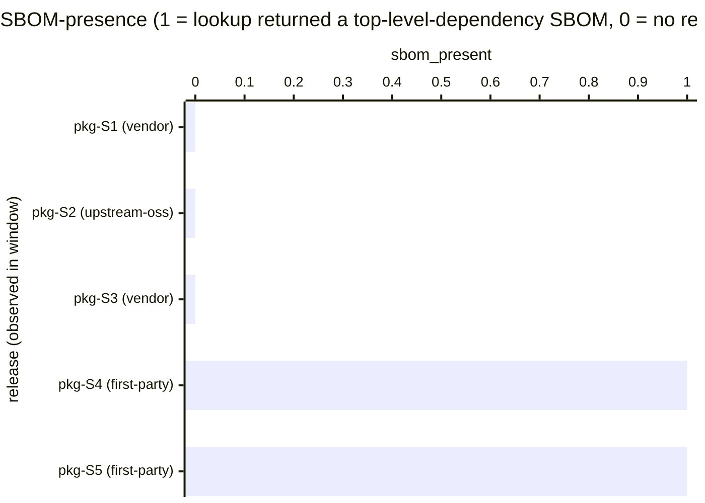

# Reference visualisation — `kri.releases_without_sbom@v1`

This is the committed reference-visualisation artifact for the
releases-without-SBOM KRI. It exists so the G-04 catalog
definition-of-done (a *committed* reference visualisation, not a
narrated one) is closed; downstream compile targets (n8n / Temporal /
LangGraph) read the same metric YAML and render the executable form
in their own dashboard surface. The artifact here is the contract for
the chart shape, not the executable chart.

## Chart kind

Two-panel composition. The headline panel is a single gauge-style
horizontal bar reading the count of distinct releases observed by the
vulnerability-intake SBOM-correlation step within the evaluation
window that returned *no* SBOM record against the release's PURL
lookup. The drill-down panel is a horizontal bar chart, one bar per
distinct release observed in the window, plotting an SBOM-presence
encoding: `1` if the PURL lookup returned at least a top-level-
dependency SBOM, `0` if the lookup returned no record. Bars at `0`
contribute the count headline; bars at `1` do not. Slicing by
`release_origin` (first-party-internal-build / vendor-redistribute /
upstream-open-source) is the canonical drill-down dimension because
SBOM coverage typically degrades fastest on vendor-redistribute and
upstream-open-source releases compared to first-party builds.

- **Headline (count):** the `count` aggregate of distinct releases
  observed in the window with no SBOM record. Because the KRI is
  `lower_is_better`, a reading of `0` is the floor (target value)
  and any positive reading is an open CRA Annex I §2(1) exposure.
- **Drill-down x-axis:** one row per distinct release observed by
  the SBOM-correlation step within the window, labelled by the
  release identifier (`product@version` shape) and origin; sorted
  ascending so the missing-SBOM samples sit at the top — the
  releases the operator's vulnerability-intake lane cannot map to
  component identifiers.
- **Drill-down y-axis:** SBOM-presence encoding (`0` = lookup
  returned no record; `1` = lookup returned at least a top-level-
  dependency SBOM). Distinct releases are counted once per window
  regardless of how many triage-step transitions touched them.
- **Threshold overlay (drill-down):** a horizontal line at `1` —
  every bar below the line is a missing-SBOM sample that
  contributes a `1` to the count. Operators reading the drill-down
  see *which* releases pulled the KRI off zero.

## Reference rendering (Mermaid)

The mermaid block below is the canonical reference rendering — small
enough to live in-tree and renderable directly on the public repo
surface. The numeric values are illustrative; the compile target is
the source of truth for the executable form against operator data.

Reading the bars in this illustrative rendering:

| release (origin)         | sbom_present | missing? | reading                                                       |
|--------------------------|--------------|----------|---------------------------------------------------------------|
| pkg-S1 (vendor)          | 0            | yes      | vendor-redistribute release — PURL lookup returned no SBOM    |
| pkg-S2 (upstream-oss)    | 0            | yes      | upstream open-source release — no SBOM in correlation store   |
| pkg-S3 (vendor)          | 0            | yes      | second vendor-redistribute release missing SBOM record        |
| pkg-S4 (first-party)     | 1            | no       | first-party build — SBOM attached at release time             |
| pkg-S5 (first-party)     | 1            | no       | first-party build — SBOM attached at release time             |

With three missing-SBOM releases observed, the headline `count`
resolves to `3` in this snapshot. Because direction is
`lower_is_better`, a higher reading is worse — every missing-SBOM
release is an open CRA Annex I §2(1) exposure the operator carries
on their risk surface. That value is what the catalog aggregation
`measurement.aggregation: count` resolves to for this snapshot.

## Threshold band reference

| name   | comparator | value (count) | severity |
|--------|------------|---------------|----------|
| warn   | >=         | 1             | warn     |
| breach | >=         | 5             | high     |

The bands match the `thresholds` array on
`releases_without_sbom.yaml`; the catalog entry is the source of
truth, this file is the visualisation surface. Operators under CRA
Annex I §2(1) scope, NIS2 Art. 21(2)(e) vulnerability-handling
scope, or DORA Art. 9(4)(a) ICT-risk-management scope typically
scope tighter per-origin targets (and a tighter top-level
`target.value`) in their own catalog variants and ship those as
separate entries — the unscoped baseline above is
community-recommended, not a regulatory floor.

## OCSF source-data shape

The chart's underlying observations are derived from the operator's
vulnerability-intake SBOM-correlation step. Each distinct release
observed by a triage-step transition within the evaluation window
contributes one SBOM-presence sample computed against the
`measurement.inputs` declared on `releases_without_sbom.yaml`:

- **`triage_step`** — triage playbook step transition that performs
  the SBOM PURL lookup against the affected release. The triage-
  step event is bound to the vulnerability-intake triage step
  transition declared on the catalog entry's `playbook_refs`:
  - `playbook.vuln_intake@v1`
    `action--01a17a01-0000-4000-8000-000000000003` — triage step on
    the vulnerability-intake playbook.

Distinct releases are counted once per window regardless of how
many triage-step transitions touched them — the indicator measures
the *coverage* of the SBOM-correlation store against the release
surface observed, not the volume of triage activity.

The catalog entry deliberately does not pin a single OCSF telemetry
binding at the unscoped baseline: SBOM-correlation lookups land on
the operator's own SBOM store (a Dependency-Track instance, an
artifact-registry attestation, a sovereign-cloud build-attestation
service), and there is no unambiguous OCSF event class that covers
the intersection of those surfaces at the catalog level. The
deferral is named honestly — the binding is to the playbook-step
transition on the vulnerability-intake playbook, not to an OCSF
class. A CORE follow-up may add an OCSF binding for specific
SBOM-store-scoped variants once the operator's SBOM surface is
declared.

The reference rendering above remains shape-valid: it reads an
SBOM-presence predicate per distinct release observed and counts the
missing samples, regardless of which SBOM-store surface the
operator's compile target resolves the PURL lookup against.

## Operator override

Operators are expected to render this metric in their own dashboard
idiom — the catalog reference rendering above is the contract for
the chart shape (count headline, per-release SBOM-presence
drill-down sliced by release origin, presence-floor overlay at `1`),
not the visual style. The compile target is the source of truth for
the executable form.
