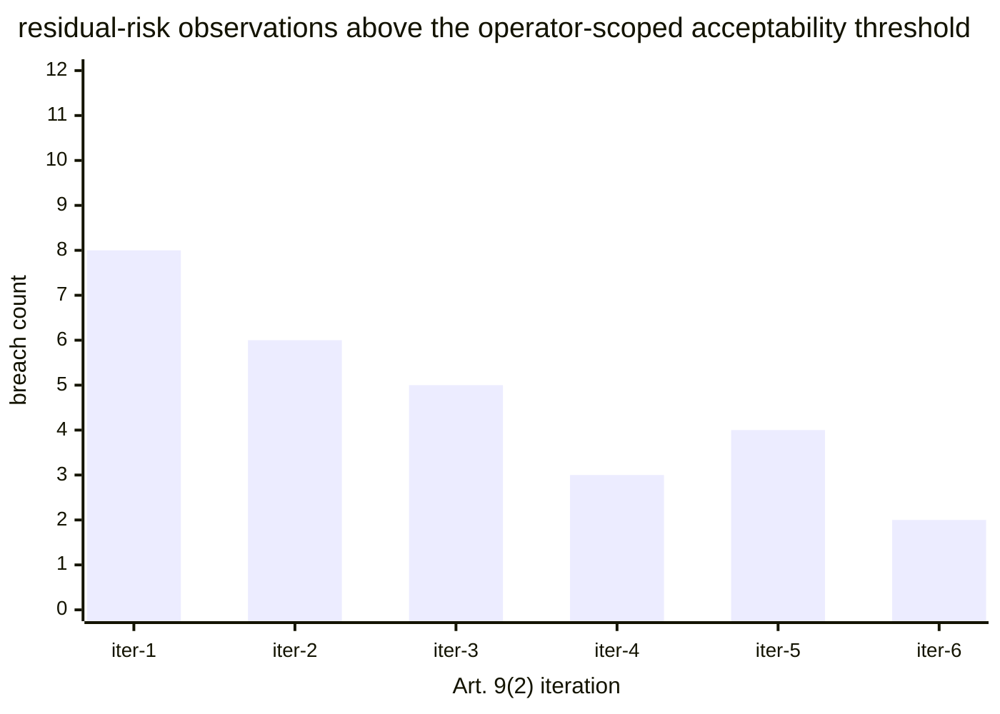

# Reference visualisation — `kri.residual_risk_threshold_breach_count@v1`

This is the committed reference-visualisation artifact for the
EU AI Act Article 9(5) residual-risk-threshold breach KRI. It exists
so the G-04 catalog definition-of-done (a *committed* reference
visualisation, not a narrated one) is closed; downstream compile
targets (n8n / Temporal / LangGraph) read the same metric YAML and
render the executable form in their own dashboard surface. The
artifact here is the contract for the chart shape, not the
executable chart.

## Chart kind

Vertical bar chart, one bar per closed Article 9(2) iteration in the
evaluation window, ordered chronologically so the trend across
iterations is visible at a glance. The aggregate `count` across
iterations is the headline figure operators read first; the
per-iteration bars are the supporting drill-down that names *which*
Article 9(2) iteration produced the breach observations.

- **x-axis:** closed Article 9(2) iteration in the window, labelled
  by iteration index (or the closing date of the iteration when
  operator dashboards support it).
- **y-axis:** `residual_risk_threshold_breach_count` — number of
  distinct residual-risk observations that crossed the operator-
  scoped acceptability threshold within the iteration.
- **Headline annotation:** the aggregate `count` across closed
  iterations in the window, annotated as the metric value.

The KRI does not redeclare a numeric acceptability threshold —
operators set that under Article 9(5) against the pinned Annex III
use-case category and the state-of-the-art reading under
Article 9(3), and typically wire scoped overrides for each use-case
category rather than a catalogue-global value.

## Reference rendering (Mermaid)

The mermaid block below is the canonical reference rendering — small
enough to live in-tree and renderable directly on the public repo
surface. The numeric values are illustrative; the compile target is
the source of truth for the executable form against operator data.

Reading the bars in this illustrative rendering:

| iteration | breach_count | reading                                                                    |
|-----------|--------------|----------------------------------------------------------------------------|
| iter-1    | 8            | initial pre-market pass surfaces the largest number of breach observations |
| iter-2    | 6            | first round of Art. 9(2)(d) targeted measures lands                        |
| iter-3    | 5            | first post-market monitoring signals fed back                              |
| iter-4    | 3            | second-round measures land; the Art. 72 loop is warming up                 |
| iter-5    | 4            | new Annex III sub-scenario surfaces a fresh breach cluster                 |
| iter-6    | 2            | steady-state — measures are converging on the residual acceptability line  |

The headline aggregate here is `≈ 28` across the six illustrative
iterations. A persistent non-zero value across successive iterations
is the operator-side flag that the Article 9(2)(d) targeted-measures
set is not converging on the Article 9(5) acceptability line.

## OCSF source-data shape

The chart's underlying observations are derived from two OCSF event
classes:

- `earliest input`: **residual_risk_observation** — bound to
  `telemetry.ocsf.compliance_finding@v1` (OCSF Compliance Finding,
  class_uid 2003). The Article 9(2) assessment step emits one
  Compliance Finding per scored residual-risk observation. The
  finding carries the scored residual-risk value, the pinned
  Annex III use-case category, and the reference to the risk
  register entry the observation belongs to.
- `trigger input`: **post_market_signal** — bound to
  `telemetry.ocsf.detection_finding@v1` (OCSF Detection Finding,
  class_uid 2004). The Article 72 post-market monitoring step emits
  a Detection Finding when a signal represents an anomaly that
  pushes a residual-risk observation across the acceptability
  threshold. Catalog entry is detection-vendor-neutral.

## Operator override

Operators are expected to render this KRI in their own dashboard
idiom — the catalog reference rendering above is the contract for
the chart shape (per-iteration vertical bars, aggregate count
headline), not the visual style. The compile target is the source
of truth for the executable form.
