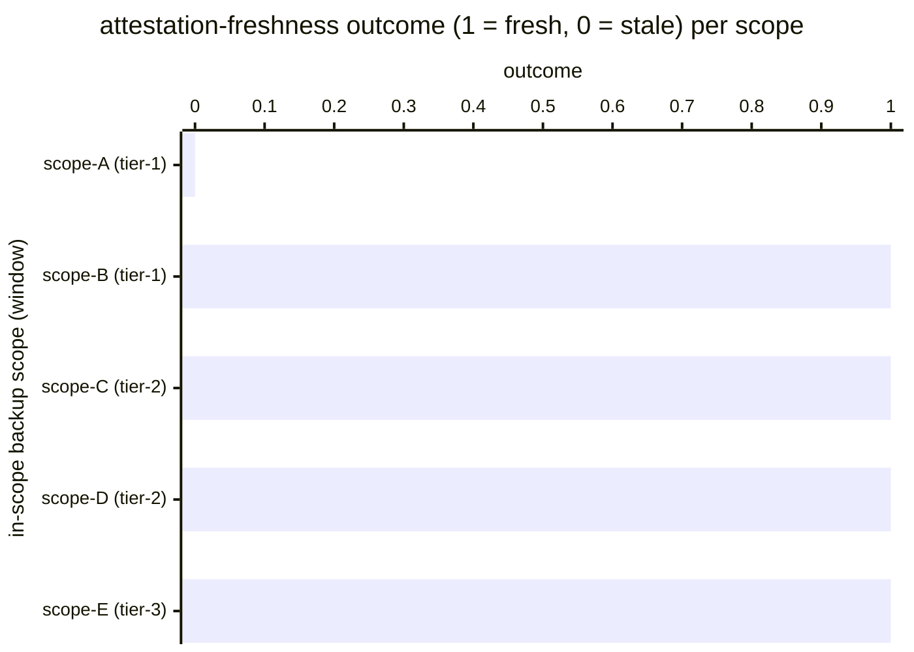

# Reference visualisation — `kpi.restore_drill_attestation_freshness@v1`

This is the committed reference-visualisation artifact for the
restore-drill-attestation-freshness KPI. It exists so the G-04 catalog
definition-of-done (a *committed* reference visualisation, not a
narrated one) is closed; downstream compile targets (n8n / Temporal /
LangGraph) read the same metric YAML and render the executable form in
their own dashboard surface. The artifact here is the contract for the
chart shape, not the executable chart.

## Chart kind

Two-panel composition. The headline panel is a single gauge-style
horizontal bar reading the attestation-freshness `ratio` across the
operator's in-scope backup scopes in the evaluation window — the share
of scopes whose most-recent restore-drill attestation carries a
publish timestamp younger than the operator's documented freshness
window. The drill-down panel is a horizontal bar chart, one bar per
in-scope backup scope observed in the window, plotting attestation
freshness encoded as `1` (fresh) or `0` (stale-or-missing). Slicing by
backup scope is the canonical drill-down dimension.

- **Headline (ratio):** the `ratio` aggregate across in-scope backup
  scopes in the window. This is the figure operators read first.
  Because the KPI is `higher_is_better`, a value near `1.00` is
  healthy and a falling value is the attestation-trail-staleness
  signal.
- **Drill-down x-axis:** one row per in-scope backup scope observed
  in the window, labelled by the scope id; sorted ascending so the
  stale scopes sit at the top — the scopes that pulled the ratio
  off `1.00`.
- **Drill-down y-axis:** freshness outcome encoded as `0` (attestation
  older than the freshness window, or no attestation on file) or
  `1` (attestation inside the freshness window).
- **Threshold overlay (drill-down):** a horizontal line at `1` —
  every bar below the line is a stale-or-missing attestation.

## Reference rendering (Mermaid)

The mermaid block below is the canonical reference rendering — small
enough to live in-tree and renderable directly on the public repo
surface. The numeric values are illustrative; the compile target is
the source of truth for the executable form against operator data.

Reading the bars in this illustrative rendering:

| scope (tier)      | outcome | fresh? | reading                                                          |
|-------------------|---------|--------|------------------------------------------------------------------|
| scope-A (tier-1)  | 0       | no     | most-recent attestation older than the freshness window          |
| scope-B (tier-1)  | 1       | yes    | attestation inside the freshness window                          |
| scope-C (tier-2)  | 1       | yes    | attestation inside the freshness window                          |
| scope-D (tier-2)  | 1       | yes    | attestation inside the freshness window                          |
| scope-E (tier-3)  | 1       | yes    | attestation inside the freshness window                          |

With one stale scope across five, the headline `ratio` resolves to
`4 / 5 = 0.80` in this snapshot. That value is what the catalog
aggregation `measurement.aggregation: ratio` resolves to for this
snapshot.

## Threshold band reference

The catalog entry at `restore_drill_attestation_freshness.yaml`
declares warn (< 0.95) and breach (< 0.80) bands at the unscoped
baseline; operators under scoped programmes tighten these bands in
their compile-target configuration. The catalog YAML at
`content/metrics/restore_drill_attestation_freshness.yaml` remains the
source of truth for the indicator shape; this file is the
visualisation surface.

## OCSF source-data shape

The chart's underlying observations are derived from the operator's
backup_recovery evidence stream. Each in-scope backup scope
contributes one freshness-outcome sample computed against the
`measurement.inputs` declared on
`restore_drill_attestation_freshness.yaml`:

- **numerator** — count of in-scope backup scopes whose most-recent
  attestation carries a publish timestamp younger than the operator's
  documented freshness window. The evidence-emission event is bound
  to the playbook step declared on the catalog entry's
  `playbook_refs`:
  - `playbook.backup_recovery@v1`
    `action--50000000-0000-4000-8000-000000000006` — evidence-capture
    step (CP-9 System Backup / CP-10 System Recovery and
    Reconstitution anchor).
- **denominator** — count of in-scope backup scopes declared in the
  operator's backup-scope catalogue. Scopes with no attestation on
  file at all count against the denominator (they are stale-by-default)
  so the indicator does not silently improve on record-keeping gaps.

The OCSF source-data shape is API Activity (class_uid 6003) per the
backup_recovery playbook's `mappings.yaml` outbound view. The
evidence-capture step emits an API Activity record per published
attestation; the record carries the `__attestation_id__` identifier
and the publish timestamp.

## Operator override

Operators are expected to render this metric in their own dashboard
idiom — the catalog reference rendering above is the contract for the
chart shape (ratio headline, per-scope fresh/stale drill-down,
freshness-floor overlay at `1`), not the visual style. The compile
target is the source of truth for the executable form.
