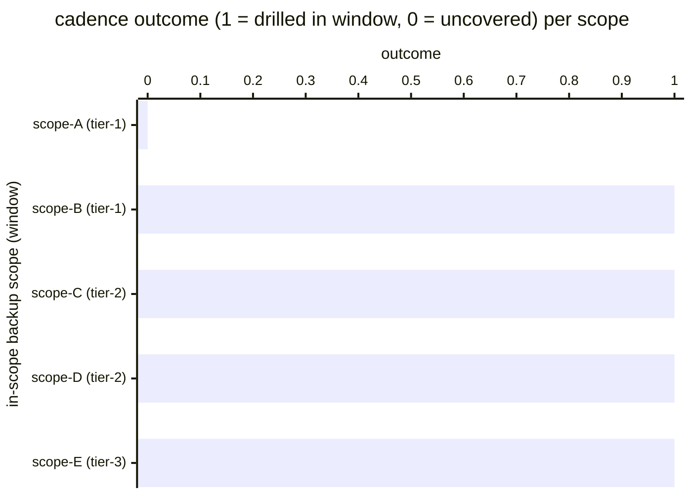

# Reference visualisation — `kpi.restore_drill_cadence@v1`

This is the committed reference-visualisation artifact for the
restore-drill-cadence KPI. It exists so the G-04 catalog
definition-of-done (a *committed* reference visualisation, not a
narrated one) is closed; downstream compile targets (n8n / Temporal /
LangGraph) read the same metric YAML and render the executable form in
their own dashboard surface. The artifact here is the contract for the
chart shape, not the executable chart.

## Chart kind

Two-panel composition. The headline panel is a single gauge-style
horizontal bar reading the restore-drill cadence `ratio` across the
operator's in-scope backup scopes in the evaluation window — the share
of scopes whose most-recent restore drill landed inside the operator's
documented drill-cadence window. The drill-down panel is a horizontal
bar chart, one bar per in-scope backup scope observed in the window,
plotting the drill-freshness outcome encoded as `1` (covered) or `0`
(uncovered). Slicing by backup scope is the canonical drill-down
dimension because operators typically declare a heterogeneous scope
catalogue — different systems, different RPO/RTO bands — and the
cadence KPI reads whether the discipline covers each scope evenly.

- **Headline (ratio):** the `ratio` aggregate across in-scope backup
  scopes in the window. This is the figure operators read first.
  Because the KPI is `higher_is_better`, a value near `1.00` is
  healthy and a falling value is the restore-drill-cadence-erosion
  signal.
- **Drill-down x-axis:** one row per in-scope backup scope observed
  in the window, labelled by the scope id; sorted ascending so the
  uncovered scopes sit at the top — the scopes that pulled the
  ratio off `1.00`.
- **Drill-down y-axis:** cadence outcome encoded as `0` (no drill in
  the cadence window) or `1` (fresh drill in the cadence window). A
  bar at `0` contributes a `1` to the denominator without contributing
  a `1` to the numerator.
- **Threshold overlay (drill-down):** a horizontal line at `1` —
  every bar below the line is an uncovered scope. Operators reading
  the drill-down see *which* scopes are dragging the cadence rate
  and which RPO/RTO bands are carrying the gap.

## Reference rendering (Mermaid)

The mermaid block below is the canonical reference rendering — small
enough to live in-tree and renderable directly on the public repo
surface. The numeric values are illustrative; the compile target is
the source of truth for the executable form against operator data.

Reading the bars in this illustrative rendering:

| scope (tier)      | outcome | drilled? | reading                                                          |
|-------------------|---------|----------|------------------------------------------------------------------|
| scope-A (tier-1)  | 0       | no       | no completed drill inside the cadence window — cadence gap       |
| scope-B (tier-1)  | 1       | yes      | drill completed against isolated target inside the window        |
| scope-C (tier-2)  | 1       | yes      | drill completed against isolated target inside the window        |
| scope-D (tier-2)  | 1       | yes      | drill completed against isolated target inside the window        |
| scope-E (tier-3)  | 1       | yes      | drill completed against isolated target inside the window        |

With one uncovered scope across five, the headline `ratio` resolves
to `4 / 5 = 0.80` in this snapshot. That value is what the catalog
aggregation `measurement.aggregation: ratio` resolves to for this
snapshot.

## Threshold band reference

The catalog entry at `restore_drill_cadence.yaml` declares warn (< 0.95)
and breach (< 0.80) bands at the unscoped baseline; operators under
scoped programmes tighten these bands in their compile-target
configuration. The catalog YAML at
`content/metrics/restore_drill_cadence.yaml` remains the source of
truth for the indicator shape; this file is the visualisation surface.

## OCSF source-data shape

The chart's underlying observations are derived from the operator's
backup_recovery execution stream. Each in-scope backup scope
contributes one cadence-outcome sample computed against the
`measurement.inputs` declared on `restore_drill_cadence.yaml`:

- **numerator** — count of in-scope backup scopes whose most-recent
  backup_recovery execute-restore-drill step landed a non-empty
  `__drill_result__` inside the operator's documented drill-cadence
  window. The write call against the operator's documented isolated
  drill target is bound to the execute-restore-drill step declared on
  the catalog entry's `playbook_refs`:
  - `playbook.backup_recovery@v1`
    `action--50000000-0000-4000-8000-000000000005` — execute-restore-
    drill step (D3-SRA System Recovery Analysis anchor).
- **denominator** — count of in-scope backup scopes declared in the
  operator's backup-scope catalogue. Scopes whose drill-pipeline
  stalled before an execute-restore-drill event was emitted count
  toward the denominator (they are uncovered) so the indicator does
  not silently improve when the pipeline itself fails.

The OCSF source-data shape is API Activity (class_uid 6003) per the
backup_recovery playbook's `mappings.yaml` outbound view. The
execute-restore-drill step emits an API Activity record per drill
against the documented isolated drill target; the record carries the
`__drill_result__` identifier and the observed RTO / RPO measurements.

## Operator override

Operators are expected to render this metric in their own dashboard
idiom — the catalog reference rendering above is the contract for the
chart shape (ratio headline, per-scope covered/uncovered drill-down,
coverage-floor overlay at `1`), not the visual style. The compile
target is the source of truth for the executable form.
