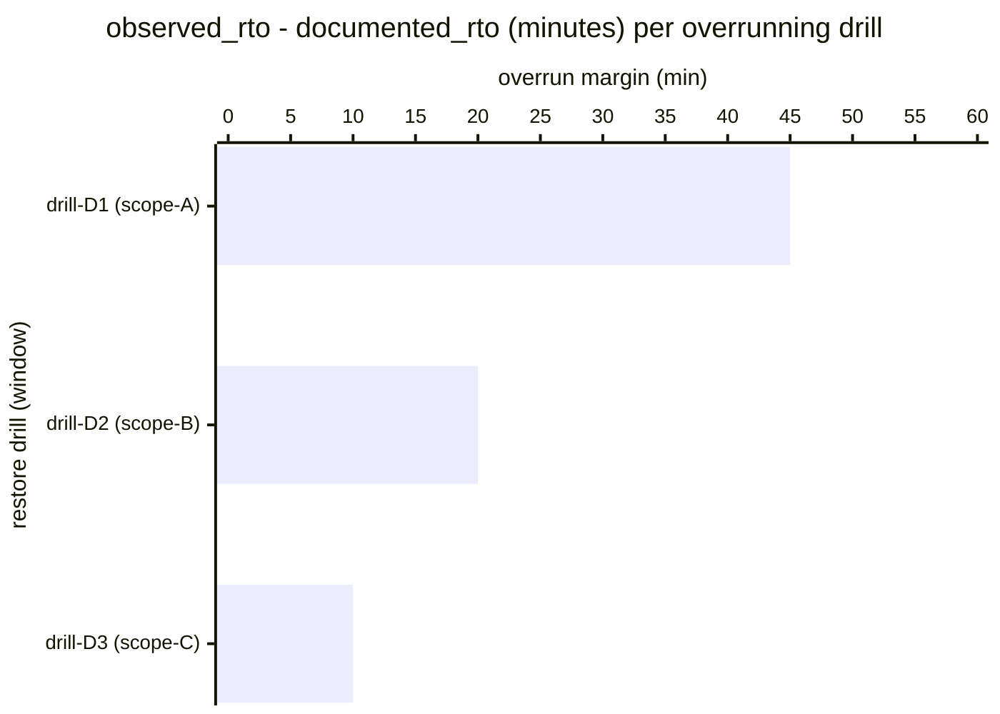

# Reference visualisation — `kri.restore_drill_rto_overrun@v1`

This is the committed reference-visualisation artifact for the
restore-drill RTO-overrun KRI. It exists so the G-04 catalog
definition-of-done (a *committed* reference visualisation, not a
narrated one) is closed; downstream compile targets (n8n / Temporal /
LangGraph) read the same metric YAML and render the executable form in
their own dashboard surface. The artifact here is the contract for the
chart shape, not the executable chart.

## Chart kind

Two-panel composition. The headline panel is a single counter card
reading the total `count` of executed restore drills whose observed
RTO exceeded the documented RTO objective during the evaluation
window. The drill-down panel is a horizontal bar chart, one bar per
overrunning drill observed in the window, plotting the overrun margin
(observed RTO minus documented RTO objective) so operators can see
which scopes are drifting away from their continuity targets. Slicing
by backup scope is the canonical drill-down dimension.

- **Headline (count):** the `count` aggregate across
  execute-restore-drill events in the window. Because the KRI is
  `lower_is_better`, zero is healthy and any positive value is the
  RTO-drift signal.
- **Drill-down x-axis:** overrun margin in minutes (observed RTO
  minus documented RTO objective). Positive values are overruns;
  bars are sorted descending so the largest overrun sits at the top.
- **Drill-down y-axis:** one row per overrunning drill in the window,
  labelled by the drill identifier and backup scope.
- **Threshold overlay (headline):** the warn (>= 1) and breach (>= 3)
  bands the catalog declares — the headline card colour-cues on those
  bands so operators see the risk posture at a glance.

## Reference rendering (Mermaid)

The mermaid block below is the canonical reference rendering — small
enough to live in-tree and renderable directly on the public repo
surface. The numeric values are illustrative; the compile target is
the source of truth for the executable form against operator data.

Reading the bars in this illustrative rendering:

| drill (scope)         | overrun (min) | reading                                                          |
|-----------------------|---------------|------------------------------------------------------------------|
| drill-D1 (scope-A)    | 45            | tier-1 scope missed RTO by 45 minutes — hardest overrun          |
| drill-D2 (scope-B)    | 20            | tier-1 scope missed RTO by 20 minutes                            |
| drill-D3 (scope-C)    | 10            | tier-2 scope missed RTO by 10 minutes                            |

With three overrunning drills in the window, the headline `count`
resolves to `3` in this snapshot. That value is what the catalog
aggregation `measurement.aggregation: count` resolves to for this
snapshot — at the breach band (>= 3).

## Threshold band reference

The catalog entry at `restore_drill_rto_overrun.yaml` declares warn
(>= 1) and breach (>= 3) bands at the unscoped baseline; operators
under scoped programmes tighten these bands in their compile-target
configuration. The catalog YAML at
`content/metrics/restore_drill_rto_overrun.yaml` remains the source of
truth for the indicator shape; this file is the visualisation surface.

## OCSF source-data shape

The chart's underlying observations are derived from the operator's
backup_recovery execution stream. Each executed restore drill
contributes one overrun-margin sample computed against the
`measurement.inputs` declared on `restore_drill_rto_overrun.yaml`:

- **rto_overrun_margin** — observed RTO minus documented RTO objective
  for the in-scope backup scope. Bound to the playbook step declared
  on the catalog entry's `playbook_refs`:
  - `playbook.backup_recovery@v1`
    `action--50000000-0000-4000-8000-000000000005` — execute-restore-
    drill step (CP-10 System Recovery and Reconstitution / D3-SRA
    System Recovery Analysis anchor).

The OCSF source-data shape is API Activity (class_uid 6003) per the
backup_recovery playbook's `mappings.yaml` outbound view. The
execute-restore-drill step emits an API Activity record per completed
drill against the operator's documented isolated drill target; the
record carries the `__drill_result__` identifier and the observed RTO
measurement in the request-metadata block.

## Operator override

Operators are expected to render this metric in their own dashboard
idiom — the catalog reference rendering above is the contract for the
chart shape (count headline with warn / breach cueing, per-drill
overrun-margin drill-down), not the visual style. The compile target
is the source of truth for the executable form.
