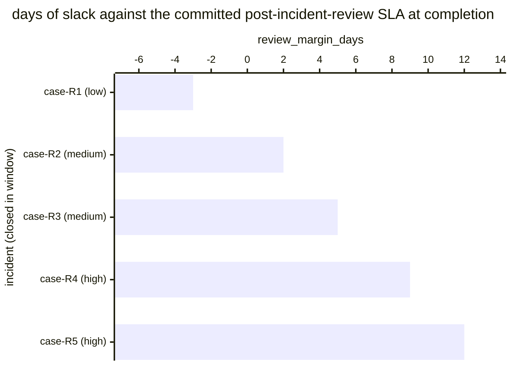

# Reference visualisation — `kpi.review_completion_sla@v1`

This is the committed reference-visualisation artifact for the
post-incident-review completion SLA KPI. It exists so the G-04 catalog
definition-of-done (a *committed* reference visualisation, not a
narrated one) is closed; downstream compile targets (n8n / Temporal /
LangGraph) read the same metric YAML and render the executable form in
their own dashboard surface. The artifact here is the contract for the
chart shape, not the executable chart.

## Chart kind

Two-panel composition. The headline panel is a single gauge-style
horizontal bar reading the on-time-review rate (`ratio`) across
incidents closed in the evaluation window. The drill-down panel is a
horizontal bar chart, one bar per closed incident, plotting
`review_margin_days` — days between the post-incident-review
completion timestamp and the review's committed SLA deadline measured
from incident closeout. Positive bars are on-time slack; negative bars
are SLA misses and contribute the failing samples that pull the ratio
below `1.00`. Slicing by `incident.severity` is the canonical
drill-down dimension because post-incident-review SLAs typically
tighten for higher-severity incidents.

- **Headline (ratio):** the `ratio` aggregate across in-scope closed
  incidents in the window. This is the figure operators read first.
- **Drill-down x-axis:** `review_margin_days` — days remaining at
  review completion against the post-incident-review SLA. Positive
  values left-to-right are on-time slack; negative values left of
  zero are SLA misses.
- **Drill-down y-axis:** one row per closed incident in the window,
  labelled by the case `incident.uid` and severity; sorted ascending
  so the slimmest margins (and any misses) sit at the top — the
  reviews that are about to break the rate.
- **Threshold overlay (drill-down):** a vertical line at zero — every
  bar left of zero is a sample that failed the SLA and contributes a
  `1` to the denominator without contributing a `1` to the numerator.
  Operators reading the drill-down see *which* reviews pulled the
  ratio off `1.00`.

## Reference rendering (Mermaid)

The mermaid block below is the canonical reference rendering — small
enough to live in-tree and renderable directly on the public repo
surface. The numeric values are illustrative; the compile target is
the source of truth for the executable form against operator data.

Reading the bars in this illustrative rendering:

| case (severity)   | review_margin_days | on-time? | reading                                                |
|-------------------|--------------------|----------|--------------------------------------------------------|
| case-R1 (low)     | -3                 | no       | review missed SLA by 3 days                            |
| case-R2 (medium)  | 2                  | yes      | completed 2 days before deadline — thin slack          |
| case-R3 (medium)  | 5                  | yes      | comfortable slack                                      |
| case-R4 (high)    | 9                  | yes      | early completion, healthy slack                        |
| case-R5 (high)    | 12                 | yes      | well under the high-severity SLA                       |

With one miss across five reviews, the headline `ratio` resolves to
`4 / 5 = 0.80` in this snapshot. That value is what the catalog
aggregation `measurement.aggregation: ratio` resolves to for this
snapshot.

## Threshold band reference

The catalog entry at `review_completion_sla.yaml` is severity-neutral
and does not declare numeric warn / breach thresholds at the unscoped
baseline — the operator's post-incident-review policy is the source of
truth for the per-severity SLA, and the catalog ratio reflects the
share of reviews that hit that policy. Severity-scoped variants (for
example a high-severity post-incident-review SLA indicator) declare
numeric bands and live as separate catalog entries. The catalog YAML
at `content/metrics/review_completion_sla.yaml` remains the source of
truth for the indicator shape; this file is the visualisation surface.

## OCSF source-data shape

The chart's underlying observations are derived from the operator's
post-incident-review record per closed incident. Each in-scope
incident closed within the evaluation window contributes one
`review_margin_days` sample computed against the `measurement.inputs`
declared on `review_completion_sla.yaml`:

- **numerator** — count of closed incidents whose post-incident-review
  completion timestamp landed earlier than (incident closeout
  timestamp + committed review SLA). The review-completion event is
  bound to the post-incident-review step transitions declared on the
  catalog entry's `playbook_refs`:
  - `playbook.post_incident_review@v1`
    `action--40000000-0000-4000-8000-000000000003` — review-completion
    step on the post-incident-review playbook.
- **denominator** — count of in-scope incidents closed within the
  evaluation window. Exclude incidents whose post-incident-review
  step never fired (record-keeping gap) so the indicator does not
  silently improve when the post-incident-review pipeline stalls.

The catalog entry deliberately does not pin a single OCSF telemetry
binding at the unscoped baseline: post-incident-review completion is
carried on the operator's own case-management surface (a ticketing
system's incident record, a SOAR case object, or a post-incident-review
document), and there is no unambiguous OCSF event class that covers
the intersection of those surfaces at the catalog level. The deferral
is named honestly — the binding is to the playbook-step transition on
the post-incident-review playbook, not to an OCSF class. A CORE
follow-up may add an OCSF binding for case-management-surface-scoped
variants once the operator's case-management surface is declared.

The reference rendering above remains shape-valid: it reads two
timestamps per closed incident (the review-completion timestamp and
the SLA deadline computed from incident closeout) and computes a
duration, regardless of which case-management surface the operator's
compile target resolves the review-completion event against.

## Operator override

Operators are expected to render this metric in their own dashboard
idiom — the catalog reference rendering above is the contract for the
chart shape (ratio headline, per-incident review-margin drill-down
sliced by severity, zero-line on-time overlay), not the visual style.
The compile target is the source of truth for the executable form.
