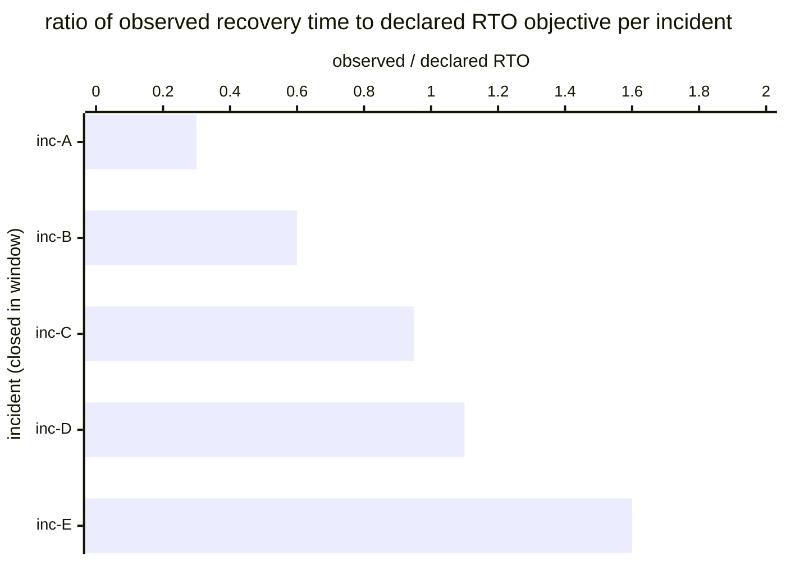

# Reference visualisation — `kpi.rto_compliance_rate@v1`

This is the committed reference-visualisation artifact for the RTO
compliance-rate KPI anchoring NIS2 Art. 21(1)(c) disaster recovery
and DORA Art. 11(2)(b) recovery-objective scoping. It exists so the
G-04 catalog definition-of-done (a *committed* reference
visualisation, not a narrated one) is closed; downstream compile
targets (n8n / Temporal / LangGraph) read the same metric YAML and
render the executable form in their own dashboard surface. The
artifact here is the contract for the chart shape, not the
executable chart.

## Chart kind

Two-panel composition. The headline panel is a single gauge-style
percentage reading the RTO compliance rate (`percent`) across the
evaluation window, plotted against the catalog `warn` / `high` /
`breach` threshold bands (98% / 95% / 90%) and the 95% operational
benchmark. Direction is `higher_is_better`: a rate below 95% is a
recovery-posture signal below the benchmark. The drill-down panel
is a horizontal bar chart, one bar per incident closed in the
window that carried a declared RTO objective, plotting
`observed_recovery_time / declared_rto_objective` ratio.

- **Headline (percent):** the aggregate RTO compliance rate across
  incidents in the window. This is the figure the operator's
  recovery-posture surface reads first — the aggregate benchmark
  reading.
- **Drill-down x-axis:** `observed_recovery_time /
  declared_rto_objective` ratio per incident — values at-or-below
  1.0 met the declared RTO, values above 1.0 exceeded it. Lower
  values are better.
- **Drill-down y-axis:** one row per incident closed in the window,
  labelled by `incident.uid`; sorted descending so the incidents
  that most-exceeded their declared RTO sit at the top — the cases
  that lower the aggregate.
- **Threshold overlay (headline):** three vertical lines at 98%
  (warn), 95% (high / benchmark), and 90% (breach). Readings left
  of the 95% line are at-or-below the operational benchmark and
  should surface on the operator's continuity-register review.

## Reference rendering (Mermaid)

The mermaid block below is the canonical reference rendering — small
enough to live in-tree and renderable directly on the public repo
surface. The numeric values are illustrative; the compile target is
the source of truth for the executable form against operator data.

Reading the bars in this illustrative rendering:

| incident | observed/declared | reading                                                            |
|----------|-------------------|--------------------------------------------------------------------|
| inc-A    | 0.30              | met RTO with comfortable headroom                                  |
| inc-B    | 0.60              | met RTO with headroom                                              |
| inc-C    | 0.95              | met RTO at the wall — leading signal                               |
| inc-D    | 1.10              | RTO exceeded by 10% — contributes to the non-compliant tail         |
| inc-E    | 1.60              | RTO exceeded by 60% — recovery-posture breach on this incident      |

With three of five incidents meeting their declared RTO the aggregate
resolves to a headline of 60% for this snapshot — well below the 95%
benchmark. That value is what the catalog aggregation
`measurement.aggregation: percent` resolves to for this snapshot.

## Threshold band reference

| name   | comparator | value | severity |
|--------|------------|-------|----------|
| warn   | <          | 98    | warn     |
| high   | <          | 95    | high     |
| breach | <          | 90    | critical |

The bands match the `thresholds` array on
`rto_compliance_rate.yaml`; the catalog entry is the source of
truth, this file is the visualisation surface. The catalog `target`
(`>= 95`) is an operational benchmark — not a statutory ratio.
Operators MAY tighten it for essential-service and financial-sector
ICT tiers.

## OCSF source-data shape

The chart's underlying observations are derived from the operator's
incident-handling timeline. Each incident closed in the evaluation
window that carried a declared RTO objective contributes one
`rto_met` sample computed from the two inputs declared in
`rto_compliance_rate.yaml`'s `measurement.inputs`:

- `observed_recovery_time` — elapsed time between incident-onset
  and service-restored on the incident-handling timeline. Bound to
  `telemetry.ocsf.compliance_finding@v1` field `duration` on the
  incident-recovery event.
- `declared_rto_objective` — RTO objective declared on the affected
  service's continuity register. Bound to
  `telemetry.ocsf.compliance_finding@v1` field
  `metadata.correlation_uid` on the incident-recovery event.

The compliance rate that drives the headline is
`100 * sum(rto_met) / count(incidents_with_declared_rto)` across
incidents.

## Operator override

Operators are expected to render this metric in their own dashboard
idiom — the catalog reference rendering above is the contract for
the chart shape (headline percentage gauge, per-incident
observed/declared ratio bars, three recovery-threshold overlays),
not the visual style. The compile target is the source of truth for
the executable form.
