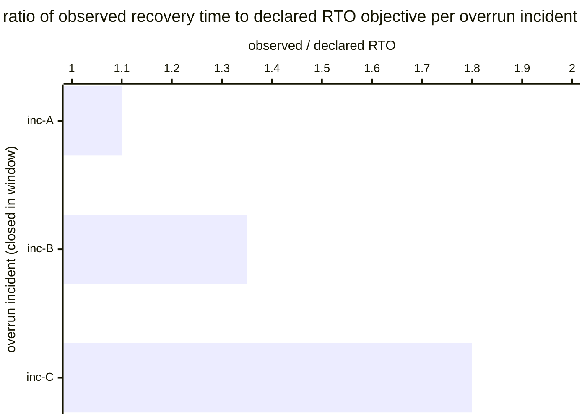

# Reference visualisation — `kri.rto_overrun_exposure_count@v1`

This is the committed reference-visualisation artifact for the
RTO-overrun exposure-count KRI — the residual-risk counterpart to
`kpi.rto_compliance_rate@v1` anchoring the risk-management-measures
limb of NIS2 Art. 21(2)(e) and the ICT-supported business-function-
continuity limb of DORA Art. 8. It exists so the G-04 catalog
definition-of-done (a *committed* reference visualisation, not a
narrated one) is closed; downstream compile targets (n8n / Temporal /
LangGraph) read the same metric YAML and render the executable form in
their own dashboard surface. The artifact here is the contract for the
chart shape, not the executable chart.

## Chart kind

Two-panel composition. The headline panel is a count card reading the
total number of production incidents (`count`) whose observed recovery
time exceeded the declared RTO objective in the trailing 90-day
evaluation window, plotted against the catalog `warn` / `high` /
`breach` threshold bands (>= 1 / >= 3 / >= 5). Direction is
`lower_is_better`: a rising overrun count is the leading signal that
the operator's declared RTO objectives are not being met in
production. The drill-down panel is a horizontal bar chart, one bar
per incident closed in the window that overran its declared RTO,
plotting the `observed_recovery_time / declared_rto_objective` ratio.

- **Headline (count):** the total number of RTO-overrun incidents in
  the window. This is the figure the operator's recovery-posture
  surface reads first — the residual-risk exposure reading.
- **Drill-down x-axis:** `observed_recovery_time /
  declared_rto_objective` ratio per overrun incident. Higher values
  are worse; every incident in this panel had a ratio above 1.0.
- **Drill-down y-axis:** one row per RTO-overrun incident closed in
  the window, labelled by `incident.uid`; sorted descending so the
  incidents that most-exceeded their declared RTO sit at the top.
- **Threshold overlay (headline):** three vertical lines at 1
  (warn), 3 (high), and 5 (breach). A headline count at or above 5
  is a continuity-posture breach and should surface on the operator's
  continuity-register review.

## Reference rendering (Mermaid)

The mermaid block below is the canonical reference rendering — small
enough to live in-tree and renderable directly on the public repo
surface. The numeric values are illustrative; the compile target is
the source of truth for the executable form against operator data.

Reading the bars in this illustrative rendering:

| incident | observed/declared | reading                                                            |
|----------|-------------------|--------------------------------------------------------------------|
| inc-A    | 1.10              | RTO exceeded by 10% — smallest overrun in the window               |
| inc-B    | 1.35              | RTO exceeded by 35%                                                |
| inc-C    | 1.80              | RTO exceeded by 80% — largest overrun in the window                |

With three overrun incidents in the trailing 90-day window the
headline resolves to `3` — inside the `high` band (`>= 3`). That value
is what the catalog aggregation `measurement.aggregation: count`
resolves to for this snapshot.

## Threshold band reference

| name   | comparator | value | severity |
|--------|------------|-------|----------|
| warn   | >=         | 1     | warn     |
| high   | >=         | 3     | high     |
| breach | >=         | 5     | critical |

The bands match the `thresholds` array on
`rto_overrun_exposure_count.yaml`; the catalog entry is the source of
truth, this file is the visualisation surface. The catalog carries no
`target` field — the residual-risk reading is exposure to be
minimised, not a bounded objective; operators MAY tighten the band
thresholds against their own service-criticality tiering.

## OCSF source-data shape

The chart's underlying observations are derived from the operator's
incident-handling timeline. Each incident closed in the evaluation
window that carried a declared RTO objective contributes one
`overrun_flag` sample computed from the inputs declared in
`rto_overrun_exposure_count.yaml`'s `measurement.inputs`:

- `observed_recovery_time` — elapsed time between incident-onset
  and service-restored on the incident-handling timeline. Bound to
  `telemetry.ocsf.compliance_finding@v1` field `duration` on the
  incident-recovery event.
- `declared_rto_objective` — RTO objective declared on the affected
  service's continuity register. Bound to
  `telemetry.ocsf.compliance_finding@v1` field
  `metadata.correlation_uid` on the incident-recovery event.

The overrun count that drives the headline is
`count(observed_recovery_time > declared_rto_objective)` across
incidents.

## Operator override

Operators are expected to render this metric in their own dashboard
idiom — the catalog reference rendering above is the contract for
the chart shape (headline count card, per-incident overrun-ratio
bars, three exposure-threshold overlays), not the visual style. The
compile target is the source of truth for the executable form.
