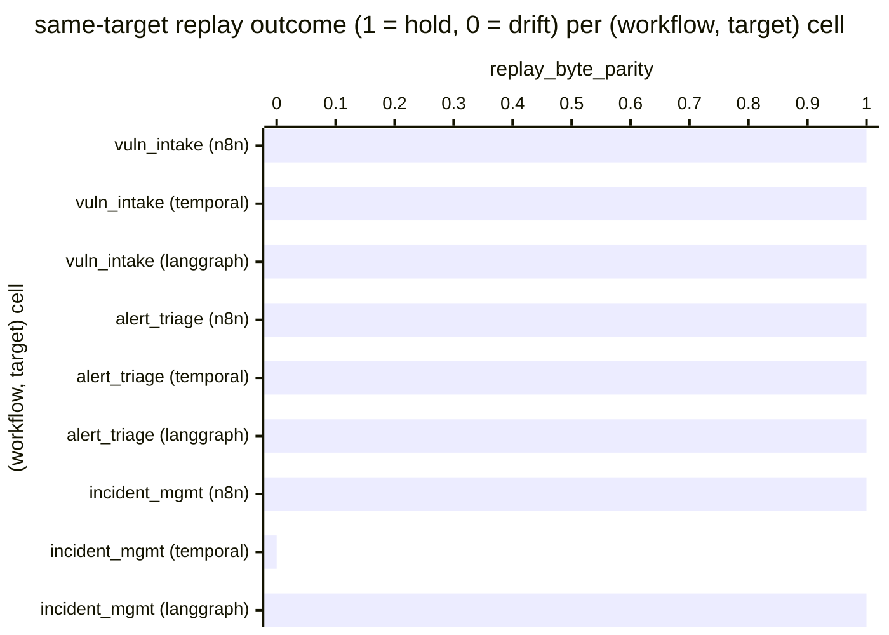

# Reference visualisation — `kpi.same_target_replay_determinism_rate@v1`

This is the committed reference-visualisation artifact for the
same-target deterministic-replay pass-rate KPI. It exists so the G-04
catalog definition-of-done (a *committed* reference visualisation,
not a narrated one) is closed; downstream compile targets (n8n /
Temporal / LangGraph) read the same metric YAML and render the
executable form in their own dashboard surface. The artifact here is
the contract for the chart shape, not the executable chart.

## Chart kind

Two-panel composition. The headline panel is a single gauge-style
horizontal bar reading the same-target replay-byte-parity `ratio`
across all (workflow, target) replay assertions exercised on the
evaluation commit — the share of (workflow, target) cells where
two independent runs of the emitter-shaped traversal produced
byte-identical audit-trail envelopes, divided by the total
(workflow, target) cell count. The drill-down panel is a horizontal
bar chart, one bar per (workflow, target) cell observed, plotting the
cell outcome encoded as `1` (same-target replay holds) or `0`
(drift). Slicing by compile target (n8n / temporal / langgraph) is
the canonical drill-down dimension because the project maintains
three reference compile targets as one of three each, and the
same-target replay contract spans the ring rather than any single
target.

- **Headline (ratio):** the `ratio` aggregate across (workflow,
  target) same-target replay assertions on the evaluation commit.
  Because the KPI is `higher_is_better`, a reading of `1.00` is the
  floor (target value) and any reading below `1.00` is an
  offline-replay regression the project shipped.
- **Drill-down x-axis:** one row per (workflow, target) cell
  observed, labelled by the worked-example workflow name and the
  compile target; sorted ascending so the drift samples sit at the
  top — the (workflow, target) cells that pulled the ratio off
  `1.00`.
- **Drill-down y-axis:** cell outcome encoded as `0` (drift — the
  two independent runs of the same emitter-shaped traversal
  produced audit-trail envelopes whose bytes were not equal) or `1`
  (same-target replay holds — the two runs produced byte-identical
  envelopes, the envelope is non-empty, and a perturbed input
  correctly breaks parity).
- **Threshold overlay (drill-down):** a horizontal line at `1` —
  every bar below the line is a drift sample. Operators reading
  the drill-down see *which* (workflow, target) cells pulled the
  ratio off `1.00`.

## Reference rendering (Mermaid)

The mermaid block below is the canonical reference rendering — small
enough to live in-tree and renderable directly on the public repo
surface. The numeric values are illustrative; the compile target is
the source of truth for the executable form against the same-target
replay-test suite at evaluation time.

Reading the bars in this illustrative rendering:

| (workflow, target)                  | replay_byte_parity | drift? | reading                                                                                |
|-------------------------------------|--------------------|--------|----------------------------------------------------------------------------------------|
| vuln_intake (n8n)                   | 1                  | no     | two same-target runs produced byte-identical audit envelopes                           |
| vuln_intake (temporal)              | 1                  | no     | two same-target runs produced byte-identical audit envelopes                           |
| vuln_intake (langgraph)             | 1                  | no     | two same-target runs produced byte-identical audit envelopes                           |
| alert_triage (n8n)                  | 1                  | no     | two same-target runs produced byte-identical audit envelopes                           |
| alert_triage (temporal)             | 1                  | no     | two same-target runs produced byte-identical audit envelopes                           |
| alert_triage (langgraph)            | 1                  | no     | two same-target runs produced byte-identical audit envelopes                           |
| incident_mgmt (n8n)                 | 1                  | no     | two same-target runs produced byte-identical audit envelopes                           |
| incident_mgmt (temporal)            | 0                  | yes    | temporal emitter-shaped traversal produced divergent envelopes across two runs         |
| incident_mgmt (langgraph)           | 1                  | no     | two same-target runs produced byte-identical audit envelopes                           |

With one drift across nine cells, the headline `ratio` resolves to
`8 / 9 ≈ 0.89` in this snapshot. Because direction is
`higher_is_better`, a falling value is the offline-replay erosion
signal — the same-target replay suite under
``tests/examples/*test_*replay*.py`` is the FOUNDATION §2 offline
contract and a drop below `1.00` means the project shipped a
same-target non-determinism on the evaluation commit. That value is
what the catalog aggregation `measurement.aggregation: ratio`
resolves to for this snapshot.

## Threshold band reference

| name   | comparator | value (ratio) | severity |
|--------|------------|---------------|----------|
| warn   | <          | 1.0           | warn     |
| breach | <          | 0.95          | high     |

The bands match the `thresholds` array on
`same_target_replay_determinism_rate.yaml`; the catalog entry is the
source of truth, this file is the visualisation surface. The `warn`
band fires on any drift; the `breach` band fires when more than 5 %
of the (workflow, target) cells are red, the practical level at
which an offline-replay regression cannot be explained away as a
single intentional emitter change that forgot to refresh its
fixed-clock / deterministic-stub LM contract.

## Test-artifact source-data shape

The chart's underlying observations are derived from the same-target
deterministic-replay suite under ``tests/examples/`` — specifically
the three files
``tests/examples/vuln_intake/test_replay.py``,
``tests/examples/test_alert_triage_replay.py``, and
``tests/examples/test_incident_management_replay.py``. Each
(workflow, target) cell exercised by ``python -m pytest
tests/examples/`` on the evaluation commit contributes one
same-target replay observation computed against the
`measurement.inputs` declared on
`same_target_replay_determinism_rate.yaml`:

- **`same_target_replay_envelope_bytes_assertion`** —
  byte-equality of the audit-trail envelope across two independent
  runs of the emitter-shaped traversal for one worked example, under
  a fixed clock and a deterministic-stub LM adapter, in fresh
  ``contextvars`` contexts. The cell is `1` only when the bytes are
  equal.
- **`same_target_replay_envelope_nonempty_assertion`** — the
  envelope produced by the emitter-shaped traversal is non-empty
  and well-formed. Precondition for the byte-equality assertion to
  be meaningful.
- **`same_target_perturbed_input_breaks_replay_assertion`** — a
  perturbed input correctly breaks parity, guarding against a
  degenerate replay implementation.

A (workflow, target) cell counts as `1` only when all three
assertions in its file pass for that target; any red flips the cell
to `0`. Per-(workflow, target) cells are counted once per evaluation
commit; the catalog window is `P1D` and tumbling because the suite
runs against a discrete commit, not against an operator's runtime
telemetry stream.

## Operator override

Operators are expected to render this metric in their own dashboard
idiom — the catalog reference rendering above is the contract for
the chart shape (ratio headline, per-(workflow, target) replay
drill-down sliced by compile target, pass-floor overlay at `1`),
not the visual style. The compile target is the source of truth for
the executable form.
