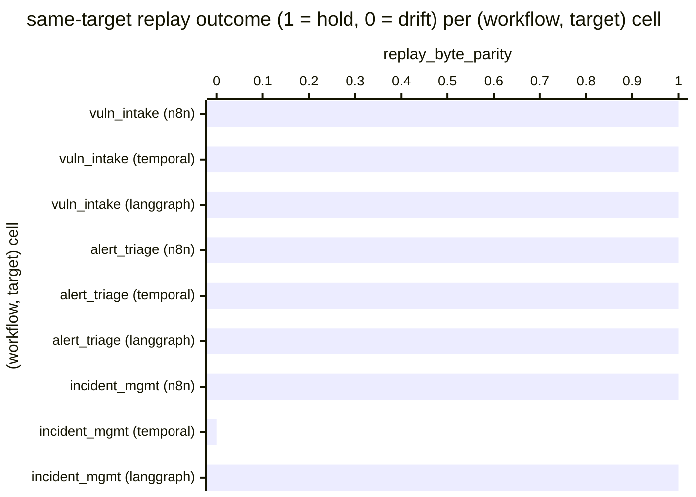

# Reference visualisation — `kri.same_target_replay_drift@v1`

This is the committed reference-visualisation artifact for the
same-target deterministic-replay drift-count KRI. It exists so the
G-04 catalog definition-of-done (a *committed* reference
visualisation, not a narrated one) is closed; downstream compile
targets (n8n / Temporal / LangGraph) read the same metric YAML and
render the executable form in their own dashboard surface. The
artifact here is the contract for the chart shape, not the
executable chart.

## Chart kind

Two-panel composition. The headline panel is a single gauge-style
horizontal bar reading the `count` of (workflow, target) cells in
the same-target replay suite under ``tests/examples/`` that were
red on the evaluation commit — the absolute drift count across the
nine (worked-example, reference compile target) cells the suite
exercises. The drill-down panel is a horizontal bar chart, one bar
per (workflow, target) cell observed, plotting the cell outcome
encoded as `1` (same-target replay holds) or `0` (drift). Bars at
`0` contribute to the count headline; bars at `1` do not. Slicing
by compile target (n8n / temporal / langgraph) is the canonical
drill-down dimension because the project maintains three reference
compile targets as one of three each, and the same-target replay
contract spans the ring rather than any single target.

- **Headline (count):** the `count` aggregate of distinct
  (workflow, target) same-target replay cells that were red on the
  evaluation commit. Because the KRI is `lower_is_better`, a
  reading of `0` is the floor (target value) and any positive
  reading is open offline-replay exposure on the commit under
  evaluation.
- **Drill-down x-axis:** one row per (workflow, target) cell
  observed, labelled by the worked-example workflow name and the
  compile target; sorted ascending so the drift samples sit at the
  top — the cells that pulled the count off `0`.
- **Drill-down y-axis:** cell outcome encoded as `0` (drift — at
  least one assertion in the cell's same-target replay file is red
  for that target) or `1` (same-target replay holds — every
  assertion in the file passes).
- **Threshold overlay (drill-down):** a horizontal line at `1` —
  every bar below the line is a drift sample that contributes one
  to the headline count.

## Reference rendering (Mermaid)

The mermaid block below is the canonical reference rendering — small
enough to live in-tree and renderable directly on the public repo
surface. The numeric values are illustrative; the compile target is
the source of truth for the executable form against the same-target
replay-test suite at evaluation time.

Reading the bars in this illustrative rendering:

| (workflow, target)                  | replay_byte_parity | drift? | reading                                                                                |
|-------------------------------------|--------------------|--------|----------------------------------------------------------------------------------------|
| vuln_intake (n8n)                   | 1                  | no     | every assertion in the same-target replay file passes for n8n                          |
| vuln_intake (temporal)              | 1                  | no     | every assertion in the same-target replay file passes for temporal                     |
| vuln_intake (langgraph)             | 1                  | no     | every assertion in the same-target replay file passes for langgraph                    |
| alert_triage (n8n)                  | 1                  | no     | every assertion in the same-target replay file passes for n8n                          |
| alert_triage (temporal)             | 1                  | no     | every assertion in the same-target replay file passes for temporal                     |
| alert_triage (langgraph)            | 1                  | no     | every assertion in the same-target replay file passes for langgraph                    |
| incident_mgmt (n8n)                 | 1                  | no     | every assertion in the same-target replay file passes for n8n                          |
| incident_mgmt (temporal)            | 0                  | yes    | one or more same-target replay assertions are red for temporal                         |
| incident_mgmt (langgraph)           | 1                  | no     | every assertion in the same-target replay file passes for langgraph                    |

With one drift across nine cells, the headline `count` resolves to
`1` in this snapshot. Because direction is `lower_is_better`, a
positive value is the offline-replay exposure signal — the
same-target replay suite under ``tests/examples/*test_*replay*.py``
is the FOUNDATION §2 offline contract and a count above `0` means
the project shipped a same-target non-determinism on the evaluation
commit. That value is what the catalog aggregation
`measurement.aggregation: count` resolves to for this snapshot.

## Threshold band reference

| name   | comparator | value (count) | severity |
|--------|------------|---------------|----------|
| warn   | >=         | 1             | warn     |
| breach | >=         | 3             | high     |

The bands match the `thresholds` array on
`same_target_replay_drift.yaml`; the catalog entry is the source of
truth, this file is the visualisation surface. The `warn` band
fires on any drift; the `breach` band fires when three or more
cells are red, the practical level at which an offline-replay
regression cannot be explained away as a single intentional change
to the fixed-clock / deterministic-stub LM contract.

## Test-artifact source-data shape

The chart's underlying observations are derived from the same-target
deterministic-replay suite under ``tests/examples/`` — specifically
the three files
``tests/examples/vuln_intake/test_replay.py``,
``tests/examples/test_alert_triage_replay.py``, and
``tests/examples/test_incident_management_replay.py``. Each
(workflow, target) cell exercised by ``python -m pytest
tests/examples/`` on the evaluation commit contributes one
same-target replay observation computed against the
`measurement.inputs` declared on
`same_target_replay_drift.yaml`:

- **`same_target_replay_envelope_bytes_assertion`** —
  byte-equality of the audit-trail envelope across two independent
  runs of the emitter-shaped traversal for one worked example, under
  a fixed clock and a deterministic-stub LM adapter.
- **`same_target_replay_envelope_nonempty_assertion`** — the
  envelope produced by the emitter-shaped traversal is non-empty
  and well-formed.
- **`same_target_perturbed_input_breaks_replay_assertion`** — a
  perturbed input correctly breaks parity, guarding against a
  degenerate replay implementation.

A (workflow, target) cell flips from `1` to `0` when any of the
three assertions is red for that target. Per-(workflow, target)
cells are counted once per evaluation commit; the catalog window is
`P1D` and tumbling because the suite runs against a discrete commit,
not against an operator's runtime telemetry stream.

## Operator override

Operators are expected to render this metric in their own dashboard
idiom — the catalog reference rendering above is the contract for
the chart shape (count headline, per-(workflow, target) replay
drill-down sliced by compile target, pass-floor overlay at `1`),
not the visual style. The compile target is the source of truth for
the executable form.
