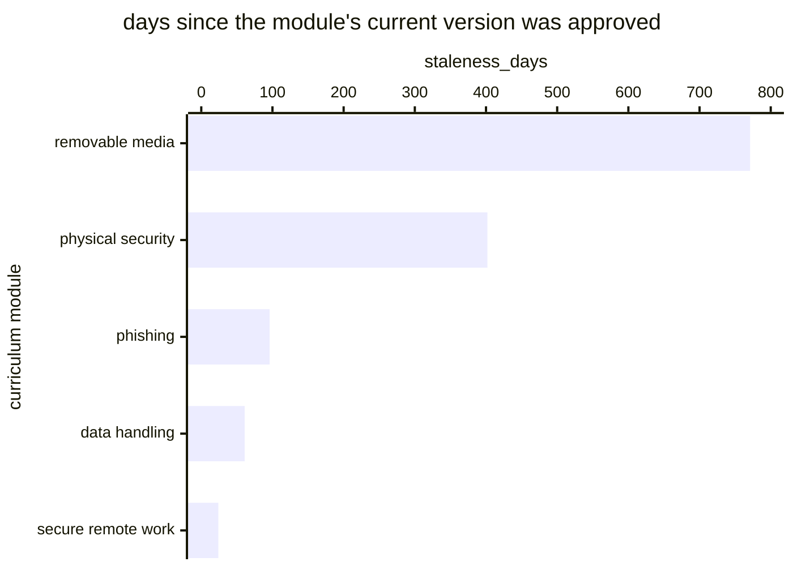

# Reference visualisation — `kri.security_awareness_curriculum_staleness_days@v1`

This is the committed reference-visualisation artifact for the
security-awareness curriculum-staleness KRI. It exists so the G-04
catalog definition-of-done (a *committed* reference visualisation, not a
narrated one) is closed; downstream compile targets (n8n / Temporal /
LangGraph) read the same metric YAML and render the executable form in
their own dashboard surface. The artifact here is the contract for the
chart shape, not the executable chart.

## Chart kind

Horizontal bar chart, one bar per **in-force curriculum module**, sorted
by `staleness_days` descending so the oldest sits at the top. The `max`
is the headline; the per-module bars name which one to revise.

The aggregation is `max` rather than mean, and the chart has to make
that legible. A programme that refreshed nine modules last month and
left the tenth untouched for three years has a mean that looks healthy
and a tenth module teaching stale material. The top bar *is* the
reading; the rest is context.

- **x-axis:** `staleness_days` — days since the module's current version
  was **approved**, not since it was last edited. A module touched
  continuously but never re-approved is stale in the sense that matters.
- **y-axis:** one row per in-force module. Retired modules are excluded.
- **Threshold overlays:** vertical lines at warn (365 d), high (548 d)
  and breach (730 d).
- **Headline annotation:** the `max`, with the band it falls in.

## Reference rendering (Mermaid)

The mermaid block below is the canonical reference rendering — small
enough to live in-tree and renderable directly on the public repo
surface. The numeric values are illustrative; the compile target is the
source of truth for the executable form against operator data.

Reading the bars in this illustrative rendering:

| module             | staleness_days | band      | reading                                                    |
|--------------------|----------------|-----------|--------------------------------------------------------------|
| removable media    | 771            | breach    | over two years unapproved — teaching a threat model that has moved |
| physical security  | 402            | warn      | past the annual cadence                                        |
| phishing           | 96             | on-target | recently revised, as the highest-churn topic should be        |
| data handling      | 61             | on-target |                                                                |
| secure remote work | 24             | on-target | freshly approved                                               |

The `max` here is **771 days**, in the `breach` band, driven entirely by
one module. The mean across these five is 271 days — comfortably
on-target, and completely misleading. That gap is why the catalog
specifies `max`.

## Threshold band reference

| name   | comparator | value (days) | severity |
|--------|------------|--------------|----------|
| warn   | >          | 365          | warn     |
| high   | >          | 548          | high     |
| breach | >          | 730          | critical |

The bands match the `thresholds` array on
`security_awareness_curriculum_staleness_days.yaml`; the catalog entry
is the source of truth for the values, this file for the chart shape.

**365 days is not a legal bound.** Neither NIS2 Art. 21(2)(g) nor
ISO/IEC 27001 A.6.3 sets a review interval. The figure is the cadence
`control.training_curriculum@v1` itself declares (`review_cadence: P1Y`)
expressed in days — so if an operator shortens that declared cadence,
this target moves with it. The two are the same statement, and letting
them drift apart makes the control's declaration meaningless.

## OCSF source-data shape

Inputs ride on `telemetry.ocsf.api_activity@v1` (Application Activity
category, class 6003), emitted by
`playbook.security_awareness_training@v1`.

| input | step | OCSF field | shape |
|---|---|---|---|
| `approved_at` | `action--54000000-0000-4000-8000-000000000003` (`design content`) | `time` | Approval date of the module's current version. The versioning requirement on `control.training_curriculum@v1` exists so this value is available at all. |
| `module_lifecycle_state` | `action--54000000-0000-4000-8000-000000000007` (`review cycle`) | `status_id` | In force or retired. Retired modules are excluded so a programme is not penalised for material it deliberately withdrew. |

`evaluation_now` is the compile target's scheduler clock and binds to no
OCSF class.

## Operator override

Re-derive the bands from your own declared review cadence rather than
inheriting 365 days. An operator whose threat surface moves faster — a
new high-risk deployment, a change of regulator, a materially different
phishing profile — should shorten both the control's `review_cadence`
and this target together.

Two behaviours the catalog formula requires that a dashboard must not
quietly simplify:

- **A module in force but never approved contributes its age since
  creation.** Otherwise an unapproved module hides by having no approval
  date, which is the worst case reading as the best.
- **No curriculum at all is *undefined*, not zero.** A programme with no
  curriculum is not maximally fresh. That absence belongs on
  `kpi.security_awareness_programme_coverage@v1` as an uncovered
  population, not as a clean reading here.
