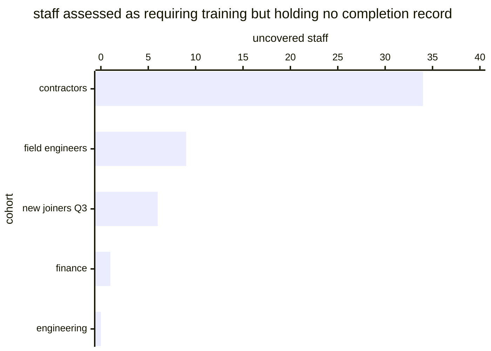

# Reference visualisation — `kpi.security_awareness_programme_coverage@v1`

This is the committed reference-visualisation artifact for the
security-awareness programme-coverage KPI. It exists so the G-04 catalog
definition-of-done (a *committed* reference visualisation, not a
narrated one) is closed; downstream compile targets (n8n / Temporal /
LangGraph) read the same metric YAML and render the executable form in
their own dashboard surface. The artifact here is the contract for the
chart shape, not the executable chart.

## Chart kind

Stacked horizontal bar **per assessed cohort**, split into covered and
uncovered, sorted by uncovered descending. The aggregate ratio is the
headline; the per-cohort split is the part an operator can act on.

Per-cohort is not a nicety here. The whole reason this indicator exists
is that a scalar hides *which* population is missing — and a population
that was assessed as needing training but never reached the roster is
exactly the thing a roster-denominated completion rate cannot see. A
chart that reports only the ratio reproduces the blindness the metric
was built to remove.

- **x-axis:** staff in the assessed population, per cohort.
- **Series:** `covered` (holds a completion record) and `uncovered`.
- **Threshold overlays:** the warn (0.95), high (0.85) and breach (0.70)
  **floors**, drawn against the aggregate.
- **Headline annotation:** the coverage ratio and the band. Where the
  assessed population is empty the headline reads *undefined*, not 100%.

## Reference rendering (Mermaid)

The mermaid block below is the canonical reference rendering — small
enough to live in-tree and renderable directly on the public repo
surface. The numeric values are illustrative; the compile target is the
source of truth for the executable form against operator data.

Reading the bars in this illustrative rendering:

| cohort          | assessed | uncovered | reading                                                     |
|-----------------|----------|-----------|---------------------------------------------------------------|
| contractors     | 41       | 34        | assessed in scope, almost none enrolled — the roster gap        |
| field engineers | 58       | 9         | partial reach                                                   |
| new joiners Q3  | 22       | 6         | ordinary cycle lag                                              |
| finance         | 96       | 1         | effectively complete                                            |
| engineering     | 210      | 0         | complete                                                        |

Assessed population is 427 and uncovered is 50, so the headline is
**0.883** — inside the `high` band. The useful reading is not the ratio
but the top bar: **contractors were assessed as requiring training and
almost none were enrolled.** A roster-denominated completion rate would
report this programme as healthy, because contractors never made it onto
the roster to be counted as incomplete.

## Threshold band reference

| name   | comparator | value (ratio) | severity |
|--------|------------|---------------|----------|
| warn   | <          | 0.95          | warn     |
| high   | <          | 0.85          | high     |
| breach | <          | 0.70          | critical |

The bands match the `thresholds` array on
`security_awareness_programme_coverage.yaml`; the catalog entry is the
source of truth for the values, this file for the chart shape.

The floor is 0.95 rather than 1.0 because a training programme has
legitimate cycle lag — see the catalog `target.rationale`, which
contrasts this with the 1.0 on
`kpi.eu_ai_act_deployer_oversight_coverage@v1`, where the underlying
obligation admits no interim state.

## OCSF source-data shape

Both inputs ride on `telemetry.ocsf.api_activity@v1` (Application Activity
category, class 6003), emitted by
`playbook.security_awareness_training@v1`.

| input | step | OCSF field | shape |
|---|---|---|---|
| `assessed_population` | `action--54000000-0000-4000-8000-000000000002` (`schedule assessment`) | `time` | The denominator, and the input a roster-denominated rate cannot see. Populations recorded as explicitly out of scope are excluded — that determination is dated evidence, not an omission. |
| `completion_records` | `action--54000000-0000-4000-8000-000000000006` (`report gaps`) | `time` | The numerator. The report-gaps step already joins completions to the assessment, which is why it is the binding site rather than `record completion`. |

## Operator override

Adjust the floor against your own onboarding cadence — an organisation
with heavy seasonal hiring legitimately runs a wider lag band than one
with stable headcount.

Do not tune away a **persistent** shortfall. A cohort sitting uncovered
across consecutive cycles is not lag; it is a population the programme
does not reach, and the report-gaps step exists to name it. The usual
causes are a cohort the assessment scoped but the delivery roster was
never extended to include — contractors, field staff and third-party
personnel are the recurring cases.

Render the headline as *undefined* where the assessed population is
empty. An assessment that scoped nobody has not achieved full coverage;
it is an assessment worth questioning, and a perfect score would hide
that.
