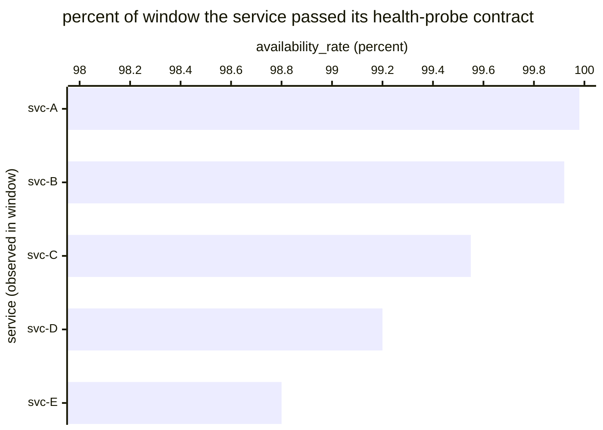

# Reference visualisation — `kpi.service_availability_rate@v1`

This is the committed reference-visualisation artifact for the
service-availability rate KPI anchoring NIS2 Art. 21(1)(b) continued
availability and DORA Art. 11 ICT business continuity. It exists so
the G-04 catalog definition-of-done (a *committed* reference
visualisation, not a narrated one) is closed; downstream compile
targets (n8n / Temporal / LangGraph) read the same metric YAML and
render the executable form in their own dashboard surface. The
artifact here is the contract for the chart shape, not the executable
chart.

## Chart kind

Two-panel composition. The headline panel is a single gauge-style
percentage reading the availability rate (`percent`) across the
evaluation window, plotted against the catalog `warn` / `high` /
`breach` threshold bands (99.9% / 99.5% / 99.0%) and the 99.5%
operational benchmark. Direction is `higher_is_better`: a rate below
99.5% is a continuity-posture signal below the benchmark. The
drill-down panel is a horizontal bar chart, one bar per in-scope
service observed in the window, plotting `availability_rate` for
that service.

- **Headline (percent):** the aggregate availability rate across
  in-scope services in the window. This is the figure the operator's
  continuity surface reads first — the aggregate benchmark reading.
- **Drill-down x-axis:** `availability_rate` per service — percent
  of the window during which the service passed its health-probe
  contract. Higher values are better.
- **Drill-down y-axis:** one row per in-scope service observed in
  the window, labelled by service identifier; sorted ascending so
  the worst-availability services (and any breaches) sit at the top
  — the cases that lower the aggregate.
- **Threshold overlay (drill-down):** three vertical lines at 99.9%
  (warn), 99.5% (high / benchmark), and 99.0% (breach). Bars left
  of the 99.5% line are at-or-below the operational benchmark and
  should surface on the operator's continuity-register review.

## Reference rendering (Mermaid)

The mermaid block below is the canonical reference rendering — small
enough to live in-tree and renderable directly on the public repo
surface. The numeric values are illustrative; the compile target is
the source of truth for the executable form against operator data.

Reading the bars in this illustrative rendering:

| service | availability_rate | band     | reading                                                                 |
|---------|-------------------|----------|-------------------------------------------------------------------------|
| svc-A   | 99.98             | ok       | above 99.9% — comfortable continuity posture                            |
| svc-B   | 99.92             | ok       | above 99.9% — comfortable continuity posture                            |
| svc-C   | 99.55             | warn     | below 99.9% — leading signal, still above operational benchmark         |
| svc-D   | 99.20             | high     | below 99.5% — under the NIS2-aligned operational benchmark              |
| svc-E   | 98.80             | breach   | below 99.0% — continuity-posture breach, register review required       |

With one breach in the window the aggregate resolves to a headline
below the 99.5% benchmark. That value is what the catalog aggregation
`measurement.aggregation: percent` resolves to for this snapshot.

## Threshold band reference

| name   | comparator | value | severity |
|--------|------------|-------|----------|
| warn   | <          | 99.9  | warn     |
| high   | <          | 99.5  | high     |
| breach | <          | 99.0  | critical |

The bands match the `thresholds` array on
`service_availability_rate.yaml`; the catalog entry is the source of
truth, this file is the visualisation surface. The catalog `target`
(`>= 99.5`) is the operational benchmark aligned with NIS2 high-impact
classification criteria — not a statutory floor. Operators MAY
tighten the target against their own service-criticality tiering
(e.g. 99.9% for essential services, 99.99% for financial-sector ICT
under DORA Art. 11 recovery-objective scoping).

## OCSF source-data shape

The chart's underlying observations are derived from the operator's
uptime-monitoring surface for in-scope services. Each health-probe
observation contributes one `probe_success` sample computed from the
two inputs declared in `service_availability_rate.yaml`'s
`measurement.inputs`:

- `probe_success` — health-probe observation emitted by the
  operator's uptime-monitoring surface for the in-scope service.
  Bound to `telemetry.ocsf.compliance_finding@v1` field `status_id`
  on the service-availability observation event.
- `observation_timestamp` — timestamp of the availability
  observation used to compute the `available_seconds` accumulator.
  Bound to `telemetry.ocsf.compliance_finding@v1` field `time` on
  the service-availability observation event.

The availability_rate that drives the headline is
`100 * sum(available_seconds) / window_seconds` across observations,
with planned-maintenance windows excluded per the formula.

## Operator override

Operators are expected to render this metric in their own dashboard
idiom — the catalog reference rendering above is the contract for
the chart shape (headline percentage gauge, per-service horizontal
bars, three continuity-threshold overlays), not the visual style.
The compile target is the source of truth for the executable form.
