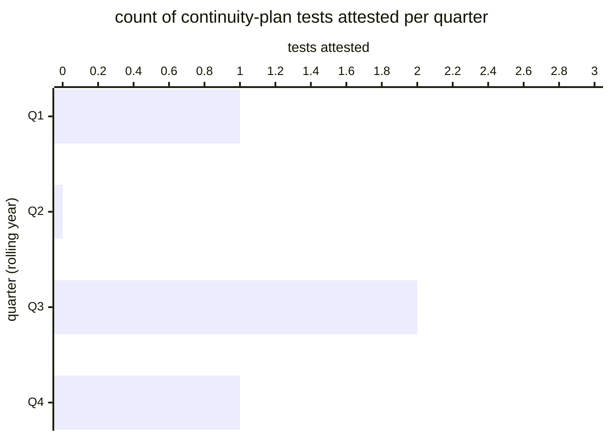

# Reference visualisation — `kpi.service_continuity_test_frequency@v1`

This is the committed reference-visualisation artifact for the
service-continuity test-frequency KPI anchoring NIS2 Art. 21(1)(c)
business-continuity arrangements and DORA Art. 11(6) annual testing
requirement. It exists so the G-04 catalog definition-of-done (a
*committed* reference visualisation, not a narrated one) is closed;
downstream compile targets (n8n / Temporal / LangGraph) read the
same metric YAML and render the executable form in their own
dashboard surface. The artifact here is the contract for the chart
shape, not the executable chart.

## Chart kind

Two-panel composition. The headline panel is a count card reading
the total number of ICT business-continuity plan tests attested
(`count`) across the rolling 12-month evaluation window, plotted
against the catalog `warn` / `high` / `breach` threshold bands (< 2
/ < 1 / == 0) and the DORA-anchored ≥ 1 statutory floor. Direction
is `higher_is_better`: zero tests in the rolling year is a DORA
Art. 11(6) statutory shortfall. The drill-down panel is a
horizontal bar chart, one bar per quarter of the rolling year,
plotting the count of tests attested in that quarter.

- **Headline (count):** the total number of continuity-plan tests
  attested in the rolling year across the in-scope service
  portfolio. This is the figure the operator's continuity surface
  reads first — the annual-cadence reading.
- **Drill-down x-axis:** count of tests attested in each quarter of
  the rolling year. Higher values are better.
- **Drill-down y-axis:** four rows, one per quarter Q1–Q4 of the
  rolling year, labelled by quarter offset from the current
  evaluation moment; sorted chronologically so temporal drift in
  the testing cadence is visible at a glance.
- **Threshold overlay (headline):** three vertical lines at 2
  (warn), 1 (high / DORA floor), and 0 (breach). A headline
  reading at 0 is a DORA statutory shortfall and should surface
  on the operator's continuity-attestation review.

## Reference rendering (Mermaid)

The mermaid block below is the canonical reference rendering — small
enough to live in-tree and renderable directly on the public repo
surface. The numeric values are illustrative; the compile target is
the source of truth for the executable form against operator data.

Reading the bars in this illustrative rendering:

| quarter | tests attested | reading                                                                 |
|---------|----------------|-------------------------------------------------------------------------|
| Q1      | 1              | annual-cadence baseline landed                                          |
| Q2      | 0              | no test in Q2 — expected if the annual cadence lands in one quarter     |
| Q3      | 2              | annual-cadence test plus a substantive-change-triggered test            |
| Q4      | 1              | annual-cadence baseline landed                                          |

With four tests attested in the rolling year the headline resolves
to `4` — well above the ≥ 1 DORA floor. That value is what the
catalog aggregation `measurement.aggregation: count` resolves to for
this snapshot.

## Threshold band reference

| name   | comparator | value | severity |
|--------|------------|-------|----------|
| warn   | <          | 2     | warn     |
| high   | <          | 1     | high     |
| breach | ==         | 0     | critical |

The bands match the `thresholds` array on
`service_continuity_test_frequency.yaml`; the catalog entry is the
source of truth, this file is the visualisation surface. The catalog
`target` (`>= 1`) is the DORA Art. 11(6) statutory floor. Operators
holding an essential-service or financial-sector ICT tier MAY tighten
this against a per-service tabletop-plus-technical cadence.

## OCSF source-data shape

The chart's underlying observations are derived from the operator's
continuity-testing attestation surface. Each attested test
contributes one `test_attestation` sample computed from the two
inputs declared in `service_continuity_test_frequency.yaml`'s
`measurement.inputs`:

- `test_attestation` — ICT business-continuity plan test
  attestation emitted at test completion. Bound to
  `telemetry.ocsf.compliance_finding@v1` field `status_id` on the
  continuity-test attestation event.
- `attestation_timestamp` — timestamp of the continuity-test
  attestation used to slot the observation into the rolling
  12-month window. Bound to
  `telemetry.ocsf.compliance_finding@v1` field `time` on the
  continuity-test attestation event.

The count that drives the headline is `count(test_attestation)`
across the rolling 12-month window.

## Operator override

Operators are expected to render this metric in their own dashboard
idiom — the catalog reference rendering above is the contract for
the chart shape (headline count card, per-quarter horizontal bars,
three testing-cadence threshold overlays), not the visual style.
The compile target is the source of truth for the executable form.
