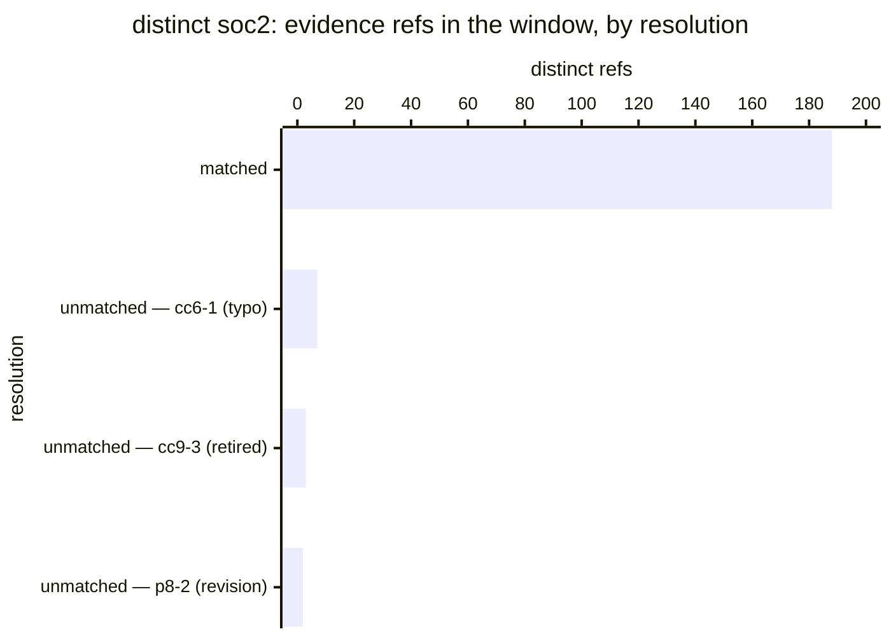

# Reference visualisation — `kpi.soc2_evidence_ref_resolution_rate@v1`

This is the committed reference-visualisation artifact for the SOC 2
evidence-reference resolution-rate KPI. It exists so the G-04 catalog
definition-of-done (a *committed* reference visualisation, not a
narrated one) is closed; downstream compile targets (n8n / Temporal /
LangGraph) read the same metric YAML and render the executable form in
their own dashboard surface. The artifact here is the contract for the
chart shape, not the executable chart.

## Chart kind

Two-panel composition. The headline panel is a single stacked
horizontal bar of the distinct `soc2:` evidence references supplied in
the window, split into **matched** (resolved to a criterion the
crosswalk carries) and **unmatched**, with the resolution rate
annotated as the headline figure and the `warn` / `high` / `breach`
floors overlaid as reference lines.

The second panel breaks the unmatched portion out **by criterion ref**.
That panel is not optional. The scalar cannot distinguish thirty
distinct mistyped refs — a systemic problem in one producing playbook —
from one ref repeated thirty times, which is a single typo; the two
carry the same rate and completely different remediation.

Direction is `higher_is_better`, so the bar reads left-to-right toward
1.00 and the bands sit as floors rather than ceilings.

**Undefined is a distinct state, not zero and not 1.00.** Where no
`soc2:` references were supplied in the window, the panel renders an
explicit *no references supplied* state rather than a full or empty
bar. Rendering it as 1.00 would report the healthiest possible number
for an evidence pipeline that produced nothing.

## Reference rendering (Mermaid)

Reading the bars in this illustrative rendering:

| resolution                    | distinct refs | reading                                                            |
|-------------------------------|---------------|--------------------------------------------------------------------|
| matched                       | 188           | resolved to a crosswalk criterion — the wiring works               |
| unmatched — `cc6-1` (typo)    | 7             | one producer emitting a mistyped ref repeatedly — a single fix     |
| unmatched — `cc9-3` (retired) | 3             | criterion left the crosswalk, producers not updated                |
| unmatched — `p8-2` (revision) | 2             | producer citing a framework revision this repo does not ship       |

Rate = 188 / 200 = **0.94**, which sits below the `high` floor of 0.95
and above `breach`. The headline is the rate; the actionable content is
the breakdown, and in this illustration a single producer fix recovers
more than half the shortfall.

## Threshold band reference

| Band     | Condition   | Operator reading                                                                 |
|----------|-------------|----------------------------------------------------------------------------------|
| healthy  | `>= 1.00`   | every supplied reference resolves; no wiring defect visible                        |
| `warn`   | `< 0.99`    | at least one reference does not resolve — inspect before it becomes a pattern      |
| `high`   | `< 0.95`    | a measurable share of the evidence path is broken; a producer is likely at fault   |
| `breach` | `< 0.90`    | a tenth or more of the references are unresolvable; treat the run as unreliable    |

The bands are tight because the target is the whole population rather
than a tolerance. An unmatched reference is always a defect in the
operator's own configuration — a typo, a criterion retired without
updating its producers, or a producer emitting refs for a framework
revision the repo does not carry — and all three are fixable.

## OCSF source-data shape

The indicator is computed from workflow-emitted records, not from a
telemetry class: the map-evidence-to-criteria step's verdict carries
the matched and unmatched reference sets directly. Where an operator
mirrors the run into an audit stream, the natural carrier is
`telemetry.ocsf.compliance_finding@v1` (Compliance Finding, uid 2003),
one record per assessment run, with:

Using only the fields that artifact declares in `fields_used`:

| Field                     | Carries                                                            |
|---------------------------|--------------------------------------------------------------------|
| `compliance.requirements` | the criterion refs supplied in the window — the denominator         |
| `compliance.control`      | the individual criterion a record speaks to                         |
| `compliance.status_id`    | per-reference match outcome, machine-readable                       |
| `compliance.status`       | the same outcome as a label, so unmatched refs stay legible          |
| `compliance.standards`    | the Trust Services Criteria revision the refs were resolved against |
| `finding_info.uid`        | the deterministic `__attestation_id__`, tying records to one run     |
| `time`                    | the supplied `__captured_at__`, so windows are reconstructable       |

The second panel's per-criterion breakdown is recovered by grouping
unmatched records on `compliance.control` — there is no separate
unmapped-reference field in the class, and inventing one would put this
metric in the position #875 spent a wave correcting.

Counting from the emitted records rather than from the operator's
evidence store is deliberate — the indicator is about what the
collector was handed, and a store-side count would silently include
references the collector never saw.

## Operator override

The bands assume the operator intends every reference to resolve. An
operator mid-migration between crosswalk revisions may legitimately sit
in `warn` for a bounded period; that is a reason to annotate the window,
not to widen the band. If the floors are relaxed, record the revision
window they were relaxed for, so a later reviewer can tell a deliberate
migration from a tolerated defect.
