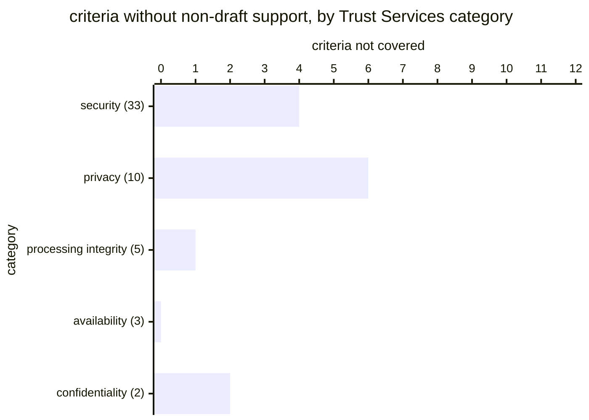

# Reference visualisation — `kri.soc2_unsupported_criteria_count@v1`

This is the committed reference-visualisation artifact for the SOC 2
unsupported-criteria residual-risk KRI. It exists so the G-04 catalog
definition-of-done (a *committed* reference visualisation, not a
narrated one) is closed; downstream compile targets (n8n / Temporal /
LangGraph) read the same metric YAML and render the executable form in
their own dashboard surface. The artifact here is the contract for the
chart shape, not the executable chart.

## Chart kind

Stacked horizontal bars, **one per Trust Services category**, each split
three ways into `covered` / `draft_backed` / `uncovered`. The headline
figure is the count of criteria not `covered` — the sum of the second
and third segments across all categories — with the `warn` / `high` /
`breach` bands overlaid on that total.

Both slices are mandatory, for different reasons.

**By state**, because the two non-covered states carry different
remediation. An `uncovered` criterion has no evidence and the operator
must produce some. A `draft_backed` criterion has evidence whose
crosswalk entry is not yet audit-grade — a repo maturity question the
operator cannot close alone. A single "not covered" bar would tell an
operator to go find evidence they may already have.

**By category**, because the categories are not equally sized: security
carries 33 of the 53 criteria currently shipped, privacy 10, processing
integrity 5, availability 3, confidentiality 2. An absolute count says
nothing about which part of the control environment is thin, and eight
gaps concentrated in confidentiality is a very different posture from
eight spread across security.

Direction is `lower_is_better`, so the bands sit as ceilings and the
chart reads best when the `covered` segment fills each bar.

## Reference rendering (Mermaid)

Reading the bars in this illustrative rendering:

| category            | shipped | not covered | of which draft_backed | reading                                                     |
|---------------------|---------|-------------|-----------------------|-------------------------------------------------------------|
| security            | 33      | 4           | 4                     | evidence exists throughout; four entries await graduation     |
| privacy             | 10      | 6           | 1                     | five criteria have no evidence — the real gap                  |
| processing integrity| 5       | 1           | 1                     | one entry awaiting graduation                                 |
| availability        | 3       | 0           | 0                     | fully covered                                                 |
| confidentiality     | 2       | 2           | 0                     | both uncovered — small category, complete absence              |

Headline count = **13**, which sits above the `breach` ceiling of 12.
The aggregate alone would suggest a broad evidentiary failure; the
slices show something quite different — 6 of the 13 are `draft_backed`
and need nothing from the operator at all, while privacy and
confidentiality hold 7 genuinely unevidenced criteria between them.
That is the actionable set, and no single ratio surfaces it.

## Threshold band reference

| Band     | Condition | Operator reading                                                                        |
|----------|-----------|------------------------------------------------------------------------------------------|
| healthy  | `0`       | every shipped criterion has non-draft support; readiness may report `ready`                |
| `warn`   | `>= 1`    | at least one criterion unsupported — readiness is `not_ready` by construction               |
| `high`   | `>= 8`    | roughly a seventh of the criteria set unsupported; check the state slice before acting      |
| `breach` | `>= 16`   | under two-thirds of the criteria set defensible; the attestation is a gap list, not a report |

The bands are expressed as counts against the 53 criteria currently
shipped. They are **not** proportional and will need revisiting when the
crosswalk grows — a deliberate choice, because a proportional band would
quietly re-admit the coverage percentage this metric exists to avoid.
Recording the crosswalk revision alongside an observation is what makes
two windows comparable.

## OCSF source-data shape

The indicator is computed from the workflow-emitted coverage verdict,
not from a telemetry class. Where an operator mirrors the run into an
audit stream, the natural carrier is
`telemetry.ocsf.compliance_finding@v1` (Compliance Finding, uid 2003),
one record per criterion per run, using only the fields that artifact
declares in `fields_used`:

| Field                     | Carries                                                              |
|---------------------------|----------------------------------------------------------------------|
| `compliance.control`      | the criterion — one record each, so both slices are reconstructable   |
| `compliance.status_id`    | the three-valued coverage state, machine-readable                     |
| `compliance.status`       | the same state as a label (`covered` / `draft_backed` / `uncovered`)  |
| `compliance.standards`    | the Trust Services Criteria revision, pinning the denominator          |
| `compliance.requirements` | the evidence refs that supported the criterion, where any did          |
| `finding_info.uid`        | the deterministic `__attestation_id__`, tying records to one run        |
| `finding_info.title`      | the criterion title, so a reviewer need not resolve stable-ids by hand |
| `time`                    | the supplied `__captured_at__`, so windows are reconstructable          |

One record per criterion rather than one per run is what allows the
category and state slices to be rebuilt downstream. A single aggregate
record would force the consumer to trust the producer's rollup, which is
the opposite of what an evidence stream is for.

## Operator override

Reaching zero can depend on the repo, not the operator: a criterion
cannot leave `draft_backed` until its crosswalk entry graduates out of
`status: draft`. An operator may therefore sit at a non-zero floor
through no fault of their own, and that is a true reading of their
evidentiary position rather than a false alarm. If the bands are
relaxed to reflect that floor, record the crosswalk revision the
relaxation was calculated against — otherwise a later reviewer cannot
tell a tolerated gap from a graduated one.
