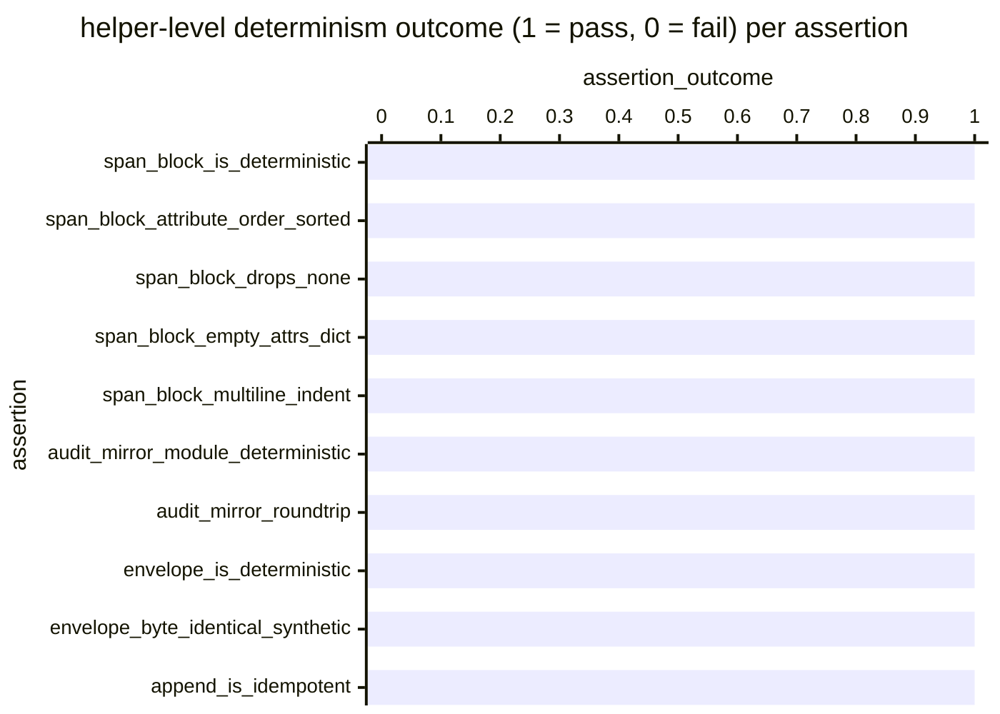

# Reference visualisation — `kpi.span_block_emitter_determinism_rate@v1`

This is the committed reference-visualisation artifact for the
shared OTel span-block emitter determinism KPI. It exists so the
G-04 catalog definition-of-done (a *committed* reference
visualisation, not a narrated one) is closed; downstream compile
targets (n8n / Temporal / LangGraph) read the same metric YAML and
render the executable form in their own dashboard surface. The
artifact here is the contract for the chart shape, not the
executable chart.

## Chart kind

Two-panel composition. The headline panel is a single gauge-style
horizontal bar reading the helper-level determinism `ratio` — the
share of assertions in
``tests/compilers/_shared/test_observability.py`` and
``tests/compilers/_shared/test_audit_mirror_helper.py`` that pin a
determinism invariant of the shared span-block / audit-mirror
helper and that pass on the evaluation commit, divided by the total
assertion population. The drill-down panel is a horizontal bar
chart, one bar per assertion observed, plotting the assertion
outcome encoded as `1` (pass) or `0` (fail). Slicing by helper
surface (span-block / audit-mirror) is the canonical drill-down
dimension because the shared helper module is structurally
two-layer — the span-block emitter wraps an individual workflow
step, and the audit-mirror helper renders the per-target replay
module the workflow imports.

- **Headline (ratio):** the `ratio` aggregate across helper-level
  determinism assertions on the evaluation commit. Because the KPI
  is `higher_is_better`, a reading of `1.00` is the floor (target
  value) and any reading below `1.00` is a helper-level
  non-determinism the project shipped.
- **Drill-down x-axis:** one row per assertion observed, labelled by
  the test-function name; sorted so the failed assertions sit at
  the top.
- **Drill-down y-axis:** assertion outcome encoded as `0` (fail —
  the helper-level determinism invariant is red) or `1` (pass —
  the invariant holds).
- **Threshold overlay (drill-down):** a horizontal line at `1` —
  every bar below the line is a fail sample. Operators reading the
  drill-down see *which* helper invariant pulled the ratio off
  `1.00`.

## Reference rendering (Mermaid)

The mermaid block below is the canonical reference rendering — small
enough to live in-tree and renderable directly on the public repo
surface. The numeric values are illustrative; the compile target is
the source of truth for the executable form against the
helper-level determinism test files at evaluation time.

Reading the bars in this illustrative rendering:

| assertion                                  | outcome | fail? | surface       | reading                                                                          |
|--------------------------------------------|---------|-------|---------------|----------------------------------------------------------------------------------|
| span_block_is_deterministic                | 1       | no    | span-block    | two invocations with the same inputs produce byte-identical output               |
| span_block_attribute_order_sorted          | 1       | no    | span-block    | attribute keys are emitted in sorted order                                       |
| span_block_drops_none                      | 1       | no    | span-block    | `None` attribute values are dropped before serialisation                         |
| span_block_empty_attrs_dict                | 1       | no    | span-block    | an empty attribute set still emits an empty dict                                 |
| span_block_multiline_indent                | 1       | no    | span-block    | multiline body content indents stably                                            |
| audit_mirror_module_deterministic          | 1       | no    | audit-mirror  | the rendered audit-mirror module is deterministic across invocations             |
| audit_mirror_roundtrip                     | 1       | no    | audit-mirror  | the rendered module round-trips through `importlib` cleanly                      |
| envelope_is_deterministic                  | 1       | no    | audit-mirror  | the envelope produced by the helper API is deterministic across two runs         |
| envelope_byte_identical_synthetic          | 1       | no    | audit-mirror  | envelopes are byte-identical across synthetic call patterns                      |
| append_is_idempotent                       | 1       | no    | audit-mirror  | re-appending the same record is a no-op                                          |

With zero failures across ten assertions, the headline `ratio`
resolves to `10 / 10 = 1.00` in this snapshot. Because direction is
`higher_is_better`, a falling value is the helper-level
non-determinism signal — the shared helper under
``compilers/_shared/observability.py`` is the F-CR-04 single source
of truth and a drop below `1.00` means the helper itself is
non-deterministic. That value is what the catalog aggregation
`measurement.aggregation: ratio` resolves to for this snapshot.

## Threshold band reference

| name   | comparator | value (ratio) | severity |
|--------|------------|---------------|----------|
| warn   | <          | 1.0           | warn     |
| breach | <          | 0.95          | high     |

The bands match the `thresholds` array on
`span_block_emitter_determinism_rate.yaml`; the catalog entry is
the source of truth, this file is the visualisation surface. The
`warn` band fires on any helper-level determinism failure; the
`breach` band fires when more than 5 % of the helper-level contract
is red, the practical level at which every per-target emitter that
imports the helper will start shedding goldens.

## Test-artifact source-data shape

The chart's underlying observations are derived from the
helper-level determinism suites at
``tests/compilers/_shared/test_observability.py`` and
``tests/compilers/_shared/test_audit_mirror_helper.py``. Each
test function contributes one observation computed against the
`measurement.inputs` declared on
`span_block_emitter_determinism_rate.yaml`:

- **`span_block_emitter_determinism_assertion`** — exercises the
  shared span-block emitter (and its sibling helpers) and pins
  deterministic output, sorted attribute keys, `None` dropping,
  multiline-body indentation, and the empty-attribute-set case.
- **`audit_mirror_helper_determinism_assertion`** — exercises the
  shared audit-mirror renderer and the ``AuditTrail`` API and pins
  envelope determinism, idempotent append, and byte-identical
  envelopes across synthetic call patterns.

Per-assertion observations are counted once per evaluation commit;
the catalog window is `P1D` and tumbling because the suite runs
against a discrete commit, not against an operator's runtime
telemetry stream.

## Operator override

Operators are expected to render this metric in their own dashboard
idiom — the catalog reference rendering above is the contract for
the chart shape (ratio headline, per-assertion drill-down sliced
by helper surface, pass-floor overlay at `1`), not the visual
style. The compile target is the source of truth for the executable
form.
