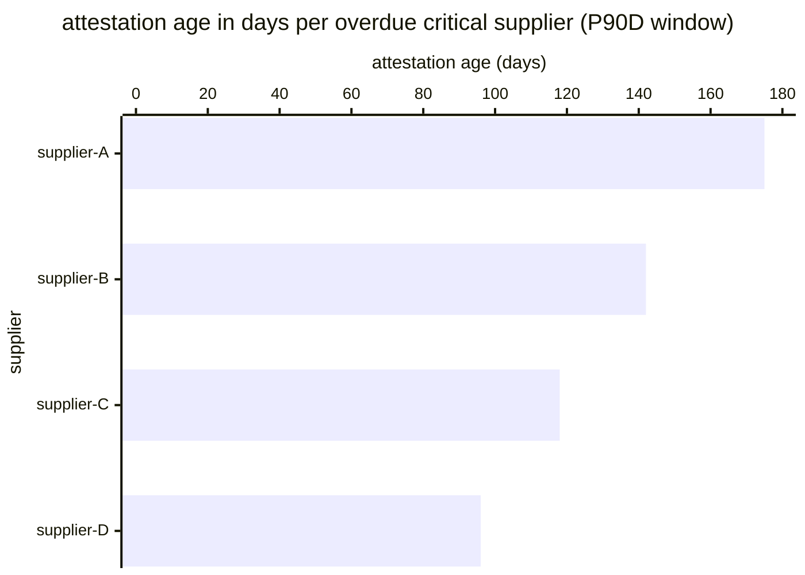

# Reference visualisation — `kri.supplier_attestation_overdue_ratio@v1`

This is the committed reference-visualisation artifact for the
supplier-attestation overdue-ratio KRI. It exists so the G-04
catalog definition-of-done (a *committed* reference visualisation,
not a narrated one) is closed; downstream compile targets (n8n /
Temporal / LangGraph) read the same metric YAML and render the
executable form in their own dashboard surface. The artifact here
is the contract for the chart shape, not the executable chart.

## Chart kind

Two-panel composition. The headline panel is a single gauge-style
horizontal bar reading the overdue-attestation ratio
`overdue_critical / total_critical` — the share of critical direct
suppliers whose most-recent attestation exceeds the operator's
documented staleness threshold (community-recommended default:
90 days). The drill-down panel is a horizontal bar chart, one row
per critical supplier with a stale-or-missing attestation record,
plotting attestation-age-in-days so operators can see which
suppliers are dragging the ratio up. Because this KRI uses
`lower_is_better` semantics (see the target rationale on the YAML),
a falling value is the healthy signal that the operator's
critical-third-party re-attestation cadence is holding.

- **Headline (ratio):** `overdue_critical / total_critical` across
  all critical direct suppliers on the register in the evaluation
  window; the figure operators read first.
- **Drill-down x-axis:** per-supplier attestation age in days
  (record `captured_at` subtracted from the evaluation-window
  right edge; suppliers with no record on file render at the
  window duration ceiling).
- **Drill-down y-axis:** one row per overdue critical supplier,
  sorted descending on attestation age so the worst-drifted
  supplier sits at the top.
- **Threshold overlay:** vertical lines on the headline gauge at
  the `warn` (0.02), `high` (0.10), and `breach` (0.25) overdue-
  ratio bounds — because the KRI is `lower_is_better`, all three
  bounds sit *above* the target and a value above any line lands
  inside the corresponding band.
- **Headline annotation:** the overall overdue-ratio figure with
  the threshold band it falls in.

## Reference rendering (Mermaid)

The mermaid block below is the canonical reference rendering —
small enough to live in-tree and renderable directly on the public
repo surface. The numeric values are illustrative; the compile
target is the source of truth for the executable form against
operator data.

Reading the bars in this illustrative rendering
(`total_critical = 40` critical suppliers on the register, four of
which are overdue against a 90-day staleness threshold):

| supplier      | attestation age (days) | record status | band            |
|---------------|------------------------|---------------|-----------------|
| supplier-A    | 175                    | present       | breach band     |
| supplier-B    | 142                    | present       | breach band     |
| supplier-C    | 118                    | present       | breach band     |
| supplier-D    | 96                     | present       | high band       |

The headline ratio here is `4 / 40 = 0.100` — sitting on the high /
breach boundary; the leading signal to watch is supplier-A and
supplier-B, whose attestations have drifted well past double the
staleness threshold.

## Threshold band reference

| name    | comparator | value (ratio) | severity  |
|---------|------------|---------------|-----------|
| warn    | >          | 0.02          | warn      |
| high    | >          | 0.10          | high      |
| breach  | >          | 0.25          | critical  |

The bands match the `thresholds` array on
`supplier_attestation_overdue_ratio.yaml`; the catalog entry is
the source of truth, this file is the visualisation surface.

## OCSF source-data shape

The chart's underlying observations are derived from OCSF API
Activity events (`class_uid: 6003`, category `Application Activity`)
the supply_chain_security playbook emit step
(`action--5c5c5c5c-0000-4000-8000-000000000003`) writes to the
supply-chain-evidence sink at attestation publication. The
overdue-critical numerator is the count of critical suppliers on
the operator's scoping artifact whose latest record's `captured_at`
predates the evaluation-window right edge by more than the
documented staleness threshold, or for whom no record is on file.
The critical-supplier denominator is sourced from the operator's
scoping artifact rather than the telemetry stream so the
denominator is stable against evidence-store ingestion gaps.

The binding lives at
`content/telemetry/telemetry.ocsf.api_activity@v1.json` and is
back-referenced from the metric YAML's `telemetry_refs[]` and from
the `overdue_critical_suppliers` `measurement.inputs[].telemetry_ref`.

## Operator override

Operators are expected to render this metric in their own dashboard
idiom — the catalog reference rendering above is the contract for
the chart shape (overdue-ratio headline gauge with `warn` / `high`
/ `breach` bounds, per-supplier attestation-age drill-down bar
chart), not the visual style. The compile target is the source of
truth for the executable form.
