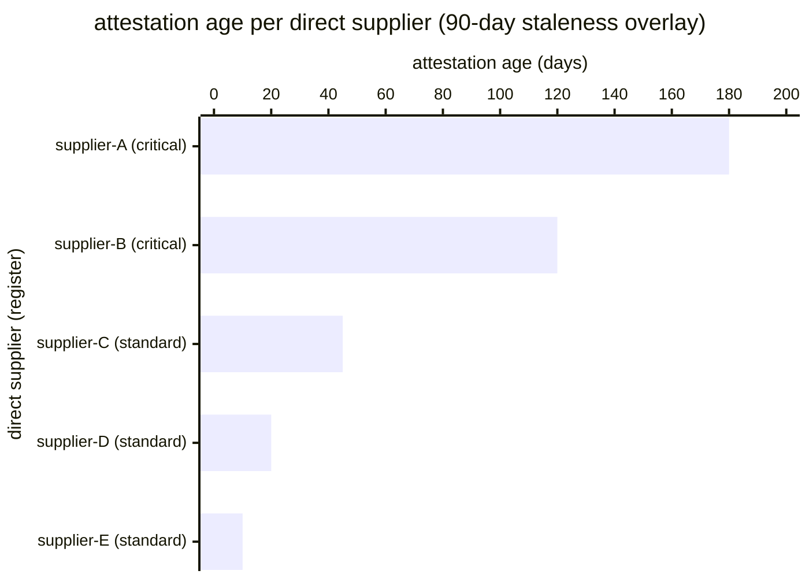

# Reference visualisation — `kri.supplier_attestation_staleness@v1`

This is the committed reference-visualisation artifact for the
supplier-attestation-staleness KRI. It exists so the G-04 catalog
definition-of-done (a *committed* reference visualisation, not a
narrated one) is closed; downstream compile targets (n8n / Temporal /
LangGraph) read the same metric YAML and render the executable form in
their own dashboard surface. The artifact here is the contract for the
chart shape, not the executable chart.

## Chart kind

Two-panel composition. The headline panel is a single count-gauge
reading the number of direct suppliers whose most-recent attestation
exceeds the operator's documented staleness threshold in the
evaluation window — the residual-exposure counterpart to the
sibling `kpi.supply_chain_coverage@v1` performance indicator. The
drill-down panel is a horizontal bar chart, one bar per direct
supplier in the register, plotting attestation age in days sorted
descending so the worst-offender suppliers sit at the top.

- **Headline (count):** the `max` aggregate across the evaluation
  window of stale-supplier count. Because the KRI is
  `lower_is_better`, a value of `0` is healthy and a rising value is
  the periodic-re-attestation-drift signal.
- **Drill-down x-axis:** attestation age in days per direct supplier;
  suppliers with no attestation on file at all appear at the top of
  the chart with an age computed against the evaluation-window right
  edge minus the supplier's register-onboarding date (stale-by-default).
- **Drill-down y-axis:** one row per direct supplier observed in the
  register, labelled by the supplier handle; sorted descending by
  attestation age so the worst-offenders sit at the top — the
  suppliers that pushed the count off `0`.
- **Threshold overlay (drill-down):** a vertical line at the
  operator's documented staleness threshold (unscoped baseline: 90
  days) — every bar to the right of the line is a stale attestation.

## Reference rendering (Mermaid)

The mermaid block below is the canonical reference rendering — small
enough to live in-tree and renderable directly on the public repo
surface. The numeric values are illustrative; the compile target is
the source of truth for the executable form against operator data.

Reading the bars in this illustrative rendering:

| supplier (tier)     | age (days) | stale? | reading                                                        |
|---------------------|------------|--------|----------------------------------------------------------------|
| supplier-A (crit.)  | 180        | yes    | attestation nearly six months stale; well past 90-day floor    |
| supplier-B (crit.)  | 120        | yes    | attestation four months stale; past 90-day floor               |
| supplier-C (std.)   | 45         | no     | attestation inside the freshness window                        |
| supplier-D (std.)   | 20         | no     | attestation inside the freshness window                        |
| supplier-E (std.)   | 10         | no     | attestation inside the freshness window                        |

Two stale suppliers across five, so the headline `count` resolves to
`2` in this snapshot — inside the `warn` band (> 0) but well below
the `breach` band (> 3). That value is what the catalog aggregation
`measurement.aggregation: max` resolves to for this snapshot.

## Threshold band reference

| name      | comparator | value (count) | severity  |
|-----------|------------|---------------|-----------|
| warn      | >          | 0             | warn      |
| breach    | >          | 3             | high      |
| critical  | >          | 10            | critical  |

The bands match the `thresholds` array on
`supplier_attestation_staleness.yaml`; the catalog entry is the source
of truth, this file is the visualisation surface.

## OCSF source-data shape

The chart's underlying observations are derived from the operator's
supply_chain_security evidence stream. Each direct supplier in the
register contributes one attestation-age sample computed against the
`measurement.inputs` declared on
`supplier_attestation_staleness.yaml`:

- **affected_supplier_handle** — canonical direct-supplier handle
  emitted on the closed assessment block of the per-execution
  supply-chain-evidence record. The evidence-emission event is bound
  to the playbook step declared on the catalog entry's
  `playbook_refs`:
  - `playbook.supply_chain_security@v1`
    `action--5c5c5c5c-0000-4000-8000-000000000003` — emit-supply-chain-
    evidence step (SR-3 / SR-6 anchors on the outbound overlay).
- **captured_at** — publish timestamp on the same record. Suppliers
  with no evidence record on file at all count against the count with
  an age computed against the evaluation-window right edge minus
  their register-onboarding date so the indicator does not silently
  improve on record-keeping gaps.

The OCSF source-data shape is API Activity (class_uid 6003) per the
supply_chain_security playbook's `mappings.yaml` outbound view. The
emit step writes an API Activity record per attestation publication;
the record carries the affected supplier handle and the publish
timestamp.

## Operator override

Operators are expected to render this metric in their own dashboard
idiom — the catalog reference rendering above is the contract for the
chart shape (count headline, per-supplier attestation-age drill-down,
staleness-threshold overlay at the operator's documented floor), not
the visual style. The compile target is the source of truth for the
executable form.
