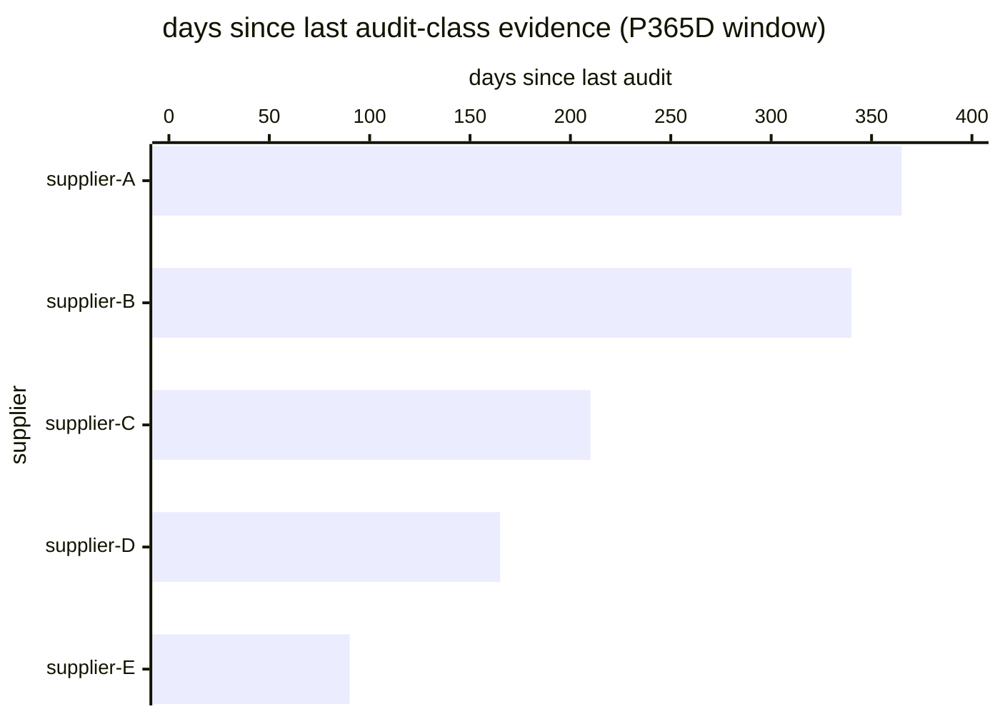

# Reference visualisation — `kpi.supply_chain_audit_coverage@v1`

This is the committed reference-visualisation artifact for the
supply-chain audit-coverage KPI. It exists so the G-04 catalog
definition-of-done (a *committed* reference visualisation, not a
narrated one) is closed; downstream compile targets (n8n /
Temporal / LangGraph) read the same metric YAML and render the
executable form in their own dashboard surface. The artifact here
is the contract for the chart shape, not the executable chart.

## Chart kind

Two-panel composition. The headline panel is a single gauge-style
horizontal bar reading the audit-coverage ratio
`audited_critical / total_critical` — the share of critical direct
suppliers with at least one audit-class supply-chain-evidence
artifact on file in the trailing 12-month window. The drill-down
panel is a horizontal bar chart, one row per critical supplier,
plotting days-since-last-audit so operators can see which
suppliers are dragging the coverage down. Because this KPI uses
`higher_is_better` semantics (see the target rationale on the
YAML), a rising value is the healthy signal that the operator's
critical-third-party audit cadence is holding.

- **Headline (ratio):** `audited_critical / total_critical` across
  all critical direct suppliers on the register in the trailing
  12-month window; the figure operators read first.
- **Drill-down x-axis:** days since last audit-class evidence
  record for each critical supplier (suppliers with no audit
  record in the window render at the window duration ceiling).
- **Drill-down y-axis:** one row per critical supplier, sorted
  descending on days-since-last-audit so the worst-lapsed supplier
  sits at the top.
- **Threshold overlay:** vertical lines on the headline gauge at
  the `warn` (0.95), `high` (0.80), and `breach` (0.60) coverage
  bounds — because the KPI is `higher_is_better`, all three
  bounds sit *below* the target and a value below any line lands
  inside the corresponding band.
- **Headline annotation:** the overall audit-coverage figure with
  the threshold band it falls in.

## Reference rendering (Mermaid)

The mermaid block below is the canonical reference rendering —
small enough to live in-tree and renderable directly on the
public repo surface. The numeric values are illustrative; the
compile target is the source of truth for the executable form
against operator data.

Reading the bars in this illustrative rendering
(`total_critical = 40` critical suppliers on the register, 34 of
which have at least one audit-class record in the trailing
12-month window):

| supplier      | days since last audit | in-window | band            |
|---------------|-----------------------|-----------|-----------------|
| supplier-A    | 365                   | no        | breach band     |
| supplier-B    | 340                   | yes       | (edge)          |
| supplier-C    | 210                   | yes       | in-window       |
| supplier-D    | 165                   | yes       | in-window       |
| supplier-E    | 90                    | yes       | in-window       |

The headline audit-coverage figure here is `34 / 40 = 0.850` —
inside the high band; the leading signal to watch is supplier-A
whose last audit-class evidence has fallen outside the trailing
12-month window entirely, and supplier-B whose next audit slot is
about to slip.

## Threshold band reference

| name    | comparator | value (ratio) | severity  |
|---------|------------|---------------|-----------|
| warn    | <          | 0.95          | warn      |
| high    | <          | 0.80          | high      |
| breach  | <          | 0.60          | critical  |

The bands match the `thresholds` array on
`supply_chain_audit_coverage.yaml`; the catalog entry is the
source of truth, this file is the visualisation surface.

## OCSF source-data shape

The chart's underlying observations are derived from OCSF API
Activity events (`class_uid: 6003`, category `Application
Activity`) the supply_chain_security playbook emit step
(`action--5c5c5c5c-0000-4000-8000-000000000003`) writes to the
supply-chain-evidence sink at audit publication. The audit-class
numerator counts critical suppliers with at least one in-window
evidence artifact carrying `evidence_kind: audit` on the closed
assessment block; the denominator is sourced from the operator's
scoping artifact so it is stable against evidence-store ingestion
gaps.

The binding lives at
`content/telemetry/telemetry.ocsf.api_activity@v1.json` and is
back-referenced from the metric YAML's `telemetry_refs[]` and
from the `audited_critical_suppliers`
`measurement.inputs[].telemetry_ref`.

## Operator override

Operators are expected to render this metric in their own
dashboard idiom — the catalog reference rendering above is the
contract for the chart shape (audit-coverage headline gauge with
`warn` / `high` / `breach` bounds, per-supplier
days-since-last-audit drill-down bar chart), not the visual
style. The compile target is the source of truth for the
executable form.
