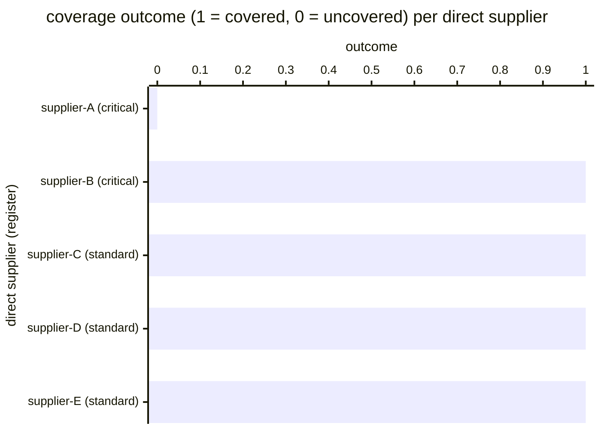

# Reference visualisation — `kpi.supply_chain_coverage@v1`

This is the committed reference-visualisation artifact for the
supply-chain-coverage KPI. It exists so the G-04 catalog
definition-of-done (a *committed* reference visualisation, not a
narrated one) is closed; downstream compile targets (n8n / Temporal /
LangGraph) read the same metric YAML and render the executable form in
their own dashboard surface. The artifact here is the contract for the
chart shape, not the executable chart.

## Chart kind

Two-panel composition. The headline panel is a single gauge-style
horizontal bar reading the coverage `ratio` across the operator's
direct-supplier register in the evaluation window — the share of
suppliers with at least one attestation record on file carrying a
non-`unverified` verdict. The drill-down panel is a horizontal bar
chart, one bar per direct supplier in the register, plotting
coverage encoded as `1` (covered) or `0` (uncovered-or-unverified).

- **Headline (ratio):** the `ratio` aggregate across direct suppliers
  in the evaluation window. This is the figure operators read first.
  Because the KPI is `higher_is_better`, a value near `1.00` is
  healthy and a falling value is the direct-supplier-attestation-
  coverage signal.
- **Drill-down x-axis:** one row per direct supplier observed in the
  register, labelled by the supplier handle; sorted ascending so the
  uncovered suppliers sit at the top — the suppliers that pulled the
  ratio off `1.00`.
- **Drill-down y-axis:** coverage outcome encoded as `0` (no evidence
  record on file, or most-recent verdict is `unverified`) or
  `1` (at least one non-`unverified` evidence record on file inside
  the evaluation window).
- **Threshold overlay (drill-down):** a horizontal line at `1` —
  every bar below the line is an uncovered-or-unverified supplier.

## Reference rendering (Mermaid)

The mermaid block below is the canonical reference rendering — small
enough to live in-tree and renderable directly on the public repo
surface. The numeric values are illustrative; the compile target is
the source of truth for the executable form against operator data.

Reading the bars in this illustrative rendering:

| supplier (tier)     | outcome | covered? | reading                                                          |
|---------------------|---------|----------|------------------------------------------------------------------|
| supplier-A (crit.)  | 0       | no       | no evidence record on file, or most-recent verdict is unverified |
| supplier-B (crit.)  | 1       | yes      | at least one non-`unverified` attestation on file                |
| supplier-C (std.)   | 1       | yes      | at least one non-`unverified` attestation on file                |
| supplier-D (std.)   | 1       | yes      | at least one non-`unverified` attestation on file                |
| supplier-E (std.)   | 1       | yes      | at least one non-`unverified` attestation on file                |

With one uncovered supplier across five, the headline `ratio` resolves
to `4 / 5 = 0.80` in this snapshot — right at the breach floor. That
value is what the catalog aggregation `measurement.aggregation: ratio`
resolves to for this snapshot.

## Threshold band reference

| name      | comparator | value (ratio) | severity  |
|-----------|------------|---------------|-----------|
| warn      | <          | 0.95          | warn      |
| breach    | <          | 0.80          | high      |

The bands match the `thresholds` array on
`supply_chain_coverage.yaml`; the catalog entry is the source of
truth, this file is the visualisation surface.

## OCSF source-data shape

The chart's underlying observations are derived from the operator's
supply_chain_security evidence stream. Each direct supplier in the
register contributes one coverage-outcome sample computed against the
`measurement.inputs` declared on `supply_chain_coverage.yaml`:

- **covered_suppliers** — count of direct suppliers with at least one
  supply-chain-evidence artifact on file in the evaluation window
  carrying a non-`unverified` verdict. The evidence-emission event is
  bound to the playbook step declared on the catalog entry's
  `playbook_refs`:
  - `playbook.supply_chain_security@v1`
    `action--5c5c5c5c-0000-4000-8000-000000000003` — emit-supply-chain-
    evidence step (SR-3 / SR-6 anchors on the outbound overlay).
- **total_registered** — count of direct suppliers declared in the
  operator's supplier register, sourced from the operator's scoping
  artifact so the denominator is stable against evidence-store
  ingestion gaps.

The OCSF source-data shape is API Activity (class_uid 6003) per the
supply_chain_security playbook's `mappings.yaml` outbound view. The
emit step writes an API Activity record per attestation publication;
the record carries the affected supplier handle and the closed
verdict the coverage calculation keys against.

## Operator override

Operators are expected to render this metric in their own dashboard
idiom — the catalog reference rendering above is the contract for the
chart shape (ratio headline, per-supplier covered/uncovered drill-down,
coverage-floor overlay at `1`), not the visual style. The compile
target is the source of truth for the executable form.
