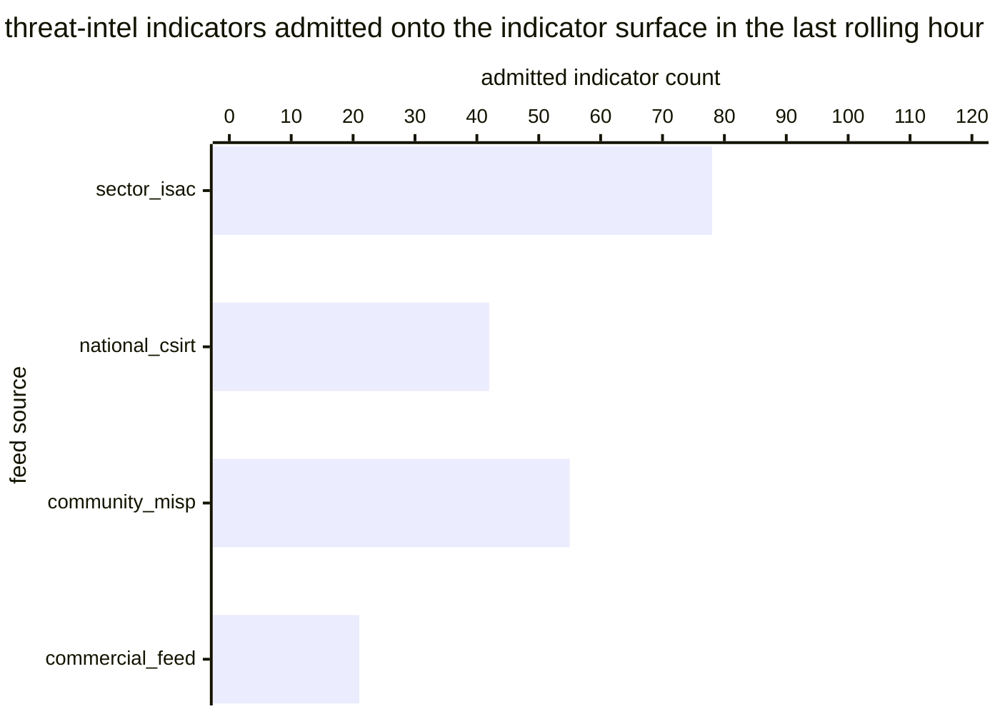

# Reference visualisation — `kpi.threat_intel_indicator_ingestion_rate@v1`

This is the committed reference-visualisation artifact for the
threat-intel indicator ingestion-rate KPI. It exists so the G-04
catalog definition-of-done (a *committed* reference visualisation,
not a narrated one) is closed; downstream compile targets (n8n /
Temporal / LangGraph) read the same metric YAML and render the
executable form in their own dashboard surface. The artifact here is
the contract for the chart shape, not the executable chart.

## Chart kind

Two-panel composition. The headline panel is a single throughput
headline reading the ingestion count `|I|` — the number of
normalised threat-intel indicators the operator's
`playbook.threat_intel_ingest@v1` lane admitted onto the internal
indicator surface during the rolling one-hour window. The drill-down
panel is a stacked bar chart, one bar per upstream `feed_source`
slice, plotting admitted-indicator counts so operators can see which
feed is contributing to the throughput and which one has fallen
silent. Because the KPI is `higher_is_better`, a rising value is the
healthy signal that the ingest lane is admitting indicators onto the
internal surface at the expected cadence; a value dropping toward
zero is the operational failure signal this KPI is meant to surface.

- **Headline (count):** `|I|` admitted indicators in the rolling
  one-hour window; the figure operators read first.
- **Drill-down x-axis:** upstream `feed_source` slice (e.g. sector
  ISAC, national CSIRT, community MISP instance, commercial feed).
- **Drill-down y-axis:** admitted-indicator count, stacked (`admitted`
  on the bottom, `dropped_at_confidence_gate` on the top so the
  raw-pull-vs-admitted split is visible on the same surface).
- **Threshold overlay:** horizontal lines on the headline throughput
  gauge at the `warn` (100), `high` (25) and `breach` (1) count
  bounds — because the KPI is `higher_is_better`, all three bounds
  sit *below* the target and a value below any line lands inside the
  corresponding band. The `breach` line at 1 is the zero-throughput
  guard: any window that admitted no indicators reads breach.
- **Headline annotation:** the admitted-indicator count with the
  threshold band it falls in, plus the raw-pull count so the drop
  rate at the confidence-threshold if-condition is visible on the
  same surface.

## Reference rendering (Mermaid)

The mermaid block below is the canonical reference rendering — small
enough to live in-tree and renderable directly on the public repo
surface. The numeric values are illustrative; the compile target is
the source of truth for the executable form against operator data.

Reading the bars in this illustrative rendering (assume the raw-pull
counts sit at sector_isac=95, national_csirt=48, community_misp=71,
commercial_feed=24 against the admitted totals above, giving
`|I|=196` admitted out of `|R|=238` normalised):

| feed source       | raw pulled | admitted | dropped at confidence gate | per-slice admit ratio | reading                        |
|-------------------|------------|----------|-----------------------------|-----------------------|--------------------------------|
| sector_isac       | 95         | 78       | 17                          | 0.821                 | above warn bound (steady)      |
| national_csirt    | 48         | 42       | 6                           | 0.875                 | above warn bound (steady)      |
| community_misp    | 71         | 55       | 16                          | 0.775                 | above warn bound (steady)      |
| commercial_feed   | 24         | 21       | 3                           | 0.875                 | above warn bound (steady)      |

The headline `|I|` figure here is `196` admitted indicators in the
last hour — above the `warn` bound (100) so the KPI reads healthy
for this snapshot. If the sector-ISAC bar collapsed to zero the
aggregate would drop to 118 and stay above `warn`; if two of the
four feeds fell silent simultaneously the aggregate would slide into
the `warn` band and the drill-down would name the silent feeds as
the slices to investigate first.

## Threshold band reference

| name      | comparator | value (count) | severity  |
|-----------|------------|---------------|-----------|
| warn      | <          | 100           | warn      |
| high      | <          | 25            | high      |
| breach    | <          | 1             | critical  |

The bands match the `thresholds` array on
`threat_intel_indicator_ingestion_rate.yaml`; the catalog entry is
the source of truth, this file is the visualisation surface.

## OCSF source-data shape

The chart's underlying observations are derived from two OCSF event
classes emitted downstream of the ingest lane, not from the STIX
2.1 / TAXII input contract itself (the released OCSF v1.3.0
catalogue does not yet expose a threat-intel ingest class, so the
consumed side of the ingest playbook stays STIX-native and only the
downstream propagation surfaces carry OCSF bindings). The admitted-
indicator population counted by this KPI is the one later
addressable by:

- OCSF `Detection Finding` events (`class_uid: 2004`) the activate-
  detection-rule step emits when an admitted indicator matches
  subsequent telemetry; and
- OCSF `Security Finding` events (`class_uid: 2001`) the propagate-
  to-blocklist step emits when an admitted indicator lands on a
  perimeter, DNS, or EDR blocklist.

The bindings live at
`content/telemetry/telemetry.ocsf.detection_finding@v1.json` and are
back-referenced from the metric YAML's `telemetry_refs[]` and from
each `measurement.inputs[].telemetry_ref`.

## Operator override

Operators are expected to render this metric in their own dashboard
idiom — the catalog reference rendering above is the contract for
the chart shape (per-feed-source stacked-bar drill-down with a
throughput headline gauge carrying `warn` / `high` / `breach`
bounds), not the visual style. The compile target is the source of
truth for the executable form.
