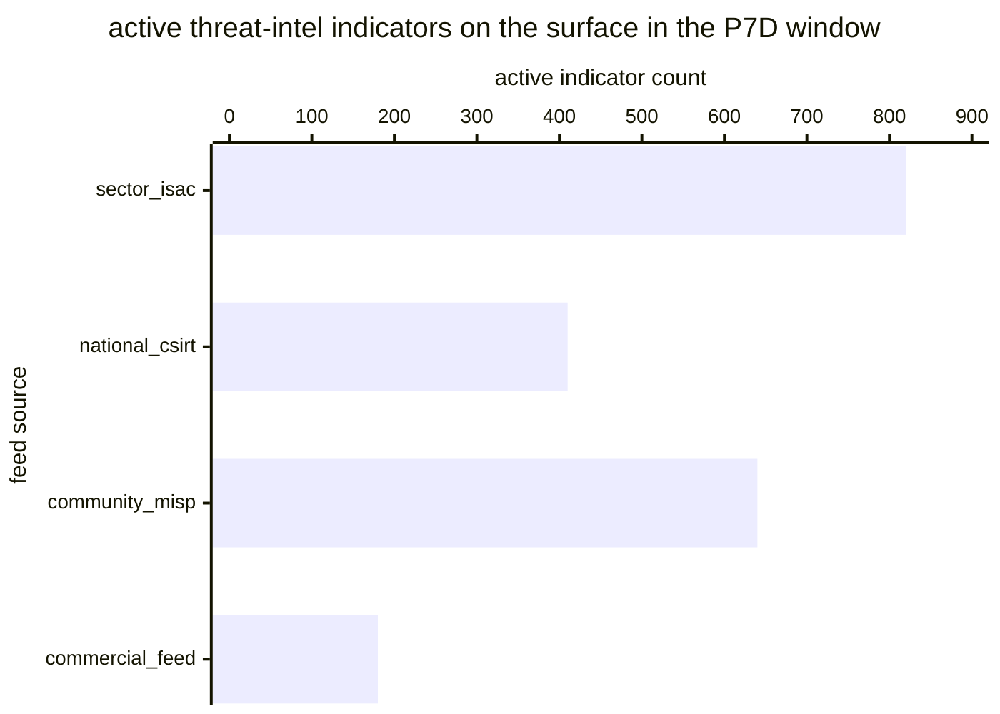

# Reference visualisation — `kri.threat_intel_stale_ioc_ratio@v1`

This is the committed reference-visualisation artifact for the
threat-intel stale-IoC ratio KRI. It exists so the G-04 catalog
definition-of-done (a *committed* reference visualisation, not a
narrated one) is closed; downstream compile targets (n8n / Temporal /
LangGraph) read the same metric YAML and render the executable form
in their own dashboard surface. The artifact here is the contract for
the chart shape, not the executable chart.

## Chart kind

Two-panel composition. The headline panel is a single ratio-headline
gauge reading the stale-IoC ratio `|S| / |A|` — the share of active
indicators on the operator's internal indicator surface whose
last-refresh timestamp has aged past the feed-scoped freshness
horizon, over the total active-indicator population in the evaluation
window. The drill-down panel is a stacked bar chart, one bar per
upstream `feed_source` slice, plotting fresh-versus-stale indicator
counts so operators can see which feed is driving the aggregate
staleness upward. Because the KRI is `lower_is_better`, a rising
value is the failure signal that the indicator surface is drifting
into a stale posture even when the ingestion-rate KPI still reads
healthy.

- **Headline (ratio):** `|S| / |A|` across active indicators in the
  window; the figure operators read first.
- **Drill-down x-axis:** upstream `feed_source` slice (e.g. sector
  ISAC, national CSIRT, community MISP instance, commercial feed).
- **Drill-down y-axis:** active-indicator count, stacked (`fresh` on
  the bottom, `stale` on the top so the drift is visible at a
  glance).
- **Threshold overlay:** horizontal lines on the headline gauge at
  the `warn` (0.10), `high` (0.20) and `breach` (0.35) ratio bounds
  — because the KRI is `lower_is_better`, all three bounds sit
  *above* the target and a value above any line lands inside the
  corresponding band.
- **Headline annotation:** the overall `|S| / |A|` ratio with the
  threshold band it falls in, plus the retired-indicator count so
  the archive volume dropped out of the denominator is visible on
  the same surface.

## Reference rendering (Mermaid)

The mermaid block below is the canonical reference rendering — small
enough to live in-tree and renderable directly on the public repo
surface. The numeric values are illustrative; the compile target is
the source of truth for the executable form against operator data.

Reading the bars in this illustrative rendering (assume the stale
counts sit at sector_isac=62, national_csirt=25, community_misp=118,
commercial_feed=41 against the active totals above, giving
`|S|=246` and `|A|=2050`):

| feed source       | active | fresh | stale | per-slice ratio | reading                      |
|-------------------|--------|-------|-------|-----------------|------------------------------|
| sector_isac       | 820    | 758   | 62    | 0.076           | inside target band           |
| national_csirt    | 410    | 385   | 25    | 0.061           | inside target band           |
| community_misp    | 640    | 522   | 118   | 0.184           | inside warn band             |
| commercial_feed   | 180    | 139   | 41    | 0.228           | inside high band             |

The headline `|S| / |A|` figure here is `246/2050 = 0.120` — inside
the `warn` band (above 0.10, below 0.20) so the KRI reads warn for
this snapshot; the per-slice breakdown names the community-MISP and
commercial-feed slices as the two pulling the aggregate ratio
upward and where the operator's refresh-cadence lane should focus.

## Threshold band reference

| name      | comparator | value (ratio) | severity  |
|-----------|------------|---------------|-----------|
| warn      | >          | 0.10          | warn      |
| high      | >          | 0.20          | high      |
| breach    | >          | 0.35          | critical  |

The bands match the `thresholds` array on
`threat_intel_stale_ioc_ratio.yaml`; the catalog entry is the
source of truth, this file is the visualisation surface.

## OCSF source-data shape

The chart's underlying observations are derived from the operator's
internal indicator-surface store — the shape carried on that store
is attested via `control.threat_intel_program@v1` and
`control.threat_intel_program_automated_sharing@v1` cross-references
rather than pinned to an OCSF class (the released OCSF v1.3.0
catalogue does not yet expose a threat-intel indicator class, so the
consumed side stays STIX-native). The stale-versus-detection
read-across binds to OCSF `Detection Finding` events
(`class_uid: 2004`) the activate-detection-rule step emits when a
matching event arrives against the indicator surface: operators use
that binding to see which stale indicators are still firing
detections, which is the evidence-trail residual risk this KRI
tracks. The binding lives at
`content/telemetry/telemetry.ocsf.detection_finding@v1.json` and is
back-referenced from the metric YAML's `telemetry_refs[]`.

## Operator override

Operators are expected to render this metric in their own dashboard
idiom — the catalog reference rendering above is the contract for
the chart shape (stale-ratio headline gauge with `warn` / `high` /
`breach` bounds, per-feed-source stacked bar drill-down), not the
visual style. The compile target is the source of truth for the
executable form.
