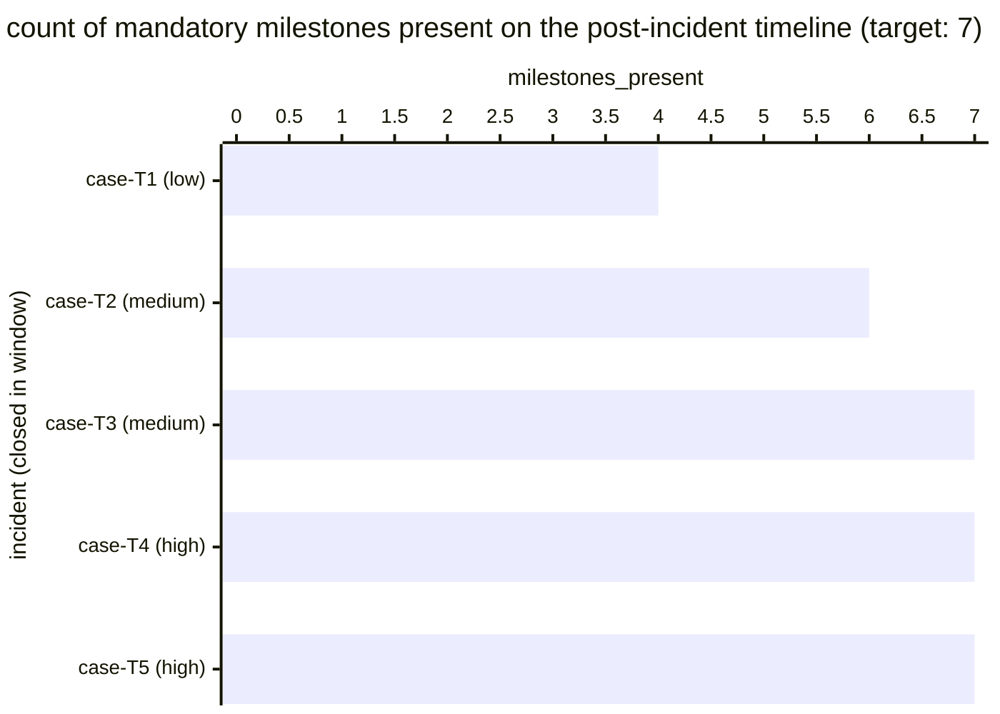

# Reference visualisation — `kpi.timeline_completeness@v1`

This is the committed reference-visualisation artifact for the
incident-timeline completeness KPI. It exists so the G-04 catalog
definition-of-done (a *committed* reference visualisation, not a
narrated one) is closed; downstream compile targets (n8n / Temporal /
LangGraph) read the same metric YAML and render the executable form in
their own dashboard surface. The artifact here is the contract for the
chart shape, not the executable chart.

## Chart kind

Two-panel composition. The headline panel is a single gauge-style
horizontal bar reading the timeline-completeness `ratio` across
incidents closed in the evaluation window — the share of in-scope
incidents whose post-incident timeline carries every mandatory
milestone (first observation, detection, triage, containment,
eradication, recovery, closeout). The drill-down panel is a horizontal
bar chart, one bar per incident closed in the window, plotting the
count of present mandatory milestones (0..7) on that incident's
timeline. Slicing by `incident.severity` is the canonical drill-down
dimension because record-keeping discipline typically degrades faster
on lower-severity incidents than on the regulatory-reportable
ones.

- **Headline (ratio):** the `ratio` aggregate across in-scope
  incidents closed in the window. This is the figure operators read
  first. Because the KPI is `higher_is_better`, a value near `1.00`
  is healthy and a falling value is the record-keeping-gap signal.
- **Drill-down x-axis:** one row per closed incident in the window,
  labelled by the case `incident.uid` and severity; sorted ascending
  so the most incomplete timelines sit at the top — the incidents
  whose post-incident review the operator owes attention to next.
- **Drill-down y-axis:** count of present mandatory milestones on the
  incident's timeline (0..7). Anything less than `7` is an incomplete
  timeline and contributes a `1` to the denominator without
  contributing a `1` to the numerator.
- **Threshold overlay (drill-down):** a horizontal line at `7` — every
  bar below the line is a sample that failed the completeness
  predicate. Operators reading the drill-down see *which* incidents
  pulled the ratio off `1.00`.

## Reference rendering (Mermaid)

The mermaid block below is the canonical reference rendering — small
enough to live in-tree and renderable directly on the public repo
surface. The numeric values are illustrative; the compile target is
the source of truth for the executable form against operator data.

Reading the bars in this illustrative rendering:

| case (severity)   | milestones_present | complete? | reading                                                    |
|-------------------|--------------------|-----------|------------------------------------------------------------|
| case-T1 (low)     | 4                  | no        | three milestones missing — review owes record-keeping pass |
| case-T2 (medium)  | 6                  | no        | one milestone missing — likely closeout not stamped        |
| case-T3 (medium)  | 7                  | yes       | full timeline                                              |
| case-T4 (high)    | 7                  | yes       | full timeline — regulatory-reportable severity             |
| case-T5 (high)    | 7                  | yes       | full timeline — regulatory-reportable severity             |

With two incomplete timelines across five closed incidents, the
headline `ratio` resolves to `3 / 5 = 0.60` in this snapshot. That
value is what the catalog aggregation `measurement.aggregation: ratio`
resolves to for this snapshot.

## Threshold band reference

The catalog entry at `timeline_completeness.yaml` is severity-neutral
and does not declare numeric warn / breach thresholds at the unscoped
baseline — the operator's post-incident-review policy is the source of
truth for the completeness floor, and the catalog ratio reflects the
share of incidents that hit that policy. Severity-scoped variants (for
example a high-severity-only timeline completeness indicator) declare
numeric bands and live as separate catalog entries. The catalog YAML
at `content/metrics/timeline_completeness.yaml` remains the source of
truth for the indicator shape; this file is the visualisation surface.

## OCSF source-data shape

The chart's underlying observations are derived from the operator's
post-incident review record per closed incident. Each in-scope
incident closed within the evaluation window contributes one
`milestones_present` sample computed against the
`measurement.inputs` declared on `timeline_completeness.yaml`:

- **numerator** — count of closed incidents whose post-incident
  timeline carries every mandatory milestone (`first_observation`,
  `detection`, `triage`, `containment`, `eradication`, `recovery`,
  `closeout`). The timeline-record event is bound to the
  post-incident-review step transitions declared on the catalog
  entry's `playbook_refs`:
  - `playbook.post_incident_review@v1`
    `action--40000000-0000-4000-8000-000000000002` — timeline-capture
    step on the post-incident-review playbook.
- **denominator** — count of in-scope incidents closed within the
  evaluation window. Exclude incidents whose closeout step never
  fired (record-keeping gap) so the indicator does not silently
  improve when the post-incident-review pipeline stalls.

The catalog entry deliberately does not pin a single OCSF telemetry
binding at the unscoped baseline: post-incident-review timelines are
carried on the operator's own case-management surface (a ticketing
system's incident record, a SOAR case object, or a post-incident-review
document), and there is no unambiguous OCSF event class that covers
the intersection of those surfaces at the catalog level. The deferral
is named honestly — the binding is to the playbook-step transition on
the post-incident-review playbook, not to an OCSF class. A CORE
follow-up may add an OCSF binding for case-management-surface-scoped
variants once the operator's case-management surface is declared.

The reference rendering above remains shape-valid: it reads a presence
predicate per mandatory milestone per closed incident and computes a
ratio, regardless of which case-management surface the operator's
compile target resolves the timeline record against.

## Operator override

Operators are expected to render this metric in their own dashboard
idiom — the catalog reference rendering above is the contract for the
chart shape (ratio headline, per-incident milestone-count drill-down
sliced by severity, completeness-floor overlay at `7`), not the visual
style. The compile target is the source of truth for the executable
form.
