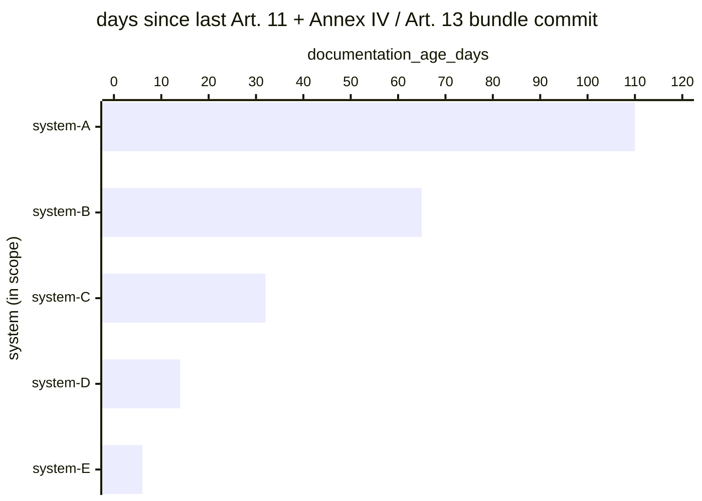

# Reference visualisation — `kri.transparency_doc_freshness_age@v1`

This is the committed reference-visualisation artifact for the
EU AI Act Article 11 + Annex IV / Article 13 technical documentation
freshness KRI. It exists so the G-04 catalog definition-of-done (a
*committed* reference visualisation, not a narrated one) is closed;
downstream compile targets (n8n / Temporal / LangGraph) read the
same metric YAML and render the executable form in their own
dashboard surface. The artifact here is the contract for the chart
shape, not the executable chart.

## Chart kind

Horizontal bar chart, one bar per high-risk AI system in scope,
sorted by `documentation_age_days` descending so the stalest bundle
sits at the top. The `max` aggregate across systems is the headline
figure operators read first; the per-system bars are the supporting
drill-down that names *which* AI system is drifting behind the
risk-management iteration cadence.

- **x-axis:** `documentation_age_days` — age in days at the window
  closing time of the latest committed Article 11 + Annex IV or
  Article 13 bundle for the system, whichever is older.
- **y-axis:** one row per high-risk AI system in scope, labelled by
  the system identifier the operator carries in the AI-system
  inventory; sorted by age descending so the stalest bundle sits
  at the top.
- **Headline annotation:** the `max` aggregate across systems,
  annotated as the metric value.

The KRI does not redeclare a numeric freshness threshold —
operators set that under their own documentation-refresh policy,
typically aligned with the pinned Annex III use-case category's
Article 9 iteration cadence, and typically wire scoped overrides
for each use-case category rather than a catalogue-global value.

## Reference rendering (Mermaid)

The mermaid block below is the canonical reference rendering — small
enough to live in-tree and renderable directly on the public repo
surface. The numeric values are illustrative; the compile target is
the source of truth for the executable form against operator data.

Reading the bars in this illustrative rendering:

| system    | documentation_age_days | reading                                                                       |
|-----------|------------------------|-------------------------------------------------------------------------------|
| system-A  | 110                    | stalest bundle in scope — the last Art. 9(2) iteration is not yet mirrored    |
| system-B  | 65                     | drifting behind the iteration cadence; the next re-commit is overdue          |
| system-C  | 32                     | within the operator-scoped freshness window for most use-case categories       |
| system-D  | 14                     | fresh bundle — the last Art. 9(2)(d) measures set is reflected                |
| system-E  | 6                      | just re-committed — the pinned Annex III use-case category is up to date      |

The headline `max` figure here is `≈ 110 days`. A value drifting
upward across evaluation windows is the operator-side flag that the
documentation-assembly cadence is falling behind the
risk-management-system iteration cadence.

## OCSF source-data shape

The chart's underlying observations are derived from the operator's
Article 11 + Annex IV and Article 13 documentation-assembly surface:
each committed bundle contributes one age sample computed from the
two inputs declared in `transparency_doc_freshness_age.yaml`'s
`measurement.inputs`:

- `technical_documentation_bundle` — bound to
  `telemetry.ocsf.compliance_finding@v1` (OCSF Compliance Finding,
  class_uid 2003) emitted by the assemble-technical-documentation
  step. The finding carries the bundle identifier and the assembly
  time.
- `instructions_for_use_bundle` — bound to the same OCSF Compliance
  Finding class, emitted alongside the technical documentation
  bundle on the same assemble step (the two share the Article 11
  read with Article 13 documentation surface).

## Operator override

Operators are expected to render this KRI in their own dashboard
idiom — the catalog reference rendering above is the contract for
the chart shape (per-system horizontal bars, max headline), not the
visual style. The compile target is the source of truth for the
executable form.
