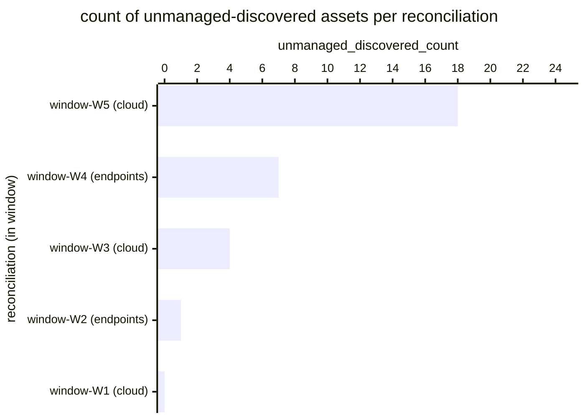

# Reference visualisation — `kpi.unmanaged_asset_cardinality@v1`

This is the committed reference-visualisation artifact for the
unmanaged-asset cardinality KPI. It exists so the G-04 catalog
definition-of-done (a *committed* reference visualisation, not a
narrated one) is closed; downstream compile targets (n8n / Temporal /
LangGraph) read the same metric YAML and render the executable form
in their own dashboard surface. The artifact here is the contract for
the chart shape, not the executable chart.

## Chart kind

Two-panel composition. The headline panel is a single gauge-style
horizontal bar reading the `max` unmanaged-discovered count
(`count`) across asset_management reconciliations in the evaluation
window — the worst-case observation of assets that appeared in a
reconciled snapshot without an authoritative owner or source
attribution from the reconciliation block. The drill-down panel is a
horizontal bar chart, one bar per reconciliation in the window,
plotting `unmanaged_discovered_count` — the per-window cardinality of
the `unmanaged-discovered` bucket carried on the asset-inventory-delta
evidence artifact. Slicing by `snapshot_window` (the reconciliation
window identifier on the evidence artifact) is the canonical
drill-down dimension because operators usually carry a per-cohort
reconciliation cadence and the indicator surfaces which cohort
contributed the worst-case observation.

- **Headline (count):** the `max` aggregate across in-scope
  reconciliations in the window. This is the figure operators read
  first. Because the KPI is `lower_is_better`, a value of zero is
  healthy and any non-zero value is the asset-management signal that
  the playbook surfaces for the next operator lever (claim ownership,
  attach to a documented baseline, decommission the asset).
- **Drill-down x-axis:** `unmanaged_discovered_count` — per-window
  count of `unmanaged-discovered` entries on the
  asset-inventory-delta evidence artifact. Each bar contributes one
  observation toward the headline `max`.
- **Drill-down y-axis:** one row per reconciliation in the window,
  labelled by `snapshot_window` and `snapshot_id` short prefix;
  sorted descending so the noisiest reconciliations sit at the top —
  the cohorts that pulled the headline count to its window-maximum.
- **Threshold overlays:** horizontal lines at the `warn` (>0),
  `breach` (>10), and `critical` (>100) count values, drawn on a
  companion count gauge / axis next to the bar chart, so the
  operator reads the band the headline sits in without arithmetic.

## Reference rendering (Mermaid)

The mermaid block below is the canonical reference rendering — small
enough to live in-tree and renderable directly on the public repo
surface. The numeric values are illustrative; the compile target is
the source of truth for the executable form against operator data.

Reading the bars in this illustrative rendering:

| reconciliation (cohort)   | unmanaged_discovered_count | band     | reading                                                    |
|---------------------------|----------------------------|----------|------------------------------------------------------------|
| window-W5 (cloud)         | 18                         | breach   | 18 cloud assets surfaced without authoritative ownership   |
| window-W4 (endpoints)     | 7                          | warn     | 7 endpoint assets surfaced without authoritative ownership |
| window-W3 (cloud)         | 4                          | warn     | 4 cloud assets surfaced without authoritative ownership    |
| window-W2 (endpoints)     | 1                          | warn     | 1 endpoint asset surfaced without authoritative ownership  |
| window-W1 (cloud)         | 0                          | healthy  | no unmanaged-discovered assets — clean reconciliation      |

With the worst-case observation at `18` across five reconciliations,
the headline `count` resolves to `18` — inside the breach band, below
the critical floor. That value is what the catalog aggregation
`measurement.aggregation: max` resolves to for this snapshot.

## Threshold band reference

| name     | comparator | value (count) | severity |
|----------|------------|---------------|----------|
| warn     | >          | 0             | warn     |
| breach   | >          | 10            | high     |
| critical | >          | 100           | critical |

The bands match the `thresholds` array on
`unmanaged_asset_cardinality.yaml`; the catalog entry is the source
of truth, this file is the visualisation surface. The catalog target
(`target.value: 0`, `comparator: "=="`) is the community-recommended
starting point for the unscoped baseline; operators set scoped
tolerances per asset cohort under their reconciliation programme.

## OCSF source-data shape

The chart's underlying observations are derived from the
asset_management reconciliation evidence stream rather than a direct
OCSF event class. Each reconciliation within the evaluation window
contributes one `unmanaged_discovered_count` sample computed against
the `measurement.inputs` declared on
`unmanaged_asset_cardinality.yaml`:

- **unmanaged_discovered_count** — pre-computed integer field on the
  JSON-native asset-inventory-delta evidence artifact, emitted by the
  capture-evidence step against the upstream classify-delta block.
  Carried on the step transition declared on the catalog entry's
  `measurement.inputs.unmanaged_discovered_count.playbook_step`:
  - `playbook.asset_management@v1`
    `action--80000000-0000-4000-8000-000000000005` — classify-delta
    step on the asset_management playbook (the upstream that
    materialises the bucket the count is derived from).
- **classify_block** — per-delta classification array on the same
  evidence artifact (`delta_classification`), provided so a
  drill-down consumer reads the contributing entries against the
  per-asset `delta_set` (1:1 ordering with `delta_classification`).
  When the classify step short-circuited under the documented
  reconciliation deadline, the array carries the single
  `unclassified` sentinel and the consuming reviewer treats the
  delta set as unmanaged-discovered for notification urgency.

The catalog entry deliberately does not pin a single OCSF telemetry
binding at the unscoped baseline: the reconciliation evidence stream
is itself the binding shape and is carried in the JSON-native
evidence artifact rather than via an OCSF event class. The deferral
is named honestly — the playbook step transition is the binding for
the classification event, not an OCSF class. The asset_management
ingest step emits an OCSF API Activity event per source pull
(`telemetry.ocsf.api_activity@v1`) that the operator's telemetry
pipeline may correlate against, but the indicator itself reads the
evidence record.

The reference rendering above remains shape-valid: it reads one
`unmanaged_discovered_count` integer per reconciliation and takes the
window `max`, regardless of which inventory sources the operator's
compile target consulted.

## Operator override

Operators are expected to render this metric in their own dashboard
idiom — the catalog reference rendering above is the contract for the
chart shape (max-count headline, per-reconciliation count drill-down
sliced by snapshot window, warn / breach / critical band overlays on
the companion count axis), not the visual style. The compile target
is the source of truth for the executable form.
