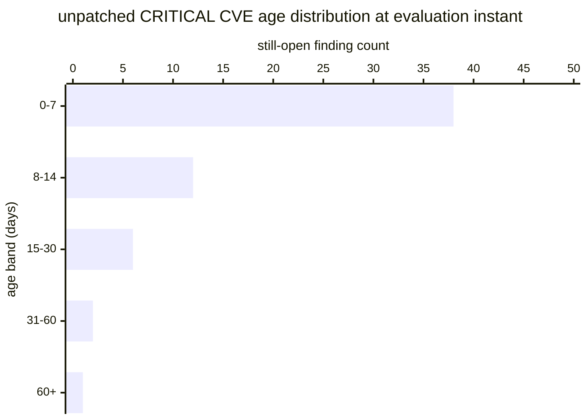

# Reference visualisation — `kri.unpatched_critical_cve_age_days@v1`

This is the committed reference-visualisation artifact for the
unpatched-critical-CVE age KRI. It exists so the G-04 catalog
definition-of-done (a *committed* reference visualisation, not a
narrated one) is closed; downstream compile targets (n8n / Temporal /
LangGraph) read the same metric YAML and render the executable form
in their own dashboard surface. The artifact here is the contract for
the chart shape, not the executable chart.

## Chart kind

Two-panel composition. The headline panel is a single P95-headline
number reading `P95(age_days | f ∈ U)` over the still-open
CRITICAL-severity finding population at the evaluation instant. The
drill-down panel is an age-histogram bar chart binning the still-open
population by day-band (0–7, 8–14, 15–30, 31–60, 60+), plotting per-
band finding count so operators can see how the tail of the ageing
distribution is shaped. Because the KRI is `lower_is_better`, a
rising value is the unhealthy signal that the residual critical
exposure is drifting past the operator's SLA window.

- **Headline (days):** `P95(age_days)` across the still-open critical
  population; the figure operators read first.
- **Drill-down x-axis:** age day-band (0–7, 8–14, 15–30, 31–60, 60+).
- **Drill-down y-axis:** count of still-open CRITICAL findings in
  the band.
- **Threshold overlay:** horizontal lines on the headline number at
  the `warn` (7 days), `high` (14 days) and `breach` (30 days)
  bounds — because the KRI is `lower_is_better`, all three bounds
  sit *above* target and a value above any line lands inside the
  corresponding band.
- **Headline annotation:** the P95 value with the threshold band it
  falls in, plus the population size `|U|` (small-population marker
  when `|U| < 20` so downstream consumers do not read the P95 as if
  it were the tail of a large population).

## Reference rendering (Mermaid)

The mermaid block below is the canonical reference rendering — small
enough to live in-tree and renderable directly on the public repo
surface. The numeric values are illustrative; the compile target is
the source of truth for the executable form against operator data.

Reading the bars in this illustrative rendering (assume `|U| = 59`
still-open CRITICAL findings and the P95 falls in the 15–30 day
band):

| age band | count | cumulative | reading                          |
|----------|-------|------------|----------------------------------|
| 0–7      | 38    | 38         | inside SLA window                |
| 8–14     | 12    | 50         | past warn bound                  |
| 15–30    | 6     | 56         | past high bound (P95 lands here) |
| 31–60    | 2     | 58         | past breach bound                |
| 60+      | 1     | 59         | far past breach bound            |

The headline `P95(age_days)` here is ~22 days — above the `high`
bound (14) and below the `breach` bound (30), so the KRI reads
inside the high band for this snapshot; a drift upward past 30
would drop the reading into the breach band, a drift downward
under 14 into the warn band, under 7 into a healthy reading at
target.

## Threshold band reference

| name      | comparator | value (days) | severity  |
|-----------|------------|--------------|-----------|
| warn      | >          | 7            | warn      |
| high      | >          | 14           | high      |
| breach    | >          | 30           | critical  |

The bands match the `thresholds` array on
`unpatched_critical_cve_age_days.yaml`; the catalog entry is the
source of truth, this file is the visualisation surface.

## OCSF source-data shape

The chart's underlying observations are derived from the OCSF
`Vulnerability Finding` events (`class_uid: 2002`) the operator's
vulnerability-management surface emits at triage. The still-open
predicate is the absence of a paired closure evidence record from
the verify-remediation step on the same finding stable_id, evaluated
at the evaluation instant. The catalog entry binds to the OCSF class
shape, not to a vendor-specific scanner or ticket object. The
binding lives at
`content/telemetry/telemetry.ocsf.vulnerability_finding@v1.json` and
is back-referenced from the metric YAML's `telemetry_refs[]` and
from the `triage_timestamp` / `remediation_close`
`measurement.inputs[].telemetry_ref`.

## Operator override

Operators are expected to render this indicator in their own
dashboard idiom — the catalog reference rendering above is the
contract for the chart shape (P95-headline number with `warn` /
`high` / `breach` bounds, still-open population age-histogram
drill-down), not the visual style. The compile target is the source
of truth for the executable form.
