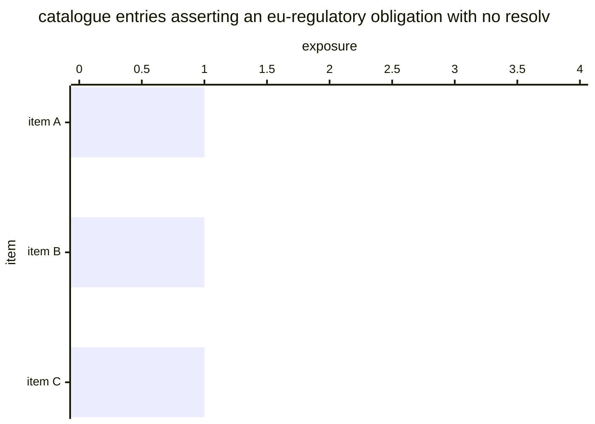

# Reference visualisation — `kri.unresolvable_regulatory_reference_count@v1`

This is the committed reference-visualisation artifact for the
residual-risk KRI paired with `kpi.eu_regulatory_reference_coverage@v1`. It exists so the G-04 catalog
definition-of-done (a *committed* reference visualisation, not a
narrated one) is closed; downstream compile targets read the same
metric YAML and render the executable form in their own dashboard
surface. The artifact here is the contract for the chart shape, not
the executable chart.

## Chart kind

Horizontal bar chart over the **unclassifiable population** — the
slice the paired coverage KPI has no basis to judge, never the slice
it judged as failing. One bar per offending catalogue entry, its unresolvable-ref count as the bar length, sorted descending; the entry count is the headline. The chart names the files to fix, which is the only part an author can act on.

## Reference rendering (Mermaid)

The numeric values are illustrative; the compile target is the source
of truth for the executable form.

The headline is the **count**; a reading of zero renders an empty
chart deliberately — the absence of residual-risk rows is the
reading, and hiding the empty chart would hide the claim.

## Threshold band reference

| name   | comparator | value | severity |
|--------|------------|-------|----------|
| warn   | >          | 0     | warn     |
| breach | >=         | 3     | high     |

The bands match the `thresholds` array on `unresolvable_regulatory_reference_count.yaml`; the catalog
entry is the source of truth for the values, this file for the chart
shape. The floor is zero because one unclassifiable item is already a
residual-risk row the operator owes a resolution for — the same floor
the LM-endpoint exemplar set.

## Source-data shape

The chart's underlying observations are derived from the inputs
declared under `measurement.inputs` on `unresolvable_regulatory_reference_count.yaml`. Each observation
contributes one bar to the drill-down; the headline aggregate is
computed per the catalog `measurement.aggregation` over the window
declared under `measurement.window`.

## Operator override

Operators render this in their own dashboard idiom — the reference
rendering is the contract for the shape, not the style. Do **not**
merge this KRI into the paired coverage chart as a third stack
segment: the pairing exists because the unclassifiable population is
a different claim than the failing one, and stacking them re-creates
the ambiguity the pairing removes.

Paired coverage KPI: `kpi.eu_regulatory_reference_coverage@v1` — its `residual_risk_refs` declares this
pairing, and `tools.lint_sovereignty_pairing` enforces it.
